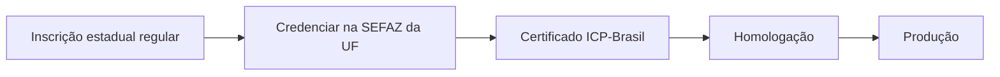

Antes de emitir com efeito fiscal, três condições precisam estar resolvidas: **credenciamento na UF**, **certificado digital** e **ambiente correto**.

## Credenciamento

### O que o manual diz

Para se tornar emissor, o contribuinte deve **se credenciar junto à SEFAZ do seu Estado**. O credenciamento em uma Unidade da Federação **não** credencia a empresa nas demais: é preciso solicitar credenciamento em **cada UF** onde houver estabelecimento que deseje emitir.

Nos Estados que usam a **Sefaz-Virtual/RS (SVRS)** ou a **Sefaz-Virtual/AN (SVAN)**, quem credencia é a administração tributária do Estado do contribuinte — não o ambiente virtual. A SEFAZ pode ainda credenciar **de ofício** contribuintes enquadrados em obrigatoriedade.

### Implicação de implementação

> **Implementação:** credenciamento é por (CNPJ do estabelecimento × UF). Modele isso como dado, não como configuração global — uma mesma empresa pode estar em UFs com autorizadoras diferentes. Ver [Autorizadoras e ambientes](/docs/operacao/autorizadoras-e-ambientes).

## Certificado digital

### O que o manual diz

A emissão exige **certificado digital ICP-Brasil, tipo A1 ou A3**, contendo o CNPJ do titular no campo `otherName` `OID = 2.16.76.1.3.3`. O certificado deve conter o CNPJ do **estabelecimento emissor** ou o da **matriz**. Um mesmo certificado pode assinar as NF-e de todos os estabelecimentos **se** contiver o CNPJ da matriz.

| Tipo | Onde fica a chave | Característica |
|---|---|---|
| **A1** | arquivo (software) | mais fácil de automatizar em servidor |
| **A3** | mídia/token/HSM | chave não exportável |

### Vigência

🕒 A escolha entre A1 e A3 e os requisitos de algoritmo seguem a documentação técnica vigente e a ICP-Brasil. Confronte detalhes de assinatura com o schema atual — ver [Arquitetura de comunicação](/docs/emissao-e-comunicacao/arquitetura).

## Homologação e produção

O campo `tpAmb` no XML separa os ambientes: **2 = homologação**, **1 = produção**.

| Aspecto | Homologação (`tpAmb=2`) | Produção (`tpAmb=1`) |
|---|---|---|
| finalidade | testes de integração | documento com efeito fiscal |
| dados | textos e condições de teste | dados reais da operação |
| numeração | controle separado | sequência fiscal oficial |
| endpoint | URL do ambiente de testes | URL produtiva |

> **Implementação:** nunca escolha o ambiente apenas pela URL. Valide `tpAmb` no XML **e** na resposta; rejeite resposta de ambiente diferente do solicitado.

## Checklist para começar

- [ ] inscrição estadual regular na(s) UF(s) de emissão;
- [ ] credenciamento solicitado em cada UF;
- [ ] certificado A1 ou A3 com o CNPJ correto;
- [ ] CSC/CSRT obtidos quando a UF exigir (NFC-e e QR Code); 📍
- [ ] catálogo de endpoints por serviço, UF e ambiente;
- [ ] cenário em homologação antes de qualquer emissão produtiva.

## Fonte

Manual de Credenciamento como Emissor de NF-e (SVRS), §2–§4; e Manual do Emissor de NF-e (ENCAT). Detalhes de assinatura no MOC 7.0 — Visão Geral, capítulo 4.
