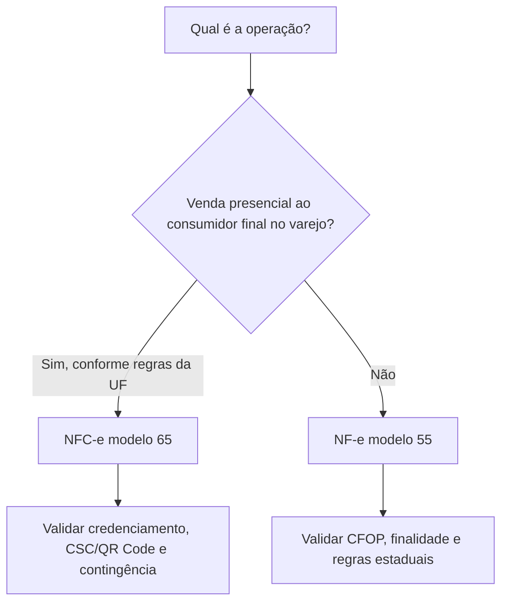
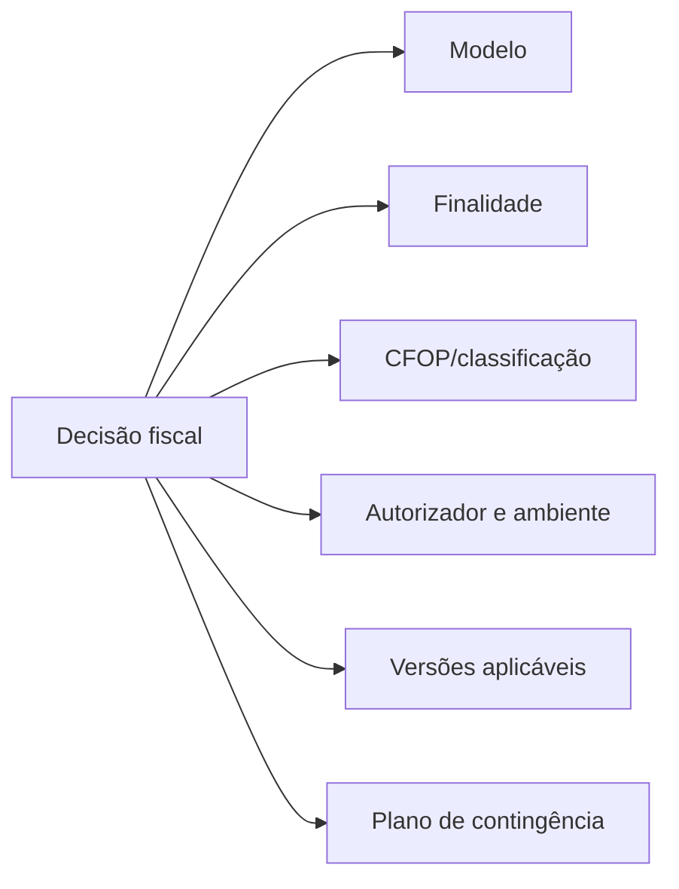

Escolher o modelo é uma **decisão fiscal**, não de impressão. Não use o formato do papel ou o tipo do cliente como critério único.

## Comparação rápida

| Critério | NF-e | NFC-e |
|---|---|---|
| Modelo | 55 | 65 |
| Uso principal | circulação de mercadorias e operações documentadas por NF-e | varejo para consumidor final |
| Documento auxiliar | DANFE | DANFE NFC-e |
| Consulta visual | chave e código de barras | QR Code |
| Contingência típica | SVC, EPEC ou FS-DA conforme cenário | off-line conforme regras da UF 📍 |
| Dados específicos | produtos, transporte, cobrança e referências | consumidor, pagamentos e dados suplementares |

## Perguntas obrigatórias

Antes de gerar qualquer XML, registre as respostas:

1. Qual fato gerador está sendo documentado?
2. Qual estabelecimento será o emitente?
3. Qual UF e município autorizam ou validam a operação?
4. O destinatário precisa ser identificado?
5. Existe documento anterior a referenciar, complementar ou substituir?
6. Qual legislação estadual ou regulatória adiciona condições? 📍
7. Qual versão de schema e Nota Técnica está ativa na data de emissão? 🔄

## Casos que exigem atenção

### Venda ao consumidor final

Nem toda venda para pessoa física é NFC-e. Operação interestadual, entrega, exigência de identificação, limite definido pela UF ou natureza da operação podem levar à NF-e modelo 55. 📍

### Transporte

A NF-e documenta a mercadoria. Ela **não** substitui automaticamente o documento da prestação de transporte (CT-e), tratado em documentação própria.

## Saída esperada da decisão

> **Implementação:** guarde a justificativa da escolha junto à regra fiscal. Isso permite explicar por que o sistema selecionou determinado modelo e evita decisões espalhadas pelo código.
