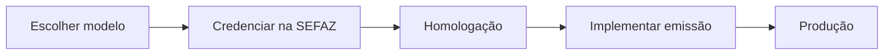

Se você vai integrar um sistema emissor pela primeira vez, comece por aqui. Estas páginas são guias de planejamento — para regras de campo e validação, siga depois para [Leiaute e rejeições](/docs/leiaute-e-rejeicoes).

## Roteiro

| Passo | Página |
|---|---|
| decidir qual modelo emitir | [Escolha do modelo](/docs/comece-aqui/escolha-do-modelo) |
| planejar a integração de ponta a ponta | [Roteiro de implementação](/docs/comece-aqui/roteiro-de-implementacao) |
| credenciar-se e configurar ambientes | [Credenciamento e ambientes](/docs/comece-aqui/credenciamento-e-ambientes) |

