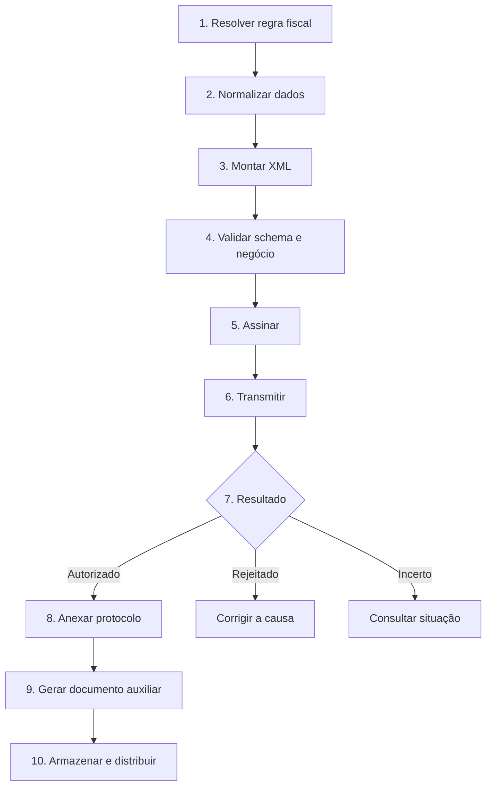
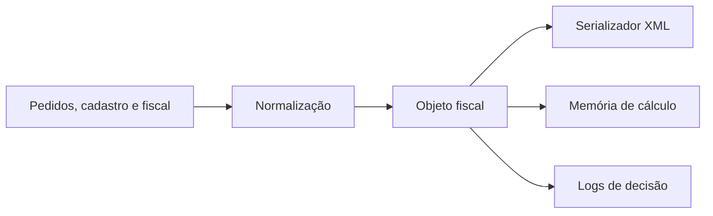
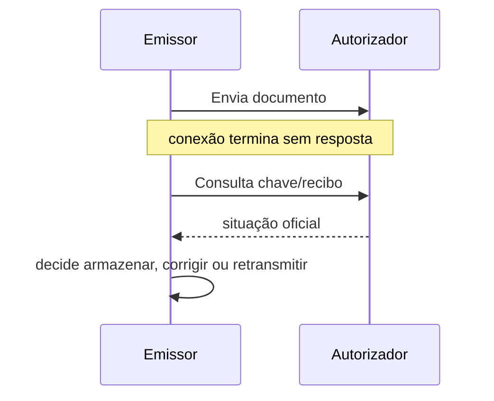

Implemente o documento como um **processo verificável**. A autorização é uma etapa, não o fim do ciclo.

## Fluxo completo

## 1. Regra fiscal

Produza uma decisão estruturada antes do XML: modelo e finalidade; natureza da operação e CFOP; emitente, destinatário e locais; itens, quantidades, preços e descontos; tributação e memória de cálculo; documentos referenciados; forma de pagamento; modo de emissão normal ou contingência.

## 2. Modelo interno

Não monte o XML diretamente de telas ou tabelas do banco. Crie um objeto fiscal validado e imutável para a emissão.

> **Implementação:** trate chaves, documentos, códigos e séries como texto. Use decimal exato para valores; evite ponto flutuante binário.

## 3. XML e validação local

Valide em camadas:

| Camada | Exemplos |
|---|---|
| estrutura | ordem das tags, tipos, tamanhos e ocorrências |
| domínio | códigos permitidos, UF, município, CFOP e classificações |
| negócio | condições entre campos, datas, finalidade e totalização |
| segurança | certificado, cadeia, assinatura, digest e referência |
| autorização | cadastro, duplicidade, situação e regras externas |

O sistema local não reproduzirá todas as consultas do autorizador, mas deve impedir erros determinísticos antes do envio. Detalhe das validações em [Pipeline de validação](/docs/leiaute-e-rejeicoes/pipeline-de-validacao).

## 4. Transmissão idempotente

Associe cada tentativa a uma identidade fiscal estável. Se houver timeout, **consulte antes** de gerar outro número ou retransmitir.

## 5. Pós-autorização

- combine XML e protocolo no formato `procNFe` correspondente;
- gere [DANFE](/docs/danfe) a partir do XML final;
- distribua pelos canais permitidos;
- armazene XML, protocolo, eventos e respostas originais;
- monitore cancelamentos, inutilizações e manifestações;
- preserve rastreabilidade entre pedido, documento e lançamento contábil.

## Definição mínima de pronto

- [ ] cenário normal autorizado em homologação;
- [ ] rejeições traduzidas sem ocultar o código original;
- [ ] timeout não causa duplicidade;
- [ ] documento auxiliar confere com o XML;
- [ ] eventos atualizam o estado do documento;
- [ ] contingência testada e conciliada;
- [ ] certificado renovável sem alteração de código;
- [ ] schemas e regras com versão identificável.

Para a estratégia de testes e versionamento, veja [Operação](/docs/operacao).
