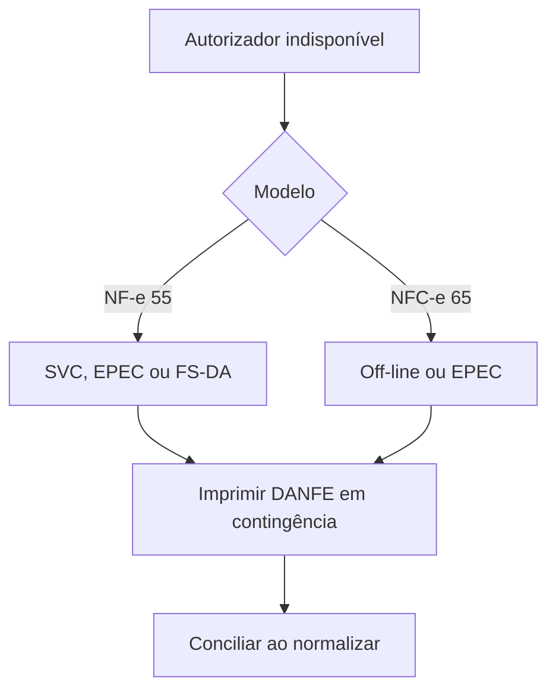

## O que o manual diz

Quando o autorizador normal está indisponível, o emissor escolhe uma modalidade de contingência (ou aguarda a normalização). **Não há hierarquia** entre modalidades: o emissor adota a que tiver disponível e for mais conveniente.

A modalidade é declarada no campo **`tpEmis` (B22)**:

| `tpEmis` | Modalidade | Modelo |
|---|---|---|
| `1` | Normal | 55 e 65 |
| `4` | EPEC | 55 e 65 |
| `5` | FS-DA (Formulário de Segurança) | 55 |
| `6`/`7` | SVC (Sefaz Virtual de Contingência) 🕒 | 55 |
| `9` | Off-line | 65 |

## Como interpretar

`tpEmis` faz parte da **chave de acesso** e da **chave natural** — então a modalidade está embutida na identidade do documento. Trocar de modalidade significa documento diferente.

## Vigência

- 🕒 Modalidades legadas (FS, SCAN) foram descontinuadas; confirme os valores de `tpEmis` de SVC no schema vigente.
- 📍 A disponibilidade de cada modalidade (especialmente off-line da NFC-e) depende da UF.

## Implicação de implementação

> **Implementação:** nunca aplique a modalidade de um modelo ao outro. A **off-line** é exclusiva da NFC-e; **FS-DA** e **SVC** são da NF-e; **EPEC** existe para ambos com leiautes próprios.

## Fonte

MOC 7.0 — Anexo III, §2.1, p. 5–16; Anexo IV e Especificações da Contingência Off-line v2.0.
