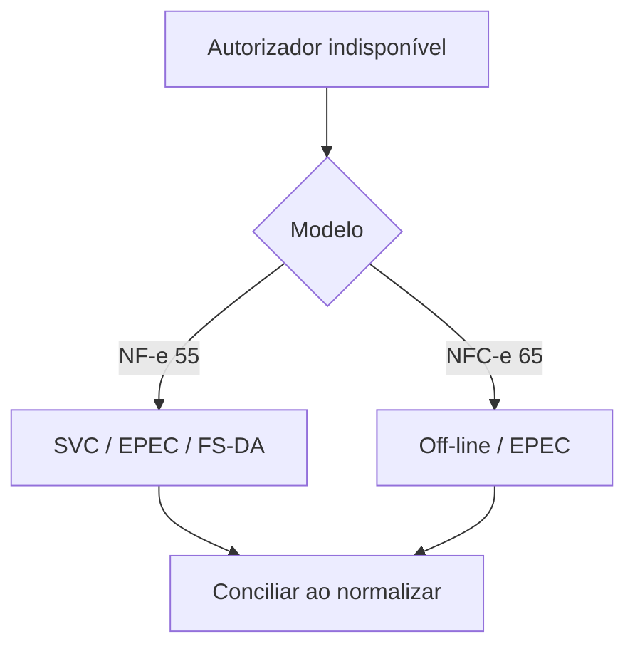

Contingência é um **fluxo formal** para emitir quando o autorizador não responde. Cada modalidade tem campos, impressão e conciliação próprios.

> **Em uma frase:** contingência não é ignorar a SEFAZ — é seguir uma modalidade prevista e conciliar depois.

## Nesta seção

| Tema | Página |
|---|---|
| qual modalidade usar em cada cenário | [Escolha da modalidade](/docs/contingencia/escolha-da-modalidade) |
| contingência da NF-e: SVC, EPEC, FS-DA (Anexo III) | [Contingência da NF-e](/docs/contingencia/nfe) |
| contingência off-line da NFC-e (Anexo IV + v2.0) | [Contingência da NFC-e](/docs/contingencia/nfce-offline) |
| recuperação e conciliação após a normalização | [Recuperação e conciliação](/docs/contingencia/recuperacao-e-conciliacao) |

> **Implementação:** não aplique a modalidade de um modelo ao outro. A off-line é característica da NFC-e; SVC e EPEC seguem regras próprias.

## Fonte

| Campo | Valor |
|---|---|
| Documento | Índice editorial: Contingência |
| Versão | ver fonte original |
| Data | ver fonte original |
| Páginas/capítulo | ver fonte original |
| NT relacionada | não indicada |
| Schema/tabela relacionada | não indicada |
| Status | página índice; rastreabilidade detalhada nas páginas filhas |

### Registro de origem

Índice editorial baseado nos Anexos III e IV do MOC 7.0 e nas especificações de contingencia off-line.
