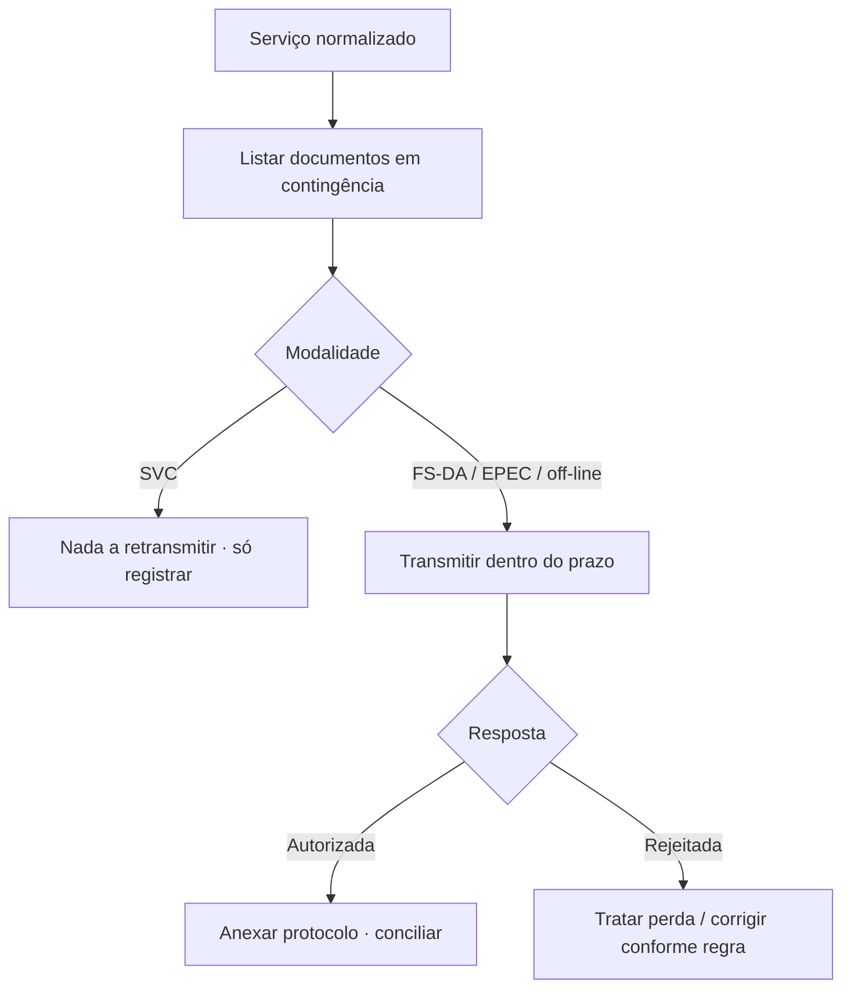

Contingência só termina quando os documentos emitidos fora do fluxo normal são **transmitidos, autorizados e conciliados**.

## O que o manual diz

- Modalidades que **exigem transmissão posterior** à SEFAZ de origem: **FS-DA**, **EPEC** (NF-e e NFC-e) e **off-line** da NFC-e. **SVC** não exige (já foi autorizada por outro ambiente).
- A **off-line** da NFC-e deve ser transmitida até o **final do 1º dia útil subsequente**, mantendo a **mesma chave** (e `cNF`).
- Em **FS-DA**, atribui-se **novo número** quando a nota original já havia sido enviada com `tpEmis=1`, para não colidir na conciliação.
- O EPEC tem a **mesma chave** do documento definitivo (incluindo `tpEmis` de EPEC).

## Como interpretar

Há dois padrões opostos para evitar duplicidade, e é fácil confundi-los:

| Situação | Regra |
|---|---|
| off-line NFC-e / EPEC | **manter** a mesma chave e `cNF` na transmissão |
| FS-DA com nota já enviada como normal | **gerar novo número** (nova chave) |

A chave natural (ver [Chave de acesso](/docs/fundamentos/chave-de-acesso)) é o que o autorizador usa para detectar duplicidade — por isso a regra muda conforme a modalidade.

## Fluxo de conciliação

## Vigência

- 🔄 Prazos e regras por NT; 📍 disponibilidade e penalidades por UF.

## Implicação de implementação

> **Implementação:** mantenha uma fila de "documentos em contingência pendentes de conciliação" como indicador operacional (ver [Testes e operação](/docs/operacao/testes-e-homologacao)). Aplique a regra de chave **por modalidade** — manter chave (off-line/EPEC) vs. novo número (FS-DA). Monitore o prazo da off-line e alerte antes do vencimento.

## Fonte

| Campo | Valor |
|---|---|
| Documento | MOC 7.0 — Anexo III, §2.3; Anexo IV; Especificações da Contingência Off-line v2.0, §2. |
| Versão | v2.0 |
| Data | ver fonte original |
| Páginas/capítulo | §2 |
| NT relacionada | não indicada |
| Schema/tabela relacionada | não indicada |
| Status | base oficial mapeada; confrontar com NT, IT, XSD e regra estadual vigentes |

### Registro de origem

MOC 7.0 — Anexo III, §2.3; Anexo IV; Especificações da Contingência Off-line v2.0, §2.
