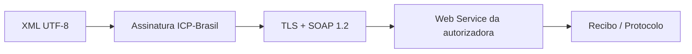

A camada técnica da comunicação: formato do XML, segurança da conexão, assinatura e os Web Services chamados em cada etapa.

## Nesta seção

| Tema | Página |
|---|---|
| XML, namespace, TLS, SOAP, certificado e assinatura | [Arquitetura de comunicação](/docs/emissao-e-comunicacao/arquitetura) |
| visão geral dos serviços e quando chamar cada um | [Mapa dos Web Services](/docs/emissao-e-comunicacao/web-services) |
| envio do lote e autorização | [NfeAutorizacao](/docs/emissao-e-comunicacao/autorizacao) |
| consulta do recibo do lote | [NfeRetAutorizacao](/docs/emissao-e-comunicacao/ret-autorizacao) |
| inutilização de numeração | [NfeInutilizacao](/docs/emissao-e-comunicacao/inutilizacao) |
| situação de uma nota | [NfeConsultaProtocolo](/docs/emissao-e-comunicacao/consulta-protocolo) |
| disponibilidade do serviço | [NfeStatusServico](/docs/emissao-e-comunicacao/status-servico) |
| situação cadastral do contribuinte | [NfeConsultaCadastro](/docs/emissao-e-comunicacao/consulta-cadastro) |
| documentos de interesse por NSU | [NFeDistribuicaoDFe](/docs/emissao-e-comunicacao/distribuicao-dfe) |
| recibo, protocolo e controle de uso indevido | [Recibo, protocolo e uso indevido](/docs/emissao-e-comunicacao/recibo-e-uso-indevido) |

## Fonte

| Campo | Valor |
|---|---|
| Documento | Índice editorial: Emissão e comunicação |
| Versão | ver fonte original |
| Data | ver fonte original |
| Páginas/capítulo | capítulo de arquitetura e Web Services |
| NT relacionada | não indicada |
| Schema/tabela relacionada | não indicada |
| Status | página índice; rastreabilidade detalhada nas páginas filhas |

### Registro de origem

Índice editorial baseado no MOC 7.0 — Visão Geral, capítulo de arquitetura e Web Services.
