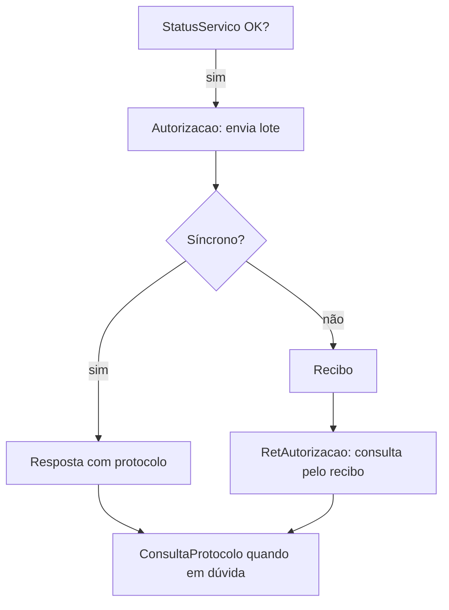

Há **um Web Service por serviço**. O fluxo é sempre iniciado pelo contribuinte; a SEFAZ responde na mesma conexão (síncrono) ou devolve um recibo para consulta posterior (assíncrono).

## O que o manual diz

| Serviço | Método | Processo | Quando usar |
|---|---|---|---|
| [NfeAutorizacao](/docs/emissao-e-comunicacao/autorizacao) | `nfeAutorizacaoLote` | síncrono/assíncrono | enviar o lote de NF-e para autorização |
| [NfeRetAutorizacao](/docs/emissao-e-comunicacao/ret-autorizacao) | `nfeRetAutorizacao` | síncrono | consultar o resultado de um lote assíncrono pelo recibo |
| [NfeInutilizacao](/docs/emissao-e-comunicacao/inutilizacao) | `nfeInutilizacaoNF` | síncrono | inutilizar uma faixa de numeração não usada |
| [NfeConsultaProtocolo](/docs/emissao-e-comunicacao/consulta-protocolo) | `nfeConsultaNF` | síncrono | consultar a situação atual de uma NF-e pela chave |
| [NfeStatusServico](/docs/emissao-e-comunicacao/status-servico) | `nfeStatusServicoNF` | síncrono | verificar se a autorizadora está disponível |
| [NfeConsultaCadastro](/docs/emissao-e-comunicacao/consulta-cadastro) | `consultaCadastro` | síncrono | consultar a situação cadastral de um contribuinte |
| [NFeDistribuicaoDFe](/docs/emissao-e-comunicacao/distribuicao-dfe) | `nfeDistDFeInteresse` | síncrono | baixar DF-e e resumos de interesse por NSU |
| NFeRecepcaoEvento | `nfeRecepcaoEvento` | síncrono | registrar eventos — ver [Eventos](/docs/eventos) |

## Premissas do modelo operacional

- **Síncrono:** envio e retorno na mesma conexão (um único método).
- **Assíncrono:** o envio retorna **recibo**; o resultado é obtido em uma segunda conexão via `RetAutorizacao`.
- As SEFAZ se comprometem a processar lotes em **até 3 minutos** em ao menos 95% do volume em 24h.
- O resultado do lote fica disponível por **no mínimo 24h** (`RetAutorizacao`); depois, a situação de cada nota fica em consulta individual.
- As **URLs e WSDL** estão no Portal Nacional (acrescente `?WSDL` ao endereço do serviço).
- Qualquer erro de validação **interrompe** o processo com código + descrição.

Para links por UF, autorizador, SVC e versão de schema publicada nos serviços, veja [Serviços por UF](/docs/operacao/servicos-por-uf).

## Overlay de NTs

| NT (vigente) | Delta nos serviços |
|---|---|
| 2026.004 v1.01 | **CNPJ e chaves passam a texto alfanumérico** nos schemas de `NfeRetAutorizacao`, `NFeRecepcaoEvento` (parte geral, cancelamento/substituição, EPEC e Ator Interessado), `NfeConsultaProtocolo`, `NfeConsultaCadastro`, `NfeDistribuicaoDFe` e `NfeInutilizacao`. Em Consulta Cadastro, CNPJ de entrada/retorno aceita **3–14** caracteres; nos demais campos CNPJ mantém 14 posições. A v1.01 acrescentou Inutilização e mudou a homologação para até **15/06/2026**; produção **01/07/2026**. 🔄 |

## Implicação de implementação

> **Implementação:** modele um cliente por serviço, com a versão de leiaute e o endpoint resolvidos por (serviço × UF/autorizador × ambiente). Não fixe URLs no código — ver [Versionamento](/docs/operacao/versionamento).

## Fonte

MOC 7.0 — Visão Geral, §4.3 (Modelo Operacional) e capítulo 5, p. 57–99 (Tabela 4-6). Overlay: NT 2026.004 v1.01 (08/06/2026).
