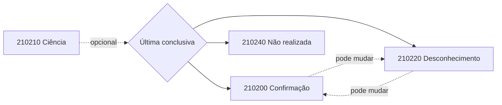

## O que o manual diz

O destinatário, pessoa jurídica ou física, pode manifestar-se sobre uma NF-e emitida para seu CNPJ/CPF. A **NT 2020.001 v1.60** substitui as NTs 2012.002 e 2013.001 e consolida os quatro eventos:

| `tpEvento` | Evento | Significado |
|---|---|---|
| `210210` | **Ciência da Operação** | reconhece a existência da NF-e, sem manifestação conclusiva ainda |
| `210200` | **Confirmação da Operação** | a operação ocorreu exatamente como na NF-e |
| `210220` | **Desconhecimento da Operação** | a operação não foi solicitada pelo destinatário |
| `210240` | **Operação não Realizada** | houve participação, mas a operação não se efetivou |

No schema (namespace `http://www.portalfiscal.inf.br/nfe`, `versao` `1.00`), o `detEvento` confirma a assimetria: Ciência, Confirmação e Desconhecimento carregam só o `descEvento` fixo; **apenas** Operação não Realizada (`210240`) acrescenta `xJust` (15–255). Cada evento tem seu arquivo (`e210200`…`e210240`) com o `descEvento` fixado no texto correspondente.

### Regra de mudança (importante)

> O destinatário pode registrar até **dois eventos de cada tipo conclusivo** (Confirmação, Desconhecimento ou Operação não Realizada), **valendo apenas a última manifestação registrada**. Ex.: pode desconhecer uma operação que havia confirmado e depois confirmá-la novamente.

A **Ciência da Emissão** (`210210`) **não** é manifestação final: é opcional, pode ser evitada, e não cabe registrá-la **após** uma manifestação conclusiva. Seu prazo é de **10 dias** da autorização; Confirmação, Desconhecimento e Operação não Realizada devem ser registrados em até **90 dias** da autorização. A redução de 180 para 90 dias é o delta da v1.60 (Ajuste SINIEF 14/26), com produção em **01/06/2026**. 🔄

### Quando a manifestação é obrigatória

Além das hipóteses definidas no Ajuste SINIEF 7/05, a NT lista operações com combustíveis (exceto lubrificantes definidos em tabela), álcool não combustível a granel e, para distribuidores/atacadistas, cigarros, bebidas alcoólicas, refrigerantes e água mineral. A obrigação é setorial e deve ser conferida na legislação vigente. 📍

### Como operacionalizar

- pelo **Web Service `NFeRecepcaoEvento`**, síncrono, em lotes de até 20 eventos;
- por **consulta no Portal Nacional**, por chave ou NSU, com certificado do destinatário;
- pelo **Programa Manifestador** para pessoa jurídica.

No evento, o autor é o destinatário e a assinatura usa certificado com o mesmo CNPJ-base ou CPF. `Operação não Realizada` exige justificativa de 15–255 caracteres (regra `H01`, rejeição 595); `nSeqEvento` vai até 2 nos eventos conclusivos (`H02`, 594); evento fora do prazo é rejeitado pela `H03` (596). 🔄

## Como interpretar

A manifestação conclusiva é **idempotente por substituição**: o estado vigente é sempre o do **último** evento conclusivo registrado, não uma máquina de estados com transições proibidas. Por isso o histórico deve ser preservado, mas a decisão de negócio usa o último.

> **Correção de modelagem:** não modele os quatro estados como finais sem transição. O MOC permite nova manifestação; **prevalece a última registrada**. Calcule a manifestação vigente pela ordem dos eventos.

## Vigência

- 🔄 NT 2020.001 v1.60: manifestação conclusiva em até 90 dias; homologação 15/05/2026 e produção 01/06/2026.
- 📍 Cenários de obrigatoriedade podem variar conforme regras setoriais.

## Implicação de implementação

> **Implementação:** guarde todos os eventos de manifestação com `dhEvento`/`nSeqEvento` e derive o estado atual como `last(conclusivos)`. Para obter a NF-e completa via [Distribuição de DF-e](/docs/emissao-e-comunicacao/distribuicao-dfe), o destinatário precisa ter manifestado antes.

## Fonte

| Campo | Valor |
|---|---|
| Documento | MOC 7.0 — Visão Geral, §3.2 (especialmente §3.2.1.5), p. 30–35. |
| Versão | v1.60 |
| Data | 23/04/2026 |
| Páginas/capítulo | §3; p. 30–35 |
| NT relacionada | NT 2020.001 v1.60 |
| Schema/tabela relacionada | Evento_ManifestaDest_PL_v1.01 |
| Status | base oficial com overlay explícito de NT, IT ou schema |

### Registro de origem

MOC 7.0 — Visão Geral, §3.2 (especialmente §3.2.1.5), p. 30–35. Overlay: NT 2020.001 v1.60 (23/04/2026).

Schema: e210200/e210210/e210220/e210240_v1.00 (Evento_ManifestaDest_PL_v1.01).
