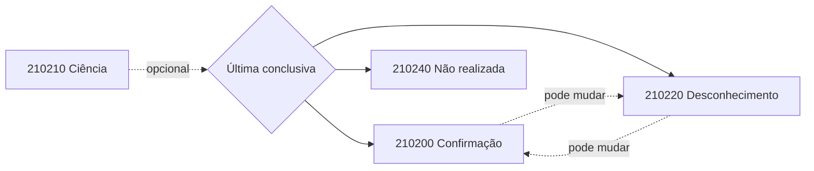

## O que o manual diz

O destinatário pode manifestar-se sobre uma NF-e em que está envolvido. São **quatro** eventos (NT 2012.002):

| `tpEvento` | Evento | Significado |
|---|---|---|
| `210210` | **Ciência da Operação** | reconhece a existência da NF-e, sem manifestação conclusiva ainda |
| `210200` | **Confirmação da Operação** | a operação ocorreu exatamente como na NF-e |
| `210220` | **Desconhecimento da Operação** | a operação não foi solicitada pelo destinatário |
| `210240` | **Operação não Realizada** | houve participação, mas a operação não se efetivou |

### Regra de mudança (importante)

> O destinatário pode enviar Confirmação, Desconhecimento ou Operação não Realizada, **valendo apenas a última mensagem registrada**. Ex.: pode desconhecer uma operação que havia confirmado, ou confirmar uma que havia desconhecido.

A **Ciência da Emissão** (`210210`) **não** é manifestação final: é opcional, pode ser evitada, e não cabe registrá-la **após** uma manifestação conclusiva. Depois de um período, toda "Ciência" deve evoluir para uma das três manifestações conclusivas.

### Como operacionalizar

- por **Web Services** no Ambiente Nacional (recebe as chaves destinadas e registra eventos de forma automatizada);
- por **consulta no Portal Nacional** (com certificado, menu "Manifestação Destinatário");
- pelo **Programa Manifestador**.

## Como interpretar

A manifestação conclusiva é **idempotente por substituição**: o estado vigente é sempre o do **último** evento conclusivo registrado, não uma máquina de estados com transições proibidas. Por isso o histórico deve ser preservado, mas a decisão de negócio usa o último.

> **Correção de modelagem:** não modele os quatro estados como finais sem transição. O MOC permite nova manifestação; **prevalece a última registrada**. Calcule a manifestação vigente pela ordem dos eventos.

## Vigência

- 🔄 Obrigatoriedade de manifestação depende da operação e evolui por NT.
- 📍 Cenários de obrigatoriedade podem variar conforme regras setoriais.

## Implicação de implementação

> **Implementação:** guarde todos os eventos de manifestação com `dhEvento`/`nSeqEvento` e derive o estado atual como `last(conclusivos)`. Para obter a NF-e completa via [Distribuição de DF-e](/docs/emissao-e-comunicacao/distribuicao-dfe), o destinatário precisa ter manifestado antes.

## Fonte

MOC 7.0 — Visão Geral, §3.2 (especialmente §3.2.1.5), p. 30–35.
