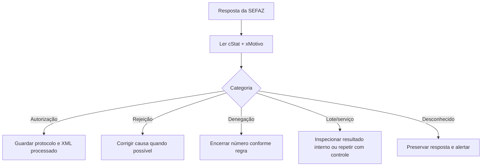
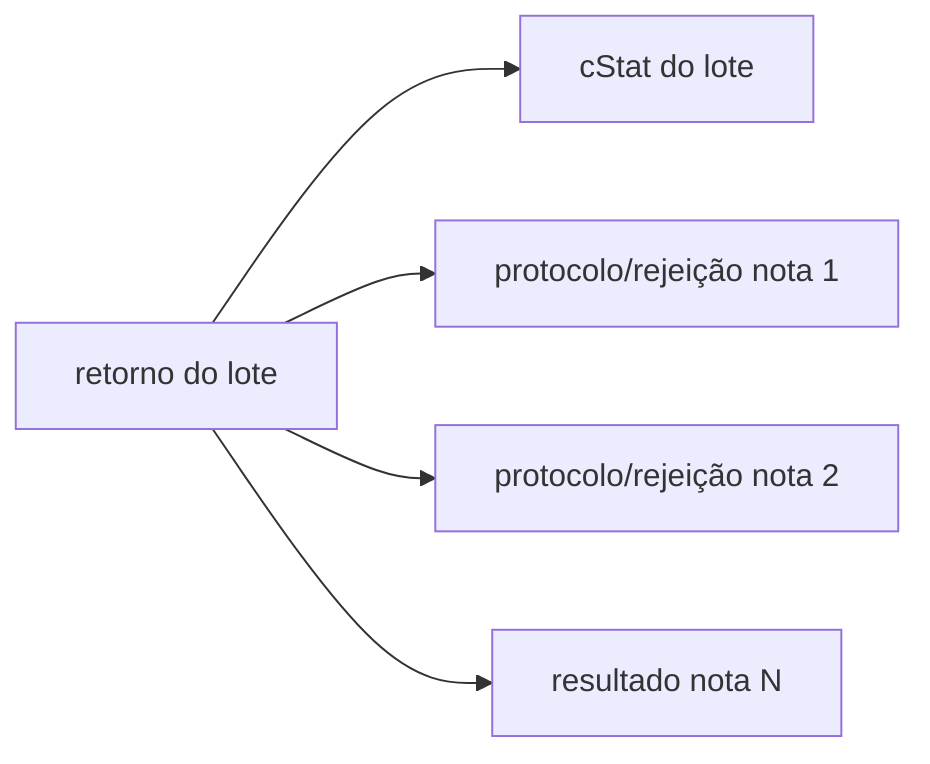

## `cStat` é um resultado, não uma exceção genérica

O sistema deve interpretar o código **no contexto do serviço**. O mesmo número não deve ser tratado por uma lista global sem considerar o tipo de resposta.

## Categorias

### Autorizada

O retorno de autorização contém protocolo. Armazene o XML enviado, a resposta e o documento processado (`procNFe`).

### Rejeitada

A solicitação não foi aceita por falha estrutural ou de negócio. Muitas rejeições permitem corrigir e reenviar, mas a decisão depende da causa e do estado da numeração.

### Denegada

No Anexo I 7.03, os códigos de denegação listados são:

| `cStat` | Motivo |
|---:|---|
| `301` | irregularidade fiscal do emitente |
| `302` | irregularidade fiscal do destinatário |
| `303` | destinatário não habilitado a operar na UF |

Denegação não é simples erro de preenchimento. Preserve o histórico e não trate como rejeição corrigível comum.

### Erro não catalogado

`999` representa erro não catalogado. Guarde resposta integral, correlação, serviço, ambiente e horário para diagnóstico.

## Resultado do lote não é resultado da nota

Um lote processado pode conter notas rejeitadas. Sempre percorra os resultados individuais — ver [RetAutorizacao](/docs/emissao-e-comunicacao/ret-autorizacao).

## Não dependa do texto

Use `cStat` para decisão e `xMotivo` para diagnóstico. O texto pode variar em acentuação, detalhes e marcadores como `[nItem]`, `[nOcor]` ou valores calculados.

> **Implementação:** não descarte códigos desconhecidos — atualizações por NT introduzem resultados antes da atualização da aplicação. Trate `cStat` como inteiro de decisão e mantenha um _fallback_ seguro para o não catalogado.

## Diagnóstico útil

Registre: chave/identificador da solicitação; serviço e URL lógica (sem segredo); ambiente e UF; versão do schema; `cStat` e `xMotivo`; item/ocorrência apontada; hash do XML; horário, duração e tentativa. Não registre chave privada, senha do certificado ou dados pessoais sem necessidade.

## Vigência

- 🔄 A lista reflete a versão 7.03 e deve ser complementada pelas Notas Técnicas posteriores. O erro **656 (consumo indevido)** vem da NT 2018.002 — ver [uso indevido](/docs/emissao-e-comunicacao/recibo-e-uso-indevido).

## Fonte

MOC 7.0 — Anexo I, §4.4 (Lista das Regras de Validação), p. 143–153.
