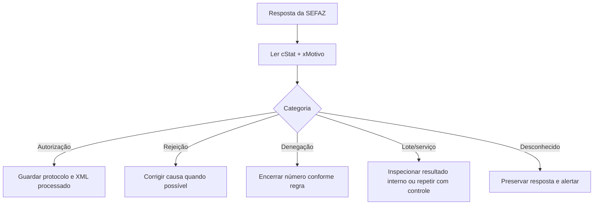
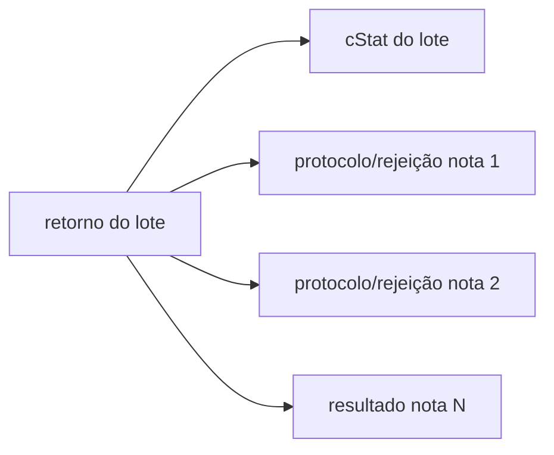

## `cStat` é um resultado, não uma exceção genérica

O sistema deve interpretar o código **no contexto do serviço**. O mesmo número não deve ser tratado por uma lista global sem considerar o tipo de resposta.

## Categorias

### Autorizada

O retorno de autorização contém protocolo. Armazene o XML enviado, a resposta e o documento processado (`procNFe`).

### Rejeitada

A solicitação não foi aceita por falha estrutural ou de negócio. Muitas rejeições permitem corrigir e reenviar, mas a decisão depende da causa e do estado da numeração.

### Denegada

No Anexo I 7.03, os códigos de denegação listados são:

| `cStat` | Motivo |
|---:|---|
| `301` | irregularidade fiscal do emitente |
| `302` | irregularidade fiscal do destinatário |
| `303` | destinatário não habilitado a operar na UF |

Denegação não é simples erro de preenchimento. Preserve o histórico e não trate como rejeição corrigível comum.

> 🔄 **Fim da denegação no modelo 55.** A **NT 2024.001 v1.20** (Ajuste SINIEF 43/23) elimina o processo de **denegação para a NF-e (modelo 55)**, convertendo-o em **rejeição**: a regra de denegação `1C17-40` foi excluída e as situações antes denegadas passam a rejeitar (`1C17-38` → 781 emitente; `1C17-50` → 307; `5E17-40` → 302; `5E17-60` → 303). A denegação permanece apenas nos cenários ainda previstos para outros modelos.

### Erro não catalogado

`999` representa erro não catalogado. Guarde resposta integral, correlação, serviço, ambiente e horário para diagnóstico.

## Resultado do lote não é resultado da nota

Um lote processado pode conter notas rejeitadas. Sempre percorra os resultados individuais — ver [RetAutorizacao](/docs/emissao-e-comunicacao/ret-autorizacao).

## Não dependa do texto

Use `cStat` para decisão e `xMotivo` para diagnóstico. O texto pode variar em acentuação, detalhes e marcadores como `[nItem]`, `[nOcor]` ou valores calculados.

> **Implementação:** não descarte códigos desconhecidos — atualizações por NT introduzem resultados antes da atualização da aplicação. Trate `cStat` como inteiro de decisão e mantenha um _fallback_ seguro para o não catalogado.

## Diagnóstico útil

Registre: chave/identificador da solicitação; serviço e URL lógica (sem segredo); ambiente e UF; versão do schema; `cStat` e `xMotivo`; item/ocorrência apontada; hash do XML; horário, duração e tentativa. Não registre chave privada, senha do certificado ou dados pessoais sem necessidade.

## Overlay de NTs

Códigos introduzidos depois do corte do Anexo I 7.03 (lista parcial — confirme na NT vigente):

| `cStat` | Motivo | NT |
|---:|---|---|
| `242` | Rejeição: Mensagem SOAP inválida | 2020.005 v1.21 |
| `446` | Rejeição: Informado CEST inexistente | 2020.005 v1.21 |
| `452` | Rejeição: Solicitada resposta assíncrona para lote com apenas 1 NFC-e | 2020.005 v1.21 |
| `939` | Rejeição: Cancelamento de NF-e com evento de Averbação para Exportação | 2020.005 v1.21 |
| `940` | Rejeição: Cancelamento de NF-e com evento Financeiro | 2020.005 v1.21 |
| `307` | Uso Denegado: Emitente bloqueado pela UF de destino em operação com consumidor final | 2020.005 v1.21 |
| `474` | Rejeição: FCP não deve ser destacado na NF-e conforme legislação estadual | 2022.003 v1.11 |
| `475` | Rejeição: Operação não permitida para não contribuinte | 2022.003 v1.11 |
| `951` | Rejeição: Chave de Acesso referenciada com código numérico zerado não permitida para finalidade diferente de normal | 2022.003 v1.11 |
| `952` | Rejeição: Chave de Acesso referenciada com a mesma Chave Natural da Nota Fiscal atual | 2022.003 v1.11 |
| `953` | Rejeição: Chave de Acesso referenciada com tipo de emissão inválido | 2022.003 v1.11 |
| `460` | Rejeição: Protocolo do Evento difere do cadastrado | 2021.001 v1.01 · reutilizado na 2023.005 v1.02 |
| `821` | Rejeição: Data-Hora de Entrega superior à data de emissão do evento | 2021.001 v1.01 · reutilizado na 2023.005 v1.02 |
| `822` | Rejeição: Data-Hora do Hash de Entrega superior à data de emissão do evento | 2021.001 v1.01 · reutilizado na 2023.005 v1.02 |
| `823` | Rejeição: Data-Hora de Entrega inferior à data de emissão da NF-e | 2021.001 v1.01 · reutilizado na 2023.005 v1.02 |
| `824` | Rejeição: Data-Hora do Hash de Entrega inferior à data de emissão da NF-e | 2021.001 v1.01 · reutilizado na 2023.005 v1.02 |
| `825` | Rejeição: Não permitido mais de um Evento de Insucesso na Entrega para a NF-e | 2021.001 v1.01 · reutilizado na 2023.005 v1.02 |
| `826` | Rejeição: Pedido de Cancelamento para NF-e com evento de Entrega | 2021.001 v1.01 · reutilizado na 2023.005 v1.02 |
| `545` | Rejeição: NF-e de devolução com valor total superior a NF-e devolvida | 2022.005 v1.11 |
| `546` | Rejeição: NF-e de devolução com valor do ICMS superior a NF-e devolvida | 2022.005 v1.11 |
| `566` | Rejeição: NF-e de devolução com valor do FCP superior a NF-e devolvida | 2022.005 v1.11 |
| `567` | Rejeição: NF-e de devolução com valor do ICMS da UF Destino superior a NF-e devolvida | 2022.005 v1.11 |
| `581` | Rejeição: NF-e de devolução com valor do FCP da UF Destino superior a NF-e devolvida | 2022.005 v1.11 |
| `694` | Rejeição: Não informado o grupo de ICMS para a UF de destino | 2022.005 v1.11 |
| `657` | Rejeição: Data de Pagamento inválida | 2024.002 v1.00 |
| `961` | Rejeição: CNPJ transacional do pagamento inválido | 2024.002 v1.00 |
| `437` | Rejeição: CNPJ da instituição de pagamento inválido | 2024.002 v1.00 |
| `618` | Rejeição: Chave de Acesso inválida (Modelo diferente de 55/65) | 2024.002 v1.00 |
| `796` | Rejeição: CNPJ recebedor do pagamento inválido | 2023.004 v1.20 |
| `963` | Rejeição: Tipo de pagamento não aceita o grupo de cartões ou boletos | 2023.004 v1.20 |
| `965` | Rejeição: Valor do troco acima do permitido | 2023.004 v1.20 |
| `652` | Rejeição: Informado indicador de desoneração inválido para a ZFM | 2023.004 v1.20 |
| `337` | Rejeição: CFOP inválido para emitente MEI (CRT=4) | 2024.001 v1.20 |
| `590` | Rejeição: Informado CST para emissor do Simples Nacional (CRT=1 ou 4) | 2024.001 v1.20 |
| `591` | Rejeição: Informado CSOSN para emissor que não é do Simples Nacional (CRT diferente de 1 ou 4) | 2024.001 v1.20 |
| `781` | Rejeição: Emissor não habilitado para emissão da NF-e/NFC-e | 2024.001 v1.20 |
| `782` | Rejeição: CSOSN inválido para emitente MEI (CRT=4) | 2024.001 v1.20 |
| `966` | Rejeição: Obrigatório o preenchimento da origem da mercadoria | 2024.001 v1.20 |
| `371` | Rejeição: CNPJ/CPF Autorizado não é emitente de CT-e | 2020.007 v1.40 |
| `421` | Rejeição: Informado o CNPJ/CPF do Emitente (ator interessado) | 2020.007 v1.40 |
| `422` | Rejeição: Informado o CNPJ/CPF do Destinatário (ator interessado) | 2020.007 v1.40 |
| `423` | Rejeição: CNPJ/CPF já está autorizado a acessar o XML da NF-e | 2020.007 v1.40 |
| `448` | Rejeição: CNPJ/CPF Autor não é emitente de CT-e | 2020.007 v1.40 |
| `449` | Rejeição: Modalidade de Frete não é por conta do Destinatário | 2020.007 v1.40 |
| `585` | Rejeição: Transportador não autorizado a emitir evento para esse documento fiscal | 2020.007 v1.40 |
| `827` | Rejeição: Obrigatório informar o tipo de autorização | 2020.007 v1.40 |
| `828` | Rejeição: Não permitido informar o campo tipo de autorização | 2020.007 v1.40 |
| `829` | Rejeição: Condição de uso não informado para o tipo de autorização de uso | 2020.007 v1.40 |
| `830` | Rejeição: Não permitido preencher o campo Condição de Uso | 2020.007 v1.40 |
| `831` | Rejeição: Transportador Contratado não autorizado a liberar acesso à NF-e | 2020.007 v1.40 |
| `818` | Rejeição: CNPJ incorreto na assinatura da NFF (certificado fora da base CNPJ da SVRS) | 2021.002 v1.12 |
| `819` | Rejeição: Informação de Solicitação de NFF (`infSolicNFF`) não pode estar preenchida fora de `tpEmis=3` | 2021.002 v1.12 |
| `820` | Rejeição: Informado produto fiscal de NFF (`infProdNFF`) fora de `tpEmis=3` ou NF-e Avulsa | 2021.002 v1.12 |
| `832` | Rejeição: CNPJ incorreto na transmissão da NFF (certificado fora da base CNPJ da SVRS) | 2021.002 v1.12 |
| `833` | Rejeição: Informada embalagem do produto (`infProdEmb`) fora de `tpEmis=3` ou NF-e Avulsa | 2021.002 v1.12 |
| `834` | Rejeição: Informação de Solicitação de NFF (`infSolicNFF`) não preenchida em `tpEmis=3` | 2021.002 v1.12 |
| `638` | Rejeição: Quantidade de Pedidos de Prorrogação 1º prazo autorizados sem resposta do Fisco excede o limite (20, ou 1 a critério da UF) | 2015.001 v1.30 |
| `639` | Rejeição: Quantidade de Pedidos de Prorrogação 2º prazo autorizados sem resposta do Fisco excede o limite (20, ou 1 a critério da UF) | 2015.001 v1.30 |
| `808` | Rejeição: Evento Fisco (Resposta à Prorrogação) emitido por contribuinte | 2015.001 v1.30 |
| `809` | Rejeição: ID do Pedido de Prorrogação/Cancelamento não existe na base ou não há prorrogação deferida para o `tpEvento` | 2015.001 v1.30 |
| `810` | Rejeição: `tpEvento` do Evento Fisco não corresponde ao `tpEvento` do Pedido de Prorrogação/Cancelamento | 2015.001 v1.30 |
| `811` | Rejeição: Pedido de Prorrogação deferido impede o cancelamento da NF-e | 2015.001 v1.30 |
| `890` | Rejeição: GTIN (`cEAN`) inexistente no Cadastro Centralizado de GTIN (CCG) | 2021.003 v1.40 |
| `891` | Rejeição: GTIN (`cEAN`) incompatível com a NCM | 2021.003 v1.40 |
| `894` | Rejeição: GTIN da unidade tributável (`cEANTrib`) inexistente no CCG | 2021.003 v1.40 |
| `895` | Rejeição: GTIN da unidade tributável (`cEANTrib`) incompatível com a NCM | 2021.003 v1.40 |
| `854` | Rejeição: Unidade Tributável (`uTrib`) incompatível com produto informado | 2023.001 v1.60 |
| `907` | Rejeição: Grupo de combustível não pode ter o índice de mistura do Biocombustível | 2023.001 v1.60 |
| `908` | Rejeição: Obrigatório o preenchimento do índice de mistura do Biocombustível | 2023.001 v1.60 |
| `909` | Rejeição: Obrigatório o preenchimento do grupo de UF de origem do combustível | 2023.001 v1.60 |
| `747` | Rejeição: Não permitido o preenchimento do grupo de UF de origem do combustível | 2023.001 v1.60 |
| `958` | Rejeição: Somatório dos percentuais originários para a UF do combustível diverge de 100 | 2023.001 v1.60 |
| `959` | Rejeição: NF-e não pode ter preenchimento de Grupo de Tributação do ICMS monofásica sobre combustíveis | 2023.001 v1.60 |
| `960` | Rejeição: Obrigatório o preenchimento de Grupo de Tributação do ICMS monofásica sobre combustíveis | 2023.001 v1.60 |
| `767` | Rejeição: Obrigatório o preenchimento da Quantidade tributada (ICMS monofásico) | 2023.001 v1.60 |
| `768` | Rejeição: Obrigatório o preenchimento da Quantidade tributada sujeita a retenção | 2023.001 v1.60 |
| `769` | Rejeição: Obrigatório o preenchimento da Quantidade tributada retida anteriormente | 2023.001 v1.60 |
| `961` | Rejeição: Alíquota ad rem do imposto difere do definido na legislação para o produto | 2023.001 v1.60 |
| `962` | Rejeição: Valor do ICMS próprio (monofásico) difere do calculado | 2023.001 v1.60 |
| `963` | Rejeição: Alíquota ad rem do imposto com retenção difere do definido na legislação | 2023.001 v1.60 |
| `964` | Rejeição: Valor do ICMS com retenção difere do calculado | 2023.001 v1.60 |
| `965` | Rejeição: Alíquota ad rem do imposto retido anteriormente difere do definido na legislação | 2023.001 v1.60 |
| `700` | Rejeição: Total da quantidade tributada do ICMS monofásico próprio difere do somatório dos itens | 2023.001 v1.60 |
| `723` | Rejeição: Total da quantidade tributada do ICMS monofásico sujeito a retenção difere do somatório dos itens | 2023.001 v1.60 |
| `744` | Rejeição: Total da quantidade tributada do ICMS monofásico retido anteriormente difere do somatório dos itens | 2023.001 v1.60 |
| `967` | Rejeição: Total do ICMS monofásico próprio difere do somatório dos itens | 2023.001 v1.60 |
| `968` | Rejeição: Total do ICMS monofásico sujeito a retenção difere do somatório dos itens | 2023.001 v1.60 |
| `969` | Rejeição: Total do ICMS monofásico retido anteriormente difere do somatório dos itens | 2023.001 v1.60 |
| `906` | Rejeição: Não informados os campos para informações do ICMS Efetivo | 2018.005 v1.52 |
| `938` | Rejeição: Não informada `vBCSTRet`, `pST`, `vICMSSubstituto` e `vICMSSTRet` | 2018.005 v1.52 |
| `970` | Rejeição: Código de País inexistente (local de retirada/entrega) | 2018.005 v1.52 |
| `971` | Rejeição: IE inválida (local de retirada/entrega) | 2018.005 v1.52 |
| `972` | Rejeição: Obrigatória as informações do responsável técnico | 2018.005 v1.52 |
| `973` | Rejeição: CNPJ do responsável técnico inválido | 2018.005 v1.52 |
| `974` | Rejeição: CNPJ do responsável técnico diverge do cadastrado | 2018.005 v1.52 |
| `975` | Rejeição: Obrigatória a informação do identificador do CSRT e do Hash do CSRT | 2018.005 v1.52 |
| `976` | Rejeição: Identificador do CSRT não cadastrado na SEFAZ | 2018.005 v1.52 |
| `977` | Rejeição: Identificador do CSRT revogado | 2018.005 v1.52 |
| `978` | Rejeição: Hash do CSRT diverge do calculado | 2018.005 v1.52 |
| `308` | Rejeição: CPF inválido para responsável técnico do receituário de agrotóxico | 2024.003 v1.10 |
| `309` | Rejeição: Nenhum item é defensivo agrícola e foi informado receituário | 2024.003 v1.10 |
| `310` | Rejeição: Informação indevida de Guia de Trânsito Animal | 2024.003 v1.10 |
| `311` | Rejeição: Não informada Guia de Trânsito Vegetal | 2024.003 v1.10 |
| `312` | Rejeição: Informação indevida de Guia de Trânsito Vegetal | 2024.003 v1.10 |
| `835` | Rejeição: Produto agrotóxico sem receita/receituário | 2024.003 v1.10 |
| `836` | Rejeição: Não informada Guia de Trânsito Animal | 2024.003 v1.10 |
| `837` | Rejeição: Guia de trânsito inválida | 2024.003 v1.10 |
| `838` | Rejeição: Guia de trânsito já utilizada | 2024.003 v1.10 |
| `839` | Rejeição: Madeira sem documento de origem | 2024.003 v1.10 |
| `1178` | Rejeição: Utilização de PAA não permitida para contribuinte enquadrado no regime normal | 2026.001 v1.00 |
| `1179` | Rejeição: Ambiente de autorização inválido para emissão pelo PAA | 2026.001 v1.00 |
| `1180` | Rejeição: CNPJ do PAA inválido | 2026.001 v1.00 |
| `1181` | Rejeição: Provedor de Assinatura e Autorização não existe na base da SEFAZ | 2026.001 v1.00 |
| `1182` | Rejeição: Emitente não associado ao PAA | 2026.001 v1.00 |
| `1183` | Rejeição: Emissão por PAA deve ser assinada pelo CNPJ do provedor | 2026.001 v1.00 |
| `1184` | Rejeição: Emissão por PAA com assinatura RSA inválida | 2026.001 v1.00 |
| `120` | Autorizado o uso da NF-e, com alerta | 2026.002 v1.00 |
| `172` | Alerta: Situação do CNPJ destinatário inabilitado no momento da autorização | 2026.002 v1.00 |
| `1000–1218` | Rejeições RTC de finalidade crédito/débito, IBS/CBS/IS, SUFRAMA/ALC, compras governamentais, referências, créditos e totais; use `xMotivo` e a regra indicada, pois a faixa não representa uma única causa | 2025.002 v1.50 |
| `1200–1202` | `cClassTrib` incompatível com finalidade ou tipo de nota de débito/crédito | 2025.002 v1.50 |
| `1219–1272` | Rejeições do leiaute monofásico reformulado: escolha temporal ad rem/ad valorem, grupos padrão/retenção/retido e cálculos de IBS/CBS e diferença de biocombustível | 2025.002 v1.50 |
| `897` | Rejeição: Código numérico (`cNF`) em formato inválido (sequência fraca ou igual ao `nNF`) | 2019.001 v1.70 |
| `922` | Rejeição: Contranota de Produtor só pode referenciar NF-e ou NF de Produtor Modelo 4 | 2019.001 v1.70 |
| `923` | Rejeição: Referenciado documento de operação interna em operação interestadual ou com o exterior | 2019.001 v1.70 |
| `924` | Rejeição: Informado Cupom Fiscal referenciado em UF que não permite | 2019.001 v1.70 |
| `925` | Rejeição: NF-e com identificação de estrangeiro e IE informada para destinatário | 2019.001 v1.70 |
| `926` | Rejeição: Operação com Exterior e país de destino igual a Brasil | 2019.001 v1.70 |
| `927` | Rejeição: Número do item (`nItem`) fora da ordem sequencial | 2019.001 v1.70 |
| `928` | Rejeição: Informado `cBenef` para CST sem benefício fiscal | 2019.001 v1.70 |
| `929` | Rejeição: Informado CST de diferimento sem as informações de diferimento | 2019.001 v1.70 |
| `930` | Rejeição: CST com benefício fiscal e não informado o `cBenef` | 2019.001 v1.70 |
| `931` | Rejeição: CST não corresponde ao tipo de código de benefício fiscal | 2019.001 v1.70 |
| `932` | Rejeição: Modalidade da BC da ST = MVA e não informado `pMVAST` | 2019.001 v1.70 |
| `933` | Rejeição: Modalidade da BC da ST ≠ MVA e informado `pMVAST` | 2019.001 v1.70 |
| `934` | Rejeição: Não informado valor do ICMS desonerado ou motivo de desoneração | 2019.001 v1.70 |
| `935` | Rejeição: Valor total da Base de Cálculo superior ao limite estabelecido pela UF | 2019.001 v1.70 |
| `936` | Rejeição: Razão Social do emitente diverge do cadastro da SEFAZ | 2019.001 v1.70 |
| `946` | Rejeição: Informado `cBenef` incorreto ou inexistente na UF | 2019.001 v1.70 |
| `507` | Rejeição: Grupo de informações sobre o Crédito Presumido não permitido | 2019.001 v1.70 |
| `626` | Rejeição: CFOP de operação isenta para ZFM diferente do previsto | 2019.001 v1.70 |
| `664` | Rejeição: `cCredPresumido` incorreto, inexistente ou incompatível na UF | 2019.001 v1.70 |
| `665` | Rejeição: Não informado `cBenefRBC` quando o percentual de redução de BC > 0 (CST 51) | 2019.001 v1.70 |
| `666` | Rejeição: `cBenefRBC` incorreto, inexistente ou incompatível na UF | 2019.001 v1.70 |
| `696` | Rejeição: Operação com não contribuinte deve indicar operação com consumidor final | 2019.001 v1.70 |
| `305` | Rejeição: Destinatário bloqueado na UF | 2019.001 v1.70 |
| `306` | Rejeição: IE do destinatário não está ativa na UF | 2019.001 v1.70 |
| `126` | Rejeição: Enviado lote com mais de 1 NFC-e (NFC-e sem lote assíncrono; ver também `961`) | 2023.002 v1.01 |
| `401` | Rejeição: CPF do emitente inválido | 2023.002 v1.01 |
| `494` | Rejeição: Chave de Acesso inexistente (evento) | 2023.002 v1.01 |
| `560` | Rejeição: CNPJ base/CPF do emitente difere do da 1ª NF-e do lote | 2023.002 v1.01 |
| `574` | Rejeição: O autor do evento diverge do emissor da NF-e | 2023.002 v1.01 |
| `617` | Rejeição: Chave de Acesso inválida (CNPJ/CPF zerado ou dígito inválido) | 2023.002 v1.01 |
| `957` | Rejeição: Tipo de emissão incompatível com o Processo de Emissão | 2023.002 v1.01 |
| `228` | Rejeição: Data de Emissão muito atrasada (acima do limite da UF) | 2025.001 v1.03 |
| `300` | Rejeição: Tipo da IE do Destinatário difere de Não Contribuinte no cadastro da UF | 2025.001 v1.03 |
| `391` | Rejeição: Não informados os dados do cartão de crédito/débito no pagamento | 2025.001 v1.03 |
| `392` | Rejeição: Não informados os dados da operação de pagamento por cartão | 2025.001 v1.03 |
| `407` | Rejeição: NFC-e com qrCode na versão 3 (UF ainda não aceita) | 2025.001 v1.03 |
| `443` | Rejeição: Código da bandeira de cartão de crédito/débito inexistente | 2025.001 v1.03 |
| `444` | Rejeição: NFC-e com qrCode na versão 2 para Pessoa Física | 2025.001 v1.03 |
| `445` | Rejeição: Parâmetro assinatura não deve ser informado no qrCode | 2025.001 v1.03 |
| `583` | Rejeição: Valor da assinatura do qrCode difere do calculado | 2025.001 v1.03 |
| `776` | Rejeição: Solicitada resposta síncrona para UF que não disponibiliza | 2025.001 v1.03 |
| `797` | Rejeição: Data de vencimento da parcela superior a 10 anos | 2025.001 v1.03 |
| `805` | Rejeição: A SEFAZ do destinatário não permite Contribuinte Isento de Inscrição Estadual | 2025.001 v1.03 |
| `853` | Rejeição: Dados de cobrança não devem ser informados para pagamento à vista | 2025.001 v1.03 |
| `865` | Rejeição: Total dos pagamentos menor que o total da nota | 2025.001 v1.03 |
| `866` | Rejeição: Ausência de troco quando os pagamentos superam o total da nota | 2025.001 v1.03 |
| `904` | Rejeição: Informado indevidamente campo valor de pagamento (`tPag`=90/91) | 2025.001 v1.03 |

> **Colisões de `cStat` (reuso por NTs distintas):** `452` (resposta assíncrona) foi estendido da NFC-e para o lote de 1 NF-e pela NT 2025.001; `474`, `437` e `781` já existiam (NT 2022.003/2024.002/2024.001) e foram reaproveitados — `474` significa "FCP não destacado" **ou** "parâmetro assinatura deve ser informado no qrCode" (NT 2025.001), `961` é usado por NT 2024.002 (CNPJ transacional), NT 2023.001 (alíquota ad rem) **e** NT 2023.002 (lote NFC-e). Sempre decida pelo `xMotivo` e pela regra de validação, não só pelo número. Os códigos de transporte da [NFeDistribuicaoDFe](/docs/emissao-e-comunicacao/distribuicao-dfe) (NT 2014.002: 108/137/138/214/215/489/490/589/593/614–619/632/640/641/653/654/656…) ficam documentados naquela página e em [Recibo e uso indevido](/docs/emissao-e-comunicacao/recibo-e-uso-indevido).

## Vigência

- 🔄 A lista reflete a versão 7.03 e deve ser complementada pelas Notas Técnicas posteriores. O erro **656 (consumo indevido)** vem da NT 2018.002 — ver [uso indevido](/docs/emissao-e-comunicacao/recibo-e-uso-indevido).
- 🔄 A NT 2025.002 amplia `cStat` para **3 ou 4 posições**. Não limite o parser a três dígitos; as rejeições exclusivas de IBS/CBS/IS usam a nova faixa de quatro dígitos.
- ⚠️ O código **966** aparece com dois sentidos nas NTs: "Obrigatório o preenchimento da origem da mercadoria" (NT 2024.001) e "Valor do ICMS retido anteriormente difere do calculado" (regra `N45-10`, NT 2023.001). Confirme o `xMotivo` na resposta e na NT vigente.

## Fonte

| Campo | Valor |
|---|---|
| Documento | MOC 7.0 — Anexo I, §4.4 (Lista das Regras de Validação), p. 143–153. |
| Versão | v1.21; v1.11; v1.02; v1.00 |
| Data | 15/10/2021; 25/01/2023; 26/04/2024; 27/05/2024 |
| Páginas/capítulo | §4; p. 143–153 |
| NT relacionada | NT 2020.005 v1.21; NT 2022.003 v1.11; NT 2023.005 v1.02; NT 2024.002 v1.00; NT 2022.005 v1.11; NT 2023.004 v1.20 |
| Schema/tabela relacionada | não indicada |
| Status | base oficial com overlay explícito de NT, IT ou schema |

### Registro de origem

MOC 7.0 — Anexo I, §4.4 (Lista das Regras de Validação), p. 143–153. Overlay: NT 2020.005 v1.21 (15/10/2021), NT 2022.003 v1.11 (25/01/2023), NT 2023.005 v1.02 (26/04/2024), NT 2024.002 v1.00 (27/05/2024), NT 2022.005 v1.11 (11/10/2024), NT 2023.004 v1.20 (07/10/2024), NT 2024.001 v1.20 (29/08/2024), NT 2020.007 v1.40 (02/08/2024), NT 2015.001 v1.30 (06/12/2024), NT 2021.002 v1.12 (28/01/2025), NT 2021.003 v1.40 (26/02/2025), NT 2023.001 v1.60 (09/06/2025), NT 2018.005 v1.52 (10/07/2025), NT 2019.001 v1.70 (18/08/2025), NT 2025.001 v1.03 (29/09/2025), NT 2023.002 v1.01 (18/11/2025), NT 2026.002 v1.00 (25/05/2026), NT 2025.002 v1.50 (03/06/2026).
