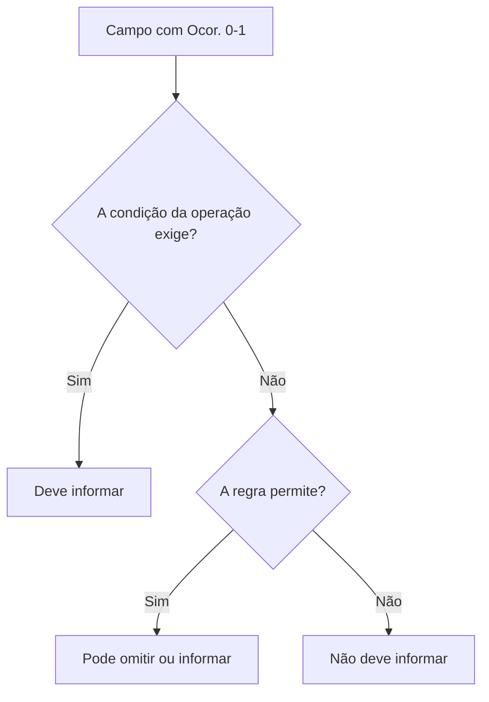

## Uma linha da tabela é um contrato

Cada linha informa onde um campo fica, como ele aparece no XML e quais limites estruturais possui.

| Coluna | Pergunta que responde |
|---|---|
| `#` | qual é a ordem de referência no documento? |
| `ID` | qual código identifica a linha no MOC? |
| `Campo` | qual é o nome da tag ou atributo XML? |
| `Descrição` | o que o dado representa? |
| `Ele` | é elemento, grupo, atributo ou escolha? |
| `Pai` | dentro de qual elemento ele aparece? |
| `Tipo` | é caractere, número ou data? |
| `Ocor.` | quantas vezes pode ou deve aparecer? |
| `Tam.` | qual tamanho ou precisão é aceita? |
| `Observação` | quais condições e domínios complementam a linha? |

## Tipos de elemento

| Símbolo | Significado prático |
|---|---|
| `G` | grupo de elementos |
| `CG` | grupo de escolha: somente uma alternativa deve ser usada |
| `E` | elemento XML |
| `A` | atributo XML |
| `CE` | escolha entre elementos |
| `ID` | identificador XML |
| `RC` | restrição de chave para garantir presença e unicidade |

Uma linha de grupo não produz valor textual. Ela organiza filhos.

```xml
<emit> <!-- grupo -->
  <CNPJ>12345678000199</CNPJ> <!-- elemento -->
  <xNome>Empresa Exemplo</xNome>
</emit>
```

## Ocorrência

Leia `mínimo-máximo`:

| Ocorrência | Leitura |
|---|---|
| `1-1` | obrigatório, exatamente uma vez |
| `0-1` | opcional, no máximo uma vez |
| `1-N` | obrigatório e repetível |
| `0-N` | opcional e repetível |

> Opcional no XSD não significa "livre para preencher". Uma regra de negócio pode exigir o campo em determinado cenário ou rejeitá-lo em outro.



## Tipos e tamanhos

| Exemplo | Leitura |
|---|---|
| `C 1-60` | texto entre 1 e 60 caracteres |
| `N 14` | número com 14 posições |
| `N 13v2` | número de tamanho máximo 13, com até 2 casas decimais |
| `N 11v0-4` | número de tamanho máximo 11, com 0 a 4 casas decimais |
| `D` | data no formato previsto, normalmente `AAAA-MM-DD` |

> **Implementação:** preserve identificadores como `CNPJ`, `cMun` e `CFOP` em string. Eles são números apenas no alfabeto aceito; não são valores para cálculo.

## ID não é o nome da tag

`B02` é o identificador documental de uma linha. `cUF` é a tag. Rejeições usam IDs compostos, como `B02-20`, para apontar uma regra relacionada ao campo.

```text
B02     → campo do leiaute
B02-20  → regra de validação ligada a esse domínio
```

Isso permite ligar documentação, código do validador, mensagem de erro e teste automatizado.

## Vigência

- 🔄 A estrutura de leiaute e os domínios mudam por Nota Técnica. Trate o ID como ponte estável entre fonte, código e teste, mas versione os valores.

## Checklist

- [ ] O gerador respeita a ordem dos elementos definida pelo XSD.
- [ ] Grupos de escolha são mutuamente exclusivos.
- [ ] Ocorrências repetíveis usam listas.
- [ ] Decimais não usam ponto flutuante sem controle.
- [ ] Identificadores preservam zeros à esquerda.
- [ ] Cada validação interna referencia o ID oficial quando existir.

## Fonte

MOC 7.0 — Anexo I, capítulo 2 (Leiaute da NF-e), p. 8–66; §3.1 (Abreviações), p. 67–69.
