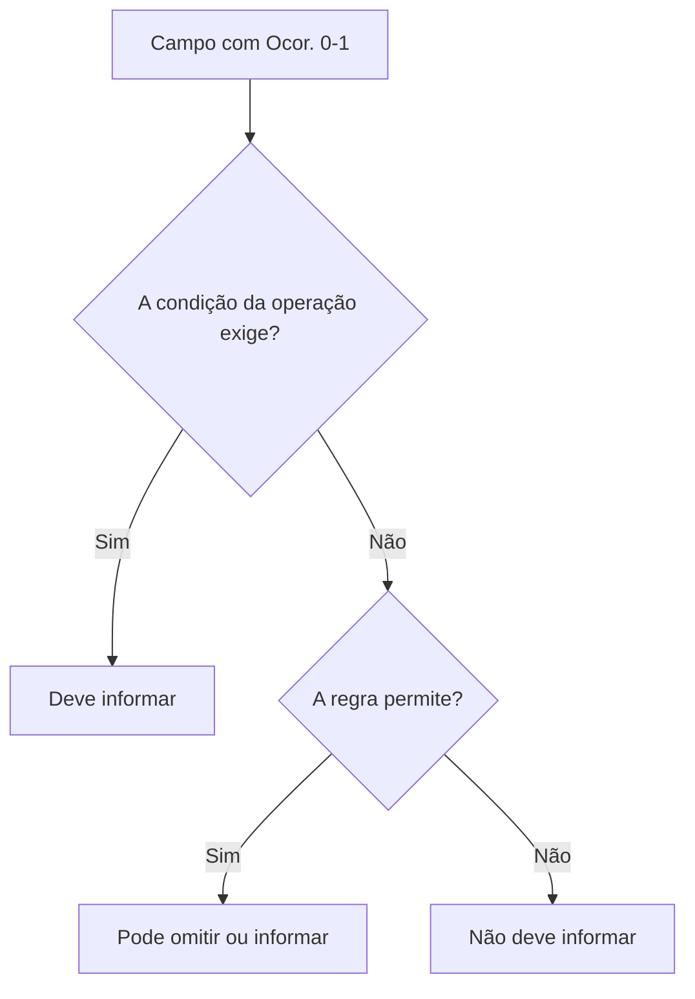

## Uma linha da tabela é um contrato

Cada linha informa onde um campo fica, como ele aparece no XML e quais limites estruturais possui.

| Coluna | Pergunta que responde |
|---|---|
| `#` | qual é a ordem de referência no documento? |
| `ID` | qual código identifica a linha no MOC? |
| `Campo` | qual é o nome da tag ou atributo XML? |
| `Descrição` | o que o dado representa? |
| `Ele` | é elemento, grupo, atributo ou escolha? |
| `Pai` | dentro de qual elemento ele aparece? |
| `Tipo` | é caractere, número ou data? |
| `Ocor.` | quantas vezes pode ou deve aparecer? |
| `Tam.` | qual tamanho ou precisão é aceita? |
| `Observação` | quais condições e domínios complementam a linha? |

## Tipos de elemento

| Símbolo | Significado prático |
|---|---|
| `G` | grupo de elementos |
| `CG` | grupo de escolha: somente uma alternativa deve ser usada |
| `E` | elemento XML |
| `A` | atributo XML |
| `CE` | escolha entre elementos |
| `ID` | identificador XML |
| `RC` | restrição de chave para garantir presença e unicidade |

Uma linha de grupo não produz valor textual. Ela organiza filhos.

```xml
<emit> <!-- grupo -->
  <CNPJ>12345678000199</CNPJ> <!-- elemento -->
  <xNome>Empresa Exemplo</xNome>
</emit>
```

## Ocorrência

Leia `mínimo-máximo`:

| Ocorrência | Leitura |
|---|---|
| `1-1` | obrigatório, exatamente uma vez |
| `0-1` | opcional, no máximo uma vez |
| `1-N` | obrigatório e repetível |
| `0-N` | opcional e repetível |

> Opcional no XSD não significa "livre para preencher". Uma regra de negócio pode exigir o campo em determinado cenário ou rejeitá-lo em outro.



## Tipos e tamanhos

| Exemplo | Leitura |
|---|---|
| `C 1-60` | texto entre 1 e 60 caracteres |
| `N 14` | número com 14 posições |
| `N 13v2` | número de tamanho máximo 13, com até 2 casas decimais |
| `N 11v0-4` | número de tamanho máximo 11, com 0 a 4 casas decimais |
| `D` | data no formato previsto, normalmente `AAAA-MM-DD` |

> **Implementação:** preserve identificadores como `CNPJ`, `cMun` e `CFOP` em string. Eles são números apenas no alfabeto aceito; não são valores para cálculo.

## Dicionário de tipos do schema

A notação `C 1-60` ou `N 13v2` das tabelas do Anexo I resolve, no XSD, para um `simpleType` nomeado com tamanho, casas decimais e regex exatos. Conhecer o tipo nomeado evita ambiguidade: é a forma que o parser aceita **antes** de qualquer Regra de Validação.

### Texto, identificadores e domínios fixos

| Tipo (XSD) | Forma exata | Onde aparece |
|---|---|---|
| `TString` | regex `[!-ÿ]{1}[ -ÿ]{0,}[!-ÿ]{1}` | base de todo texto: 1.º e último caractere não podem ser espaço |
| `TChNFe` | `[0-9]{44}` | chave de acesso |
| `TCnpj` | `[0-9]{14}` | CNPJ numérico (ver alfanumérico na chave de acesso) |
| `TCpf` | `[0-9]{11}` | CPF |
| `TCodMunIBGE` | `[0-9]{7}` | `cMun`, `cMunFG` |
| `TIe` / `TIeDest` | `[0-9]{2,14}` ou `ISENTO` | inscrição estadual |
| `TNF` | `[1-9]{1}[0-9]{0,8}` | `nNF` (1 a 999.999.999, sem zeros à esquerda) |
| `TSerie` | `0|[1-9]{1}[0-9]{0,2}` | `serie` (0 a 999) |
| `TMed` | `[0-9]{1,4}` | número de medição |
| `TPlaca` | `[A-Z]{2,3}[0-9]{4}` … `[A-Z0-9]{7}` | placa de veículo (admite padrão Mercosul) |

Textos com faixa explícita herdam de `TString`: `TVerAplic` 1–20, `TMotivo` 1–255, `TJust` 15–255 (justificativa de cancelamento/CCe exige no mínimo 15 caracteres).

### Datas e hora

| Tipo (XSD) | Formato | Observação |
|---|---|---|
| `TData` | `AAAA-MM-DD` | só ano `20xx`; valida mês, dia e ano bissexto na própria regex |
| `TTime` | `hh:mm:ss` | 00–23 / 00–59 / 00–59 |
| `TDateTimeUTC` | `AAAA-MM-DDThh:mm:ss±hh:00` | exige fuso (`-03:00`, `+00:00`…); usado em `dhEmi`, `dhSaiEnt`, `dhRecbto` |

### Decimais `TDec_IIDD`

O nome codifica a precisão: **`II`** = casas inteiras máximas, **`DD`** = casas decimais. Variações:

| Sufixo | Significado |
|---|---|
| (nenhum) | casas decimais fixas (`TDec_1302` = até 13 inteiros + exatamente 2 decimais) |
| `v` | casas decimais variáveis (`TDec_1104v` = 1 a 4 decimais) |
| `Opc` | não admite o valor zero |
| `Max100` | valor limitado a 100 (alíquotas percentuais) |

Exemplos do leiaute: `vProd`/`vNF` usam `TDec_1302` (13v2); quantidades comerciais usam `TDec_1104v` (11v0-4); alíquotas como `pICMS` usam `TDec_0302a04Max100`. Nunca normalize esses campos com ponto flutuante binário — a regex rejeita separador de milhar e exige ponto decimal.

## ID não é o nome da tag

`B02` é o identificador documental de uma linha. `cUF` é a tag. Rejeições usam IDs compostos, como `B02-20`, para apontar uma regra relacionada ao campo.

```text
B02     → campo do leiaute
B02-20  → regra de validação ligada a esse domínio
```

Isso permite ligar documentação, código do validador, mensagem de erro e teste automatizado.

## Vigência

- 🔄 A estrutura de leiaute e os domínios mudam por Nota Técnica. Trate o ID como ponte estável entre fonte, código e teste, mas versione os valores.

## Checklist

- [ ] O gerador respeita a ordem dos elementos definida pelo XSD.
- [ ] Grupos de escolha são mutuamente exclusivos.
- [ ] Ocorrências repetíveis usam listas.
- [ ] Decimais não usam ponto flutuante sem controle.
- [ ] Identificadores preservam zeros à esquerda.
- [ ] Cada validação interna referencia o ID oficial quando existir.

## Fonte

| Campo | Valor |
|---|---|
| Documento | MOC 7.0 — Anexo I, capítulo 2 (Leiaute da NF-e), p. 8–66; §3.1 (Abreviações), p. 67–69. |
| Versão | ver fonte original |
| Data | ver fonte original |
| Páginas/capítulo | §3; p. 8–66; p. 67–69; capítulo 2 (Leiaute da NF-e), p |
| NT relacionada | não indicada |
| Schema/tabela relacionada | PL_010c_NT2022_002v1.30 |
| Status | base oficial mapeada; confrontar com NT, IT, XSD e regra estadual vigentes |

### Registro de origem

MOC 7.0 — Anexo I, capítulo 2 (Leiaute da NF-e), p. 8–66; §3.1 (Abreviações), p. 67–69.

Schema: tiposBasico_v4.00 (PL_010c_NT2022_002v1.30).
