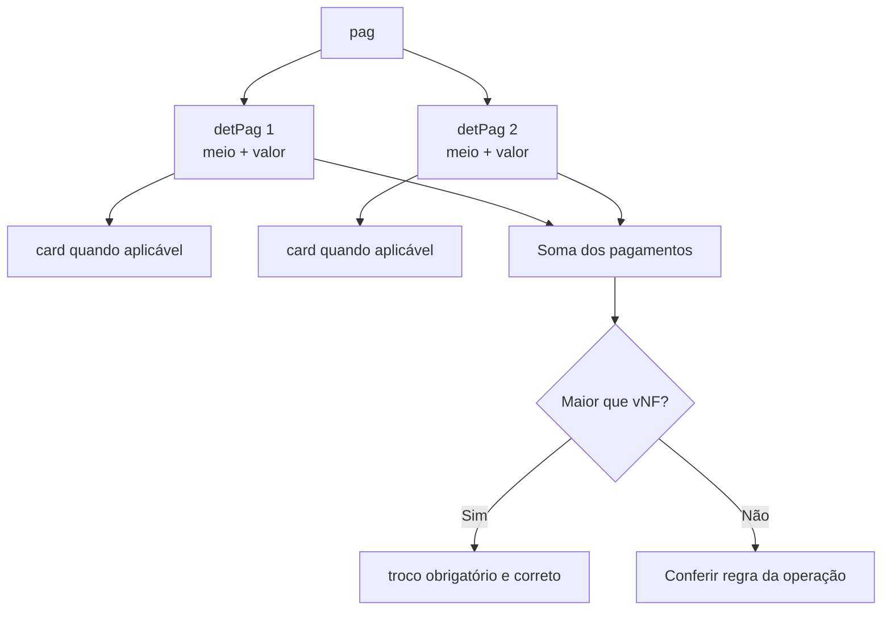
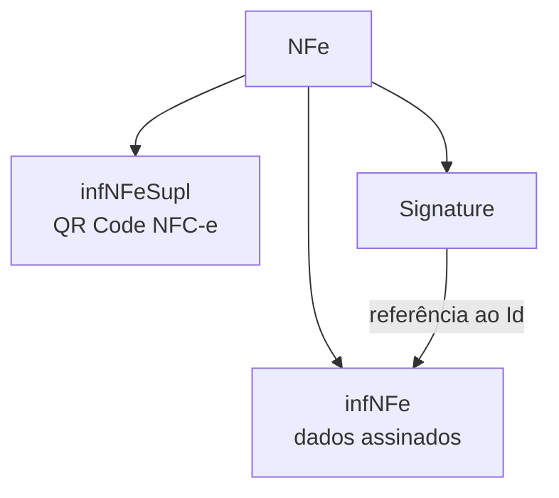

## Pagamentos

`pag` contém um ou mais `detPag`. Cada detalhe informa meio e valor, além de dados de cartão quando aplicáveis.

"Sem pagamento" é um meio específico e não deve ser combinado como se fosse dinheiro de valor zero fora das condições previstas.

## Intermediador da transação

O grupo `infIntermed` identifica o intermediador ou marketplace quando a operação ocorre em site ou plataforma de terceiro. Não confunda plataforma intermediadora, adquirente do cartão, credenciadora e software emissor — são papéis diferentes.

## Informações adicionais

`infAdic` possui campos de interesse do Fisco e do contribuinte, além de grupos para observações estruturadas e processos referenciados.

> **Implementação:** não use texto livre para substituir um campo estruturado existente.

## Comércio exterior, compras e cana

| Grupo | Uso |
|---|---|
| `exporta` | informações gerais de exportação |
| `compra` | empenho, pedido e contrato |
| `cana` | fornecimentos diários, totais e deduções de aquisição de cana |

Cada grupo é condicionado pela operação e pode ser proibido no modelo 65.

## Responsável técnico

`infRespTec` identifica a empresa responsável pelo sistema emissor: CNPJ, contato, e-mail, telefone, `idCSRT` e `hashCSRT`. Exigência e credenciamento do CSRT dependem da UF — ver [Responsável técnico](/docs/fundamentos/responsavel-tecnico). 📍

## Informações suplementares da NFC-e

`infNFeSupl` contém `qrCode` e `urlChave`. Esse grupo fica **fora** de `infNFe` e tem regras próprias.

> Gere o QR Code conforme o [manual do DANFE NFC-e e QR Code](/docs/danfe/danfe-nfce-qrcode) e a NT vigente, não apenas com base no Anexo I de 2020. 🔄

## Assinatura

`Signature` segue XMLDSig e referencia o `Id` de `infNFe`. Assine somente depois de concluir o conteúdo assinado — alterar qualquer campo depois invalida o digest. Ver [Arquitetura](/docs/emissao-e-comunicacao/arquitetura).

## Checklist

- [ ] Pagamentos têm meio e valor coerentes.
- [ ] Troco existe somente quando necessário e confere.
- [ ] Dados de cartão aparecem apenas no cenário aplicável.
- [ ] Intermediador representa o ator correto.
- [ ] Texto livre não duplica estrutura fiscal existente.
- [ ] Responsável técnico segue exigência da UF.
- [ ] QR Code usa a versão vigente.
- [ ] Nada dentro de `infNFe` muda após a assinatura.

## Fonte

MOC 7.0 — Anexo I, grupos YA a ZZ, p. 62–66.
