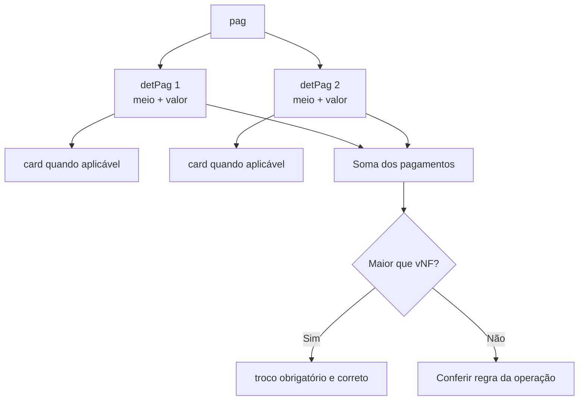
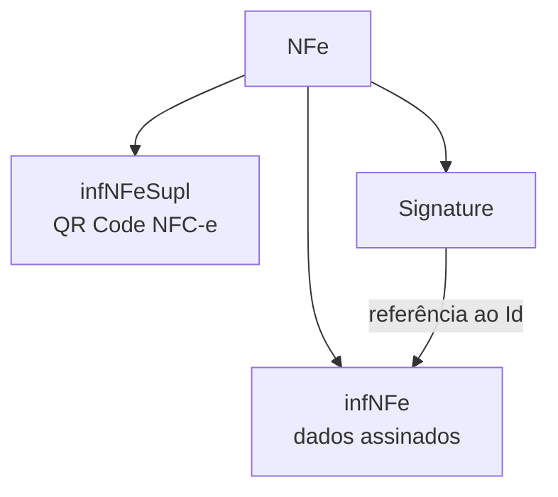

## Pagamentos

`pag` contém um ou mais `detPag`. Cada detalhe informa meio e valor, além de dados de cartão quando aplicáveis.

"Sem pagamento" é um meio específico e não deve ser combinado como se fosse dinheiro de valor zero fora das condições previstas.

No schema, `tPag` (forma de pagamento) **não** é enumeração fechada: aceita o padrão `[0-9]{2}` e os códigos (`01`=dinheiro, `03`=cartão de crédito, `17`=PIX, `90`=sem pagamento…) vêm da tabela do MOC/NT, validados por regra de negócio. Já são enumerações fechadas: `indPag` (`0`=à vista, `1`=a prazo) e, dentro de `card`, `tpIntegra` (`1`=pagamento integrado ao sistema do emissor · `2`=não integrado, maquininha avulsa).

### Bandeiras de cartão (`tBand`)

Quando `tPag` é cartão (03/04) ou outro meio com grupo `card`, a bandeira da operadora (`tBand`, dentro de `card`) é validada pela tabela do Portal Nacional (regra `YA06-10`). Valores vigentes (todos desde 01/01/2020):

| `tBand` | Operadora | `tBand` | Operadora |
|---|---|---|---|
| `01` | Visa | `15` | GoodCard |
| `02` | Mastercard | `16` | GreenCard |
| `03` | American Express | `17` | Hiper |
| `04` | Sorocred | `18` | JCB |
| `05` | Diners Club | `19` | Mais |
| `06` | Elo | `20` | MaxVan |
| `07` | Hipercard | `21` | Policard |
| `08` | Aura | `22` | RedeCompras |
| `09` | Cabal | `23` | Sodexo |
| `10` | Alelo | `24` | ValeCard |
| `11` | Banes Card | `25` | Verocheque |
| `12` | CalCard | `26` | VR |
| `13` | Credz | `27` | Ticket |
| `14` | Discover | `99` | Outros |

## Intermediador da transação

O grupo `infIntermed` identifica o intermediador ou marketplace quando a operação ocorre em site ou plataforma de terceiro. Não confunda plataforma intermediadora, adquirente do cartão, credenciadora e software emissor — são papéis diferentes.

A **NT 2020.006** estruturou esses papéis: o indicador `indIntermed` fica no grupo `ide` (ver [Identificação e atores](/docs/leiaute-e-rejeicoes/identificacao-e-atores)); o grupo `infIntermed` (YB) carrega o **CNPJ do intermediador** e o **identificador do cadastro do intermediador** (`idCadIntTran`, 2–60 caracteres); e o `YA05` foi esclarecido como **"CNPJ da instituição de pagamento"** (adquirente/subadquirente — ou o do intermediador, quando ele processa o pagamento). 🔄

## Informações adicionais

`infAdic` possui campos de interesse do Fisco e do contribuinte, além de grupos para observações estruturadas e processos referenciados.

> **Implementação:** não use texto livre para substituir um campo estruturado existente.

No grupo `procRef` (processo referenciado), o schema fecha dois domínios: `indProc` (origem do processo) — `0`=SEFAZ · `1`=Justiça Federal · `2`=Justiça Estadual · `3`=Secex/RFB · `4`=CONFAZ · `9`=outros; e `tpAto` (tipo do ato concessório, quando `indProc=0`) — `08`=Termo de Acordo · `10`=Regime Especial · `12`=Autorização específica · `14`=Ajuste SINIEF · `15`=Convênio ICMS.

## Comércio exterior, compras e cana

| Grupo | Uso |
|---|---|
| `exporta` | informações gerais de exportação |
| `compra` | empenho, pedido e contrato |
| `cana` | fornecimentos diários, totais e deduções de aquisição de cana |

Cada grupo é condicionado pela operação e pode ser proibido no modelo 65.

## Responsável técnico

`infRespTec` identifica a empresa responsável pelo sistema emissor: CNPJ, contato, e-mail, telefone, `idCSRT` e `hashCSRT`. Exigência e credenciamento do CSRT dependem da UF — ver [Responsável técnico](/docs/fundamentos/responsavel-tecnico). 📍

## Informações suplementares da NFC-e

`infNFeSupl` contém `qrCode` e `urlChave`. Esse grupo fica **fora** de `infNFe` e tem regras próprias.

> Gere o QR Code conforme o [manual do DANFE NFC-e e QR Code](/docs/danfe/danfe-nfce-qrcode) e a NT vigente, não apenas com base no Anexo I de 2020. 🔄

## Assinatura

`Signature` segue XMLDSig e referencia o `Id` de `infNFe`. Assine somente depois de concluir o conteúdo assinado — alterar qualquer campo depois invalida o digest. Estrutura da assinatura, `Reference URI`, digest e erros comuns em [Segurança e assinatura](/docs/seguranca/assinatura-xml); visão de arquitetura em [Arquitetura](/docs/emissao-e-comunicacao/arquitetura).

## Overlay de NTs

Camada incremental posterior ao MOC 7.0. Confirme sempre a revisão vigente.

| NT (vigente) | Delta nos grupos finais |
|---|---|
| 2021.004 v1.35 | **Ato concessório:** novo campo `tpAto` (Tipo do Ato Concessório) no grupo `procRef` de `infAdic`, informado quando `indProc=0` (processo originado na SEFAZ); a regra `Z13-10` valida o `tpAto` pela Tabela de Padrões de Regime Especial da UF. **Santa Catarina:** as regras `Z02-10`/`Z02-20` (modelo 65) exigem `infAdFisco` com no mínimo 251 caracteres — **implementação futura**. 🔄 |
| 2023.004 v1.20 | **Informações de Pagamento (`YA`):** novos campos — `dPag` (YA03a, data do pagamento), `CNPJPag`/`UFPag` (YA03c/d, estabelecimento que transacionou o pagamento), `CNPJReceb` (YA07a, beneficiário) e `idTermPag` (YA07b, terminal). Validações: `YA03a-10` (data, rej. 657), `YA03c-10` (CNPJPag, 961), `YA07a` (CNPJReceb, 796), `YA04-20` (grupo `card`/boleto só para meios 03/04/10–13/15/17/18, 963) e `YA09-20`, que eleva o limite do **troco** (`vTroco`) de R$ 1.000,00 para **R$ 300.000,00** (965, ativa em produção desde 01/10/2024). 🔄 |
| 2021.002 v1.12 | **Solicitação da NFF (`ZE`):** novo grupo `infSolicNFF` (ZE01) com `xSolic` (ZE02, 2–5000 caracteres) — os campos do pedido preenchidos no App NFF, em **JSON**, anexados ao XML da NF-e e ao pedido de evento. Só existe para `tpEmis=3-NFF`: a regra `ZE01-10` rejeita (819) o grupo em emissão não-NFF e `ZE01-20` rejeita (834) sua ausência quando `tpEmis=3`. Na NFF não se aplicam as validações do **responsável técnico** (grupo ZD: regras `ZD01-10`/`ZD02-10`/`ZD07-10`), pois o XML é gerado pelo Portal Nacional da NFF. 🔄 |
| 2025.001 v1.03 | **Conciliação de pagamentos no modelo 55:** regras antes opcionais por UF tornam-se padrão também na NF-e — `YA03-10` (somatório `vPag` < `vNF`, rej. **865**, **implementação futura no mod. 55**), `YA03-20` (excedente sem `vTroco`, **866**), `YA03-30` (proíbe `vPag≠0` quando `tPag=90-sem pagamento` ou `91-pagamento posterior`, **904**), `YA04-10` (exige grupo `card` em cartão/PIX, **391**, futura no mod. 55), `YA05-10` (CNPJ credenciadora + `cAut` em pagamento integrado, **392**), `YA05-20` (CNPJ da instituição, **437**) e `YA06-10` (bandeira do cartão pela tabela do Portal, **443**). Novo meio de pagamento **`tPag=91-Pagamento Posterior`** (postergação total/parcial), tratado como `90` na soma dos pagamentos. 🔄 |
| 2024.003 v1.10 | **Produtos agropecuários (grupo `ZF`/`agropecuario`, somente modelo 55):** `defensivo` (1–20) informa `nReceituario` e `CPFRespTec`; `guiaTransito` (0–1) informa `tpGuia` (GTA/TTA/DTA, ATV/PTV/GTV ou guia florestal), `UFGuia`, série e número. As regras `ZF02-*` exigem/proíbem receituário conforme o NCM do agrotóxico; `ZF05-*` exigem/proíbem guia por produto, UF e NCM; `ZF03a-10` valida o CPF; `10ZF04-*` valida existência e uso da guia. Regras facultativas por UF: GTA para bovinos NCM 0102 em BA/GO/MA/MT desde 01/10/2025; GTV ainda sem UF ativa; guia florestal é futura. Ajustes de agrotóxicos da v1.10 em produção em **20/05/2026**. 📍 🔄 |
| 2026.001 v1.00 | **Provedor de Assinatura e Autorização (grupo `ZG`/`infPAA`):** informa `CNPJPAA`, `PAASignature/SignatureValue` (assinatura RSA-SHA1 Base64 do atributo `Id`) e `RSAKeyValue` (`Modulus` + `Exponent=AQAB`). Só a SVRS autoriza PAA; as regras `ZG01-10`/`ZG02-10` a `ZG02-40`/`ZG04-10` validam ambiente, CNPJ/homologação do provedor, vínculo ativo, certificado e assinatura (rej. **1179–1184**). O mesmo grupo acompanha o evento de cancelamento. 🔄 |
| 2026.002 v1.00 | **Informações suplementares do Tipo 2:** `qrCode` é obrigatório e somente a versão **3** é aceita na NF-e modelo 55 (`ZX02-10`/`ZX02-220`). Online leva chave, versão e ambiente; offline acrescenta dia, `vNF`, tipo/identificação do destinatário e assinatura. A URL de consulta por chave (`urlChave`) e a URL-base do QR Code são as publicadas pela UF. 🔄 |
| 2026.004 v1.01 | **CNPJ alfanumérico nos grupos finais:** `CNPJPag` (YA), CNPJ do intermediador (YB) e CNPJ do responsável técnico (ZD) passam ao tipo texto de 14 posições. Produção: **01/07/2026**. 🔄 |

## Checklist

- [ ] Pagamentos têm meio e valor coerentes.
- [ ] Troco existe somente quando necessário e confere.
- [ ] Dados de cartão aparecem apenas no cenário aplicável.
- [ ] Intermediador representa o ator correto.
- [ ] Texto livre não duplica estrutura fiscal existente.
- [ ] Responsável técnico segue exigência da UF.
- [ ] QR Code usa a versão vigente.
- [ ] Nada dentro de `infNFe` muda após a assinatura.

## Fonte

| Campo | Valor |
|---|---|
| Documento | Schema: leiauteNFe_v4.00 (PL_010c_NT2022_002v1.30). |
| Versão | v1.31; v1.35; v1.20; v1.12 |
| Data | 26/09/2022; 01/11/2022; 07/10/2024; 28/01/2025 |
| Páginas/capítulo | p. 62–66 |
| NT relacionada | NT 2020.006 v1.31; NT 2021.004 v1.35; NT 2023.004 v1.20; NT 2021.002 v1.12; NT 2025.001 v1.03; NT 2026.001 v1.00 |
| Schema/tabela relacionada | PL_010c_NT2022_002v1.30 |
| Status | base oficial com overlay explícito de NT, IT ou schema |

### Registro de origem

Schema: leiauteNFe_v4.00 (PL_010c_NT2022_002v1.30).

MOC 7.0 — Anexo I, grupos YA a ZZ, p. 62–66. Overlay: NT 2020.006 v1.31 (26/09/2022), NT 2021.004 v1.35 (01/11/2022), NT 2023.004 v1.20 (07/10/2024), NT 2021.002 v1.12 (28/01/2025), NT 2025.001 v1.03 (29/09/2025), NT 2026.001 v1.00 (22/04/2026), NT 2024.003 v1.10 (11/05/2026), NT 2026.002 v1.00 (25/05/2026), NT 2026.004 v1.01 (08/06/2026).
