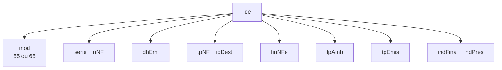
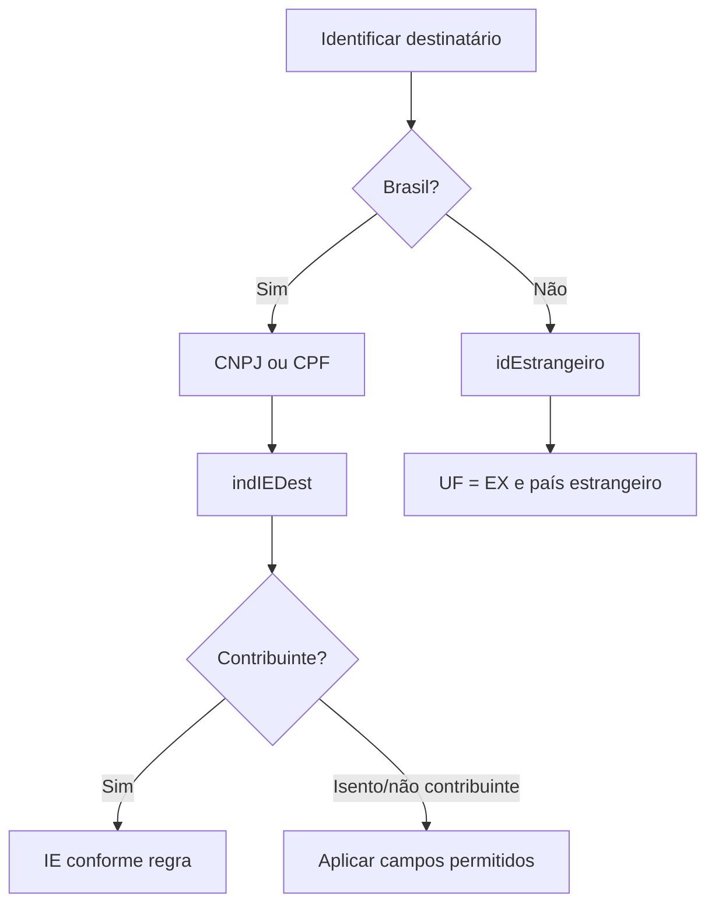

## O cabeçalho define o contexto

O grupo `ide` informa à SEFAZ **que documento é esse** e **qual operação ele representa**.

Esses campos não são independentes. Modelo, destino, finalidade, presença e tipo de emissão ativam ou proíbem outros grupos.

## Perguntas que `ide` responde

| Campo | Pergunta |
|---|---|
| `cUF` | qual UF compõe a chave e autoriza a operação? |
| `natOp` | qual é a natureza resumida da operação? |
| `mod` | é NF-e 55 ou NFC-e 65? |
| `serie` / `nNF` | qual é a numeração fiscal? |
| `dhEmi` | quando foi emitida? |
| `tpNF` | é entrada ou saída? |
| `idDest` | operação interna, interestadual ou exterior? |
| `cMunFG` | onde ocorre o fato gerador do ICMS? |
| `tpImp` | qual formato de DANFE? |
| `tpEmis` | emissão normal ou modalidade de contingência? |
| `tpAmb` | produção ou homologação? |
| `finNFe` | normal, complementar, ajuste ou devolução? |
| `indFinal` | destina-se a consumidor final? |
| `indPres` | como ocorreu a presença do comprador? |

## Emitente

O grupo `emit` contém `CNPJ` ou `CPF` (conforme cenário), razão social e nome fantasia, endereço, inscrição estadual e adicionais, e o `CRT` (regime tributário).

`CRT` influencia a escolha do grupo de ICMS: regime normal usa **CST**; Simples Nacional usa **CSOSN** (ver [Tributos](/docs/leiaute-e-rejeicoes/tributos)).

## Destinatário

Na NFC-e, a identificação pode ser omitida em situações permitidas. Isso **não** torna qualquer valor ou operação anônima válida: existem limites e regras estaduais. 📍

## Retirada e entrega

Use `retirada` quando o local físico de retirada difere do endereço do emitente; `entrega` quando o destino físico difere do endereço do destinatário. A presença desses grupos é validada conforme a operação.

## Documentos referenciados

`NFref` é um grupo de **escolha**. Cada ocorrência referencia um tipo de documento: chave de NF-e, NF modelo 1/1A, NF de produtor, cupom fiscal ou CT-e. Escolha somente a estrutura correspondente. Finalidade e CFOP podem tornar a referência obrigatória.

## Autorizados a acessar o XML

`autXML` informa CNPJ ou CPF de pessoas autorizadas a obter o XML — usado também pela [Distribuição de DF-e](/docs/emissao-e-comunicacao/distribuicao-dfe). Emitente e destinatário já participam pelos próprios papéis; não use o grupo como lista de contatos.

## Checklist

- [ ] `mod`, `tpAmb` e `tpEmis` são explícitos.
- [ ] Série e número seguem faixa e sequência válidas.
- [ ] `idDest` combina com as UFs e o CFOP.
- [ ] `indFinal` e `indPres` representam a operação real.
- [ ] Emitente usa um único identificador permitido.
- [ ] Destinatário nacional e estrangeiro usam caminhos distintos.
- [ ] Retirada e entrega só aparecem quando necessárias.
- [ ] Referências usam o subtipo correto do grupo de escolha.

## Fonte

MOC 7.0 — Anexo I, grupos A a GA, p. 8–17.
