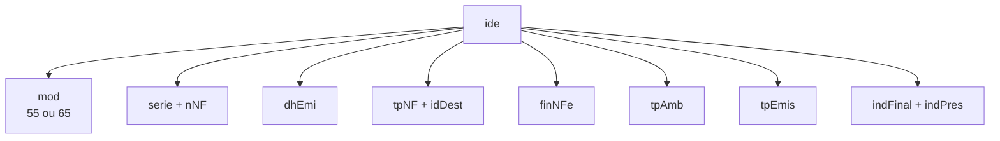
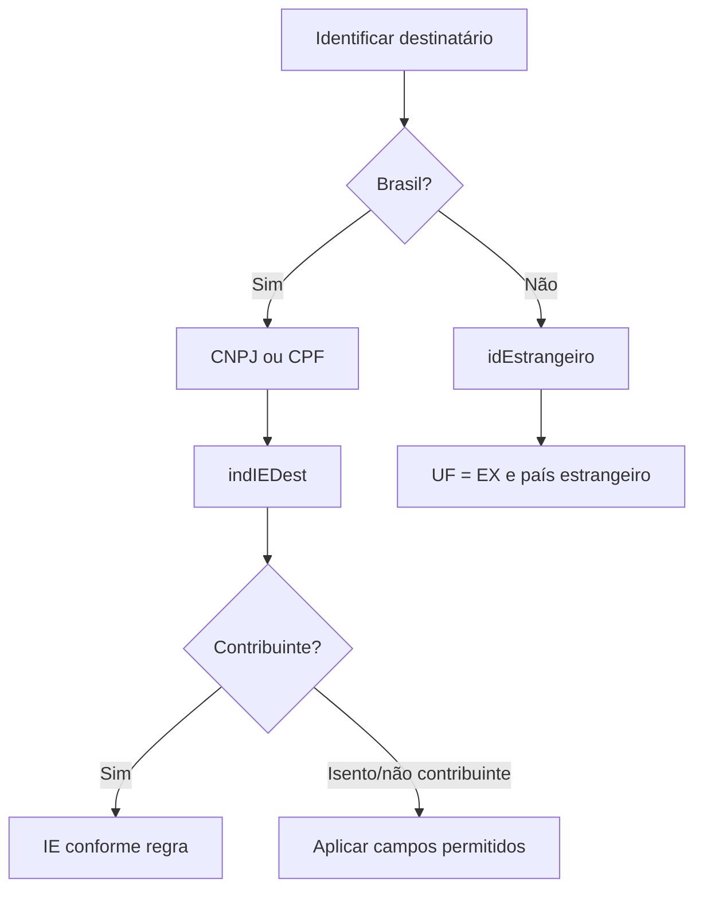

## O cabeçalho define o contexto

O grupo `ide` informa à SEFAZ **que documento é esse** e **qual operação ele representa**.

Esses campos não são independentes. Modelo, destino, finalidade, presença e tipo de emissão ativam ou proíbem outros grupos.

## Perguntas que `ide` responde

| Campo | Pergunta |
|---|---|
| `cUF` | qual UF compõe a chave e autoriza a operação? |
| `natOp` | qual é a natureza resumida da operação? |
| `mod` | é NF-e 55 ou NFC-e 65? |
| `serie` / `nNF` | qual é a numeração fiscal? |
| `dhEmi` | quando foi emitida? |
| `tpNF` | é entrada ou saída? |
| `idDest` | operação interna, interestadual ou exterior? |
| `cMunFG` | onde ocorre o fato gerador do ICMS? |
| `tpImp` | qual formato de DANFE? |
| `tpEmis` | emissão normal ou modalidade de contingência? |
| `tpAmb` | produção ou homologação? |
| `finNFe` | normal, complementar, ajuste ou devolução? |
| `indFinal` | destina-se a consumidor final? |
| `indPres` | como ocorreu a presença do comprador? |
| `indIntermed` | a operação tem intermediador/marketplace? 🔄 |

## Emitente

O grupo `emit` contém `CNPJ` ou `CPF` (conforme cenário), razão social e nome fantasia, endereço, inscrição estadual e adicionais, e o `CRT` (regime tributário).

`CRT` influencia a escolha do grupo de ICMS: regime normal usa **CST**; Simples Nacional usa **CSOSN** (ver [Tributos](/docs/leiaute-e-rejeicoes/tributos)).

## Destinatário

Na NFC-e, a identificação pode ser omitida em situações permitidas. Isso **não** torna qualquer valor ou operação anônima válida: existem limites e regras estaduais. 📍

## Retirada e entrega

Use `retirada` quando o local físico de retirada difere do endereço do emitente; `entrega` quando o destino físico difere do endereço do destinatário. A presença desses grupos é validada conforme a operação.

## Documentos referenciados

`NFref` é um grupo de **escolha**. Cada ocorrência referencia um tipo de documento: chave de NF-e, NF modelo 1/1A, NF de produtor, cupom fiscal ou CT-e. Escolha somente a estrutura correspondente. Finalidade e CFOP podem tornar a referência obrigatória.

A **NT 2022.003** criou `refNFeSig` (BA02a) para referenciar uma NF-e modelo 55 pela chave de acesso com o **código numérico zerado**, preservando o sigilo fiscal da nota referenciada; `refNFe` (BA02) continua obrigatória em devolução, complementar e quando a legislação exigir. O grupo `NFref` passou de **500 para 999** ocorrências. 🔄

## Autorizados a acessar o XML

`autXML` informa CNPJ ou CPF de pessoas autorizadas a obter o XML — usado também pela [Distribuição de DF-e](/docs/emissao-e-comunicacao/distribuicao-dfe). Emitente e destinatário já participam pelos próprios papéis; não use o grupo como lista de contatos.

## Overlay de NTs

Camada incremental posterior ao MOC 7.0. Confirme sempre a revisão vigente.

| NT (vigente) | Delta na identificação |
|---|---|
| 2020.006 v1.31 | Criado `indIntermed` (B25c): `0`=operação sem intermediador (site/plataforma próprios), `1`=operação em site/plataforma de terceiros (intermediador/marketplace). Pela regra `B25c-10` é exigido em notas de **saída com finalidade normal**; os dados do intermediador vão no grupo `infIntermed` (YB) — ver [Pagamento e grupos finais](/docs/leiaute-e-rejeicoes/grupos-finais). 🔄 |
| 2022.003 v1.11 | **Referência sigilosa:** `refNFeSig` (BA02a) referencia NF-e modelo 55 pela chave com código numérico zerado (regras `BA02a-10` a `BA02a-120` e `3BA02a-10`); `NFref` vai a **999** ocorrências. **Emitente PF:** eliminado o controle por regra das emissões por CPF (regras `C02a-04/08/14` ajustadas, opcionais por UF). **Regime tributário:** a regra `7C21-10` (CRT × cadastro CCC) passou a ser opcional por UF. 🔄 |
| 2024.001 v1.20 | **CRT=4 (MEI):** o `CRT` (C21) do emitente ganhou o valor **4=Simples Nacional – Microempreendedor Individual (MEI)**; os grupos `ICMSSN102` e `ICMSSN900` passam a valer para CRT 1 ou 4. A regra `7C21-10` confere (opcional por UF) se o CRT=4 corresponde a contribuinte cadastrado como MEI no CCC. As regras de ICMS/CFOP do MEI estão em [Tributos](/docs/leiaute-e-rejeicoes/tributos) e [Itens e produtos](/docs/leiaute-e-rejeicoes/itens-e-produtos). 🔄 |
| 2021.002 v1.12 | **Nota Fiscal Fácil (`tpEmis=3`):** o XML é gerado, assinado e transmitido pelo **Portal Nacional da NFF** (SVRS), então a assinatura/transmissão só aceitam certificado da SVRS (regras `F03`/`F03B`/`A08`, rej. 213/818/832) e o grupo `infRespTec` (ZD) não se aplica. Como a série da NFF não distingue CPF de CNPJ, use o **5º dígito do `nNF`** (`1`=CNPJ, `2`=CPF) ao validar a chave referenciada (`BA02-30`, rej. 552) — ver [Séries e numeração](/docs/fundamentos/series-e-numeracao). Não se aplicam à NFF: a vedação de CPF na NFC-e (`C02a-04`/`C02a-10`/`C02a-14`), as validações de cadastro do emitente/destinatário (`1C17-*`, `5E17-*`) nem a literal de homologação no `xNome` do destinatário (`E04-20`). 🔄 |
| 2019.001 v1.70 | **Código numérico (`cNF`):** `B03-10` rejeita `cNF` com formação fraca — sequências repetidas (`00000000`…`99999999`), sequências triviais (`12345678`…) ou igual ao `nNF` (rej. **897**). **Documentos referenciados:** `BA10-40`/`BA10-50` controlam a contranota de produtor (referencia só NF de outro emitente / só NF-e ou NF de produtor modelo 4, rej. 320/**922**); `BA20-20`/`BA20-30` impedem referenciar documento de operação interna (`refNF`/`refECF`) em operação interestadual ou com o exterior, e cupom fiscal onde a UF não permite (rej. **923**/**924**). **Destinatário:** `E03a-30` proíbe `IE` junto com `idEstrangeiro` (**925**); `E14-30` proíbe país de destino `1058-Brasil` quando o endereço é no exterior (**926**); `E16a-40` exige indicação de consumidor final quando `indIEDest=9-não contribuinte` em saída interna (**696**). **Cadastro do destinatário (CCC):** o conjunto `5E17-10` a `5E17-80` valida IE/CNPJ/CPF do destinatário no Cadastro Centralizado (rej. 232/233/234/246/302/303/305/306/623/624) — `5E17-40`/`5E17-60` **denegam** (302/303) por irregularidade/CNPJ vedado. As mesmas validações no EPEC ficam em [EPEC](/docs/eventos/epec). 🔄 |
| 2023.002 v1.01 | **Emitente Pessoa Física (CPF) na NFC-e** (Ajuste SINIEF 54/2022, produtor rural com IE): `C02a-10` exige série na faixa de emitente CPF (`890-899`/`910-969`) quando há CPF e `tpEmis≠3-NFF` (rej. **495**); `C02a-20` valida o CPF (zeros/DV, rej. **401**); `C02a-30` confere CPF/CNPJ-base igual ao da 1ª NF-e do lote (rej. **560**). `B26-30`/`B26-50` ganharam exceção para **SC** emitir NFC-e via Nota Fiscal Avulsa (`procEmi=1`/`2`) e aceitar `tpEmis=9-offline NFC-e` (rej. 370/957). Detalhes da chave e série em [Séries e numeração](/docs/fundamentos/series-e-numeracao). 🔄 |
| 2023.002 v1.01 — denegação | **Fim da denegação na NFC-e** (Ajuste SINIEF 10/2023): a NFC-e não é mais **denegada** por irregularidade fiscal do emitente — `1C17-40` (uso denegado 301) deixa de valer no modelo 65 e o emissor irregular passa a ser **rejeitado** por `1C17-38` (rej. **781**, "Emissor não habilitado para emissão da NFC-e"). Equivale, na NFC-e, ao fim da denegação no modelo 55 feito pela [NT 2024.001](/docs/leiaute-e-rejeicoes/codigos-de-retorno). 🔄 |
| 2025.001 v1.03 | **Tipo da IE do destinatário (`indIEDest`):** `E16a-30` rejeita `indIEDest=2-isento` em UF que não admite contribuinte isento de inscrição (lista: AL, AM, BA, CE, DF, ES, GO, MG, MS, MT, PB, PE, RJ, RN, RS, SE, SP), em operação interna ou interestadual (rej. **805**); exceções para destaque/retido de ICMS-ST, emissão anterior a 01/07/2016 e operações isentas/imunes/não tributadas. `E16a-35` cobre só a operação interna (facultativa). `5E17-12` confere no CCC que a IE informada com `indIEDest=9` é do tipo "IE para não contribuinte" (`CCC.tpIE=3`, rej. **300**, implementação futura). Produção (operação interna): 13/10/2025. 📍 🔄 |
| 2018.005 v1.52 | **Local de Retirada (grupo F) e de Entrega (grupo G):** os grupos `retirada`/`entrega` ganharam a identificação completa do estabelecimento e endereço: `CNPJ`/`CPF` (F02/F02a, G02/G02a), `xNome` (razão social/nome do expedidor/recebedor), `CEP`, `cPais`/`xPais`, `fone`, `email` e `IE` (inscrição estadual do expedidor/recebedor). `F11-10`/`G11-10` validam `cPais` pela tabela do BACEN (rej. **970**) e `F15-10`/`G15-10` a `IE` informada (rej. **971**). Preencha o grupo só quando o endereço diferir do remetente/destinatário. O grupo `infRespTec` (ZD) e o CSRT ficam em [Responsável técnico](/docs/fundamentos/responsavel-tecnico). 🔄 |
| 2022.002 v1.30a | **Exterior e referência sigilosa:** em `idDest=3`, as regras `E03a-10`/`E12-10`/`E14-10`/`E16a-20` aceitam destinatário brasileiro, UF/país Brasil ou contribuinte quando houver combustível com `UFCons=EX` e CFOP 7.667; também não se aplicam aos CFOP **7.552** e **7.501** (rej. 720/727/510/790). `BA02a-10` passa a permitir `refNFeSig` com `cNF` zerado também em NF-e de ajuste (`finNFe=3`), além da normal. Produção: **06/04/2026**. 🔄 |
| 2024.003 v1.10 | **Destinatário estrangeiro em operação interestadual:** a v1.09 removeu a regra `I08-94` (rej. 771), permitindo `idEstrangeiro` em operações de abastecimento de embarcação estrangeira em cabotagem e comércio eletrônico com adquirente estrangeiro. 🔄 |
| 2026.001 v1.00 | **Processo PAA:** `procEmi=4` identifica emissão por Provedor de Assinatura e Autorização e exige série 970–979. O PAA está disponível a MEI, produtor rural e optantes do Simples; `C21-20` rejeita CRT 2/3, exceto produtor rural identificado no CCC (rej. **1178**). O grupo `infPAA` e a assinatura ficam em [Pagamento e grupos finais](/docs/leiaute-e-rejeicoes/grupos-finais). Produção: **03/08/2026**. 🔄 |
| 2026.002 v1.00 | **NF-e com DANFE Simplificado Tipo 2:** `tpImp=6`; `tpEmis=9` habilita contingência offline também no modelo 55. Só admite saída interna, finalidade normal, consumidor final e `indPres=1`, `4` ou `5`; veda data de saída, documento referenciado, `IEST`, retirada e — futuramente — entrega. Na operação não presencial (`indPres=4`), destinatário é obrigatório. `BA02-35`/`VC02-40` também proíbem NF-e de saída referenciar NFC-e (65) ou CF-e (59), exceto NF-e complementar. Produção: **03/08/2026** (Tipo 2) e **05/10/2026** (alertas/regras finais). 🔄 |
| 2026.004 v1.01 | **CNPJ alfanumérico no XML:** passam ao tipo texto os CNPJ de `emit`, `dest`, `retirada`, `entrega` e `autXML`, além dos emitentes em NF/NFP referenciadas; `refNFe`, `refNFeSig` e `refCTe` também aceitam chave alfanumérica. Preserve 14 posições e caixa no fluxo inteiro. Produção: **01/07/2026**. 🔄 |
| 2025.002 v1.50 | **Identificação RTC:** `dPrevEntrega` (B10a, só mod. 55) informa a previsão de entrega; `cMunFGIBS` (B12a) identifica o município de consumo quando `indPres=5` e não há endereço de destinatário/entrega. `finNFe` ganha **5=nota de crédito** e **6=nota de débito**, detalhadas por `tpNFCredito`/`tpNFDebito`; o novo `cIndOp` (B25d) classifica o local da operação. **Compras governamentais:** `gCompraGov` muda para BB, com `tpEnteGov`, `pRedutor`, `tpOperGov` e até 99 `refDFeAnt`; antecipações vão para BC/`gPagAntecipado` com até 99 `refNFe`. O emitente ganha `ISUFEmit` (C22) para operações incentivadas de CBS em ZFM/ALC. Regras cruzam finalidade, tipo, `cClassTrib`, documentos referenciados e SUFRAMA. Leiaute v1.50: homologação até **01/09/2026**, produção **03/11/2026**. 🔄 |

## Checklist

- [ ] `mod`, `tpAmb` e `tpEmis` são explícitos.
- [ ] Série e número seguem faixa e sequência válidas.
- [ ] `idDest` combina com as UFs e o CFOP.
- [ ] `indFinal` e `indPres` representam a operação real.
- [ ] Emitente usa um único identificador permitido.
- [ ] Destinatário nacional e estrangeiro usam caminhos distintos.
- [ ] Retirada e entrega só aparecem quando necessárias.
- [ ] Referências usam o subtipo correto do grupo de escolha.

## Fonte

MOC 7.0 — Anexo I, grupos A a GA, p. 8–17. Overlay: NT 2020.006 v1.31 (26/09/2022), NT 2022.003 v1.11 (25/01/2023), NT 2024.001 v1.20 (29/08/2024), NT 2021.002 v1.12 (28/01/2025), NT 2018.005 v1.52 (10/07/2025), NT 2019.001 v1.70 (18/08/2025), NT 2023.002 v1.01 (18/11/2025), NT 2025.001 v1.03 (29/09/2025), NT 2022.002 v1.30a (26/03/2026), NT 2024.003 v1.10 (11/05/2026), NT 2026.001 v1.00 (22/04/2026), NT 2026.002 v1.00 (25/05/2026), NT 2026.004 v1.01 (08/06/2026), NT 2025.002 v1.50 (03/06/2026).
