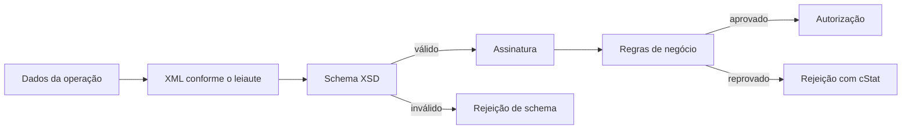

O **Anexo I** define duas coisas: a estrutura do XML e as validações aplicadas antes da autorização.

> **Em uma frase:** o schema verifica se o XML tem a forma correta; as regras de negócio verificam se a operação faz sentido.

## Nesta seção

| Tema | Página |
|---|---|
| colunas das tabelas e ocorrências | [Como ler o leiaute](/docs/leiaute-e-rejeicoes/como-ler-o-leiaute) |
| todos os grupos do XML | [Mapa do XML](/docs/leiaute-e-rejeicoes/mapa-do-xml) |
| emitente, destinatário e locais | [Identificação e atores](/docs/leiaute-e-rejeicoes/identificacao-e-atores) |
| itens, produtos e grupos específicos | [Itens e produtos](/docs/leiaute-e-rejeicoes/itens-e-produtos) |
| ICMS, IPI, PIS, COFINS e IBS/CBS | [Tributos](/docs/leiaute-e-rejeicoes/tributos) |
| totais, transporte e cobrança | [Totais e fechamento](/docs/leiaute-e-rejeicoes/totais-e-fechamento) |
| pagamento, intermediador, QR Code e assinatura | [Grupos finais](/docs/leiaute-e-rejeicoes/grupos-finais) |
| ordem das validações | [Pipeline de validação](/docs/leiaute-e-rejeicoes/pipeline-de-validacao) |
| interpretar um cStat | [Códigos de retorno](/docs/leiaute-e-rejeicoes/codigos-de-retorno) |

> **Implementação:** versão do leiaute, modelo (55/65), UF e data de emissão fazem parte do contexto da validação. Não crie um único `validarNFe()` eterno. 🔄
