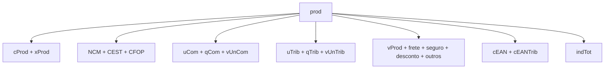
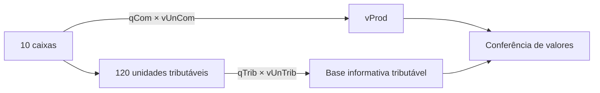

## Um item por `det`

Cada item usa o grupo `det` e recebe `nItem` sequencial.

```xml
<det nItem="1">
  <prod>...</prod>
  <imposto>...</imposto>
</det>
```

Não pule números e não repita `nItem`.

## Núcleo do produto



| Campo | Papel |
|---|---|
| `cProd` | código interno do produto no emitente |
| `cEAN` | GTIN da unidade comercial ou literal previsto para ausência |
| `xProd` | descrição do produto ou serviço |
| `NCM` | classificação fiscal |
| `CEST` | especificador de substituição tributária, quando aplicável |
| `CFOP` | natureza fiscal do item |
| `uCom`, `qCom`, `vUnCom` | unidade, quantidade e valor comercial |
| `uTrib`, `qTrib`, `vUnTrib` | unidade, quantidade e valor tributável |
| `vProd` | valor bruto do item |
| `indTot` | informa se `vProd` compõe o total da nota |

## Comercial não é sempre tributável

Exemplo: um produto pode ser vendido em caixa, mas tributado em unidade ou quilograma.



> **Implementação:** armazene a conversão comercial→tributável, não apenas copie os campos comerciais para os tributáveis.

## Valores opcionais afetam totais

Frete, seguro, desconto e outras despesas podem aparecer no item. Quando informados, precisam ser somados nos grupos totais correspondentes. Use decimal exato e política documentada de arredondamento.

## Grupos condicionais

| Situação | Grupo |
|---|---|
| importação | `DI` e suas adições |
| exportação ou drawback | `detExport` |
| rastreabilidade | `rastro` |
| veículo novo | `veicProd` |
| medicamento | `med` |
| armamento | `arma` |
| combustível | `comb` |
| papel imune | `RECOPI` |

Esses grupos não são "metadados livres". A presença deles ativa validações específicas e pode ser **proibida** para a NFC-e.

## GTIN

`cEAN` e `cEANTrib` distinguem a unidade comercial da tributável. O leiaute prevê GTIN-8, 12, 13 ou 14 e o literal `SEM GTIN` para produto sem código. Validações posteriores consultam o [Cadastro Centralizado de GTIN](/docs/fundamentos/gtin-e-ccg) e cruzam NCM, CEST e unidade tributável.

## Rastreabilidade

O grupo `rastro` identifica lote, quantidade, fabricação, validade e agregação. Datas precisam ser coerentes entre si e com a emissão.

## Vigência

- 🔄 Tabelas de NCM, CEST, CFOP e os literais de GTIN mudam por NT/IT.
- 📍 A obrigatoriedade de grupos específicos pode variar por UF.

## Checklist

- [ ] `nItem` começa em 1 e cresce sem lacunas.
- [ ] Código interno e descrição não são confundidos com NCM.
- [ ] CFOP combina com destino e natureza da operação.
- [ ] Unidade comercial e tributável têm conversão rastreável.
- [ ] `vProd` confere com quantidade e valor segundo a regra vigente.
- [ ] O uso de `SEM GTIN` segue o schema vigente.
- [ ] Grupos específicos são ativados por regras explícitas.
- [ ] Valores do item alimentam os totais corretos.

## Fonte

MOC 7.0 — Anexo I, grupos H a LB, p. 17–25.
