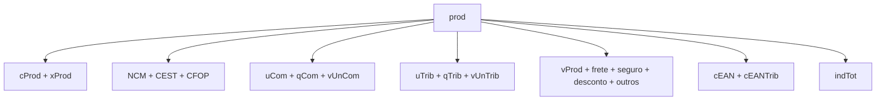
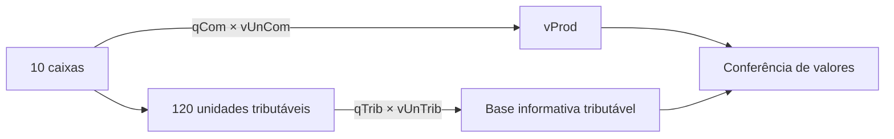

## Um item por `det`

Cada item usa o grupo `det` e recebe `nItem` sequencial.

```xml
<det nItem="1">
  <prod>...</prod>
  <imposto>...</imposto>
</det>
```

Não pule números e não repita `nItem`.

## Núcleo do produto



| Campo | Papel |
|---|---|
| `cProd` | código interno do produto no emitente |
| `cEAN` | GTIN da unidade comercial ou literal previsto para ausência |
| `xProd` | descrição do produto ou serviço |
| `NCM` | classificação fiscal |
| `CEST` | especificador de substituição tributária, quando aplicável |
| `CFOP` | natureza fiscal do item |
| `uCom`, `qCom`, `vUnCom` | unidade, quantidade e valor comercial |
| `uTrib`, `qTrib`, `vUnTrib` | unidade, quantidade e valor tributável |
| `vProd` | valor bruto do item |
| `indTot` | informa se `vProd` compõe o total da nota |

## Comercial não é sempre tributável

Exemplo: um produto pode ser vendido em caixa, mas tributado em unidade ou quilograma.



> **Implementação:** armazene a conversão comercial→tributável, não apenas copie os campos comerciais para os tributáveis.

## Valores opcionais afetam totais

Frete, seguro, desconto e outras despesas podem aparecer no item. Quando informados, precisam ser somados nos grupos totais correspondentes. Use decimal exato e política documentada de arredondamento.

## Grupos condicionais

| Situação | Grupo |
|---|---|
| importação | `DI` e suas adições |
| exportação ou drawback | `detExport` |
| rastreabilidade | `rastro` |
| veículo novo | `veicProd` |
| medicamento | `med` |
| armamento | `arma` |
| combustível | `comb` |
| papel imune | `RECOPI` |

Esses grupos não são "metadados livres". A presença deles ativa validações específicas e pode ser **proibida** para a NFC-e.

## GTIN

`cEAN` e `cEANTrib` distinguem a unidade comercial da tributável. O leiaute prevê GTIN-8, 12, 13 ou 14 e o literal `SEM GTIN` para produto sem código. Validações posteriores consultam o [Cadastro Centralizado de GTIN](/docs/fundamentos/gtin-e-ccg) e cruzam NCM, CEST e unidade tributável.

Para registrar o código de barras quando ele **difere do padrão GTIN** (código próprio ou de terceiro), use `cBarra` (I03a) e `cBarraTrib` (I12a) — campos opcionais e **sem validação**, que não substituem `cEAN`/`cEANTrib`. 🔄

## Rastreabilidade

O grupo `rastro` identifica lote, quantidade, fabricação, validade e agregação. Datas precisam ser coerentes entre si e com a emissão.

## Overlay de NTs

Camada incremental posterior ao MOC 7.0. Confirme sempre a revisão vigente.

| NT (vigente) | Delta no item |
|---|---|
| 2020.005 v1.21 | `cBarra`/`cBarraTrib` (código de barras fora do padrão GTIN); `tpViaTransp` (I23a) ganhou os modais 8=Conduto/Rede, 9=Meios Próprios, 10=Entrada/Saída Ficta, 11=Courier, 12=Em mãos, 13=Por reboque; grupo `adi` passou a aceitar a DUImp (Declaração Única de Importação) e `nDraw` (ato concessório de Drawback) tornou-se alfanumérico; `cAgreg` (I85, grupo I80) passou a alfanumérico. 🔄 |
| 2021.004 v1.35 | **Observações por item:** novo grupo `obsItem` (VA) com `obsCont` (uso livre do contribuinte) e `obsFisco` (uso livre do Fisco), semiestruturado à semelhança do grupo Z, agora no nível do item. **Veículos novos:** `tpVeic` (J19) e `espVeic` (J20) validados pela Tabela de Tipo e Espécie de Veículo (regras `J19-10`/`J20-10`/`J20-20`). **Medicamentos:** `cProdANVISA` (K01a) aceita 11 caracteres; a regra `K01-20` exige o grupo `rastro` quando há `med`, só em saídas e com exceções (venda à ordem 5118/6118/5119/6119/5120/6120, NF-e de ajuste/complementar/entrada, devolução, venda pela internet/entrega futura); a regra `K01-10` (exigia `med` por NCM 3001–3006) foi **suspensa**. 🔄 |
| 2016.003 v3.70 | **Tabela de NCM:** nova “Tabela de NCM e respectiva Utrib” vigente a partir de **01/04/2024** (Resolução Gecex 547/2023) — 57 códigos incluídos e 17 excluídos. Trate o NCM como tabela versionada por NT/IT. 🔄 |
| 2023.004 v1.20 | **Importação por conta e ordem/encomenda:** o `I23d` (CNPJ do adquirente/encomendante) passa a aceitar também pessoa física pelo novo campo `CPF` (`I23d1`); as regras `I23d-10`/`I23d-20`/`I23d1-10` validam CNPJ ou CPF (rej. 331/332). 🔄 |
| 2024.001 v1.20 | **MEI (CRT=4):** GTIN facultativo — `I03-30`/`I12-60` (`cEAN`/`cEANTrib`) não se aplicam ao CRT=4; NCM facultativo em operação interna (`I05-10`, aceita `00000000`); CFOP do MEI restrito por CSOSN (`N12a-90`/`N12a-91`, rej. 337) e devolução pelo MEI limitada aos CFOP 1.202/1.553/2.202/2.553/5.202/6.202 (`I08-140`); `I08-150` incluiu o CFOP **5.910** (bonificação/doação/brinde) na NFC-e. 🔄 |
| 2021.002 v1.12 | **Nota Fiscal Fácil / NF-e Avulsa:** novo grupo `infProdNFF` (I86) com `cProdFisco` (I86a, código fiscal do produto, 14 dígitos) e `cOperNFF` (I86b, código da operação selecionada na NFF); novo grupo `infProdEmb` (I87) que padroniza a embalagem do produto — `xEmb` (I87a, ex.: "caixa", "fardo", "saco"), `qVolEmb` (I87b, volume por embalagem) e `uEmb` (I87c, unidade, ex.: "kg", "litro", "unid"). `infProdNFF` só vale para `tpEmis=3-NFF` (rej. 820, regra `I86-10`); `infProdEmb` vale para NFF ou NF-e Avulsa `procEmi=1`/`2` (rej. 833, regra `I87-10`). 🔄 |
| 2019.001 v1.70 | **Ordem dos itens:** `H02-10` rejeita `nItem` fora da ordem incremental, consecutiva, a partir de 1 (rej. **927**, opcional por UF) — formaliza o requisito que já estava no schema. O grupo de **Crédito Presumido** (`gCred`/I05g) e o `cBenefRBC` (CST 51) entram no item, mas a regra de validação fica em [Tributos](/docs/leiaute-e-rejeicoes/tributos). 🔄 |
| 2023.001 v1.60 | **Combustíveis monofásicos (grupo `comb`/LA):** `cProdANP` (LA02) e `descANP` (LA03) referenciam a **Tabela de Código de Produtos da ANP**; a regra `I13-20` valida a unidade tributável (`uTrib`) conforme a **Tabela de Combustíveis Sujeitos à Tributação Monofásica** (rej. 854, com exceção p/ comércio exterior). Novo `pBio` (LA17, índice de mistura do biodiesel no Diesel B ou do etanol anidro na Gasolina C, regras `LA17-10`/`LA17-20`, rej. 907/908) e grupo `origComb` (LA18, 0-30 ocorrências) com `indImport` (LA19, 0=nacional/1=importado), `cUFOrig` (LA20) e `pOrig` (LA21, % originário por UF). `LA18-10`/`LA18-20` obrigam o grupo e `LA18-30` o proíbe fora da tabela (rej. 909/747); `LA21-10`/`LA21-20` exigem que o somatório de `pOrig` feche **100** (rej. 958). `LA18-10` ativada em **01/10/2025** (produção); `LA03d-10` (`vPart` do GLP) foi excluída. Os CST 02/15/53/61 e os totais ficam em [Tributos](/docs/leiaute-e-rejeicoes/tributos) e [Totais e fechamento](/docs/leiaute-e-rejeicoes/totais-e-fechamento). 🔄 |
| 2026.002 v1.00 | **Restrições do Tipo 2 (`tpImp=6`):** usa somente os CFOP permitidos à NFC-e (regra `I08-150`) e exige `indTot=1`; proíbe veículos novos, armas e RECOPI. Grupos `med`/`rastro` e `origComb`/`pBio` ficam dispensados nas regras indicadas pela NT. As regras de lançamento de cupom `I08-180` e `I08-186` tornam-se obrigatórias em produção em **05/10/2026**. 🔄 |
| 2026.004 v1.01 | **Tipos alfanuméricos:** `CNPJFab` (I05e) e o CNPJ do adquirente/encomendante na DI (`I23d`) passam a texto; `chNFe` da exportação indireta (I54) e `chaveAcesso` do `DFeReferenciado` (VC02) passam a aceitar chave alfanumérica. Produção: **01/07/2026**. 🔄 |

## Vigência

- 🔄 Tabelas de NCM, CEST, CFOP e os literais de GTIN mudam por NT/IT.
- 📍 A obrigatoriedade de grupos específicos pode variar por UF.

## Checklist

- [ ] `nItem` começa em 1 e cresce sem lacunas.
- [ ] Código interno e descrição não são confundidos com NCM.
- [ ] CFOP combina com destino e natureza da operação.
- [ ] Unidade comercial e tributável têm conversão rastreável.
- [ ] `vProd` confere com quantidade e valor segundo a regra vigente.
- [ ] O uso de `SEM GTIN` segue o schema vigente.
- [ ] Grupos específicos são ativados por regras explícitas.
- [ ] Valores do item alimentam os totais corretos.

## Fonte

MOC 7.0 — Anexo I, grupos H a LB, p. 17–25. Overlay: NT 2020.005 v1.21 (15/10/2021), NT 2021.004 v1.35 (01/11/2022), NT 2016.003 v3.70 (09/01/2024), NT 2023.004 v1.20 (07/10/2024), NT 2024.001 v1.20 (29/08/2024), NT 2021.002 v1.12 (28/01/2025), NT 2023.001 v1.60 (09/06/2025), NT 2019.001 v1.70 (18/08/2025), NT 2026.002 v1.00 (25/05/2026), NT 2026.004 v1.01 (08/06/2026).
