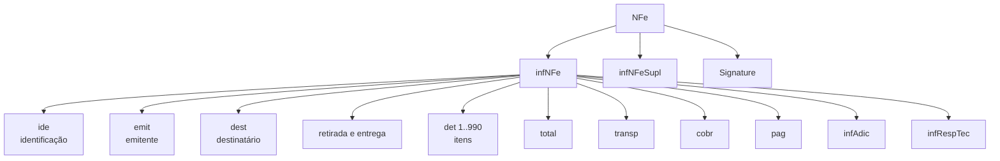
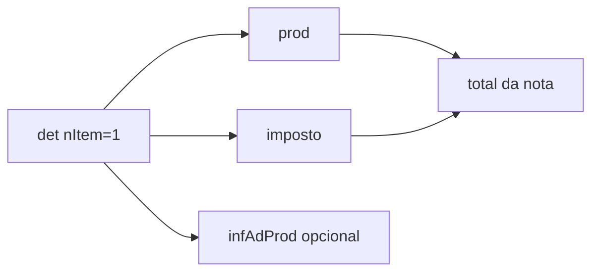

## Estrutura principal

## Grupos por domínio

### Cabeçalho e participantes

| Grupo | Tag principal | Responsabilidade |
|---|---|---|
| A | `infNFe` | raiz dos dados fiscais e atributo `Id` |
| B | `ide` | modelo, série, número, datas, finalidade e ambiente |
| BA | `NFref` | documentos fiscais referenciados |
| C | `emit` | identificação e endereço do emitente |
| D | `avulsa` | dados do Fisco na NFA-e |
| E | `dest` | identificação e endereço do destinatário |
| F | `retirada` | local de retirada diferente do emitente |
| G | `entrega` | local de entrega diferente do destinatário |
| GA | `autXML` | pessoas autorizadas a obter o XML |

### Itens

| Grupo | Tag principal | Responsabilidade |
|---|---|---|
| H | `det` | contêiner de cada item e número sequencial |
| I | `prod` | produto, quantidade, valores, NCM, CFOP e GTIN |
| I01 | `DI` | declaração de importação |
| I03 | `detExport` | informações de exportação |
| I80 | `rastro` | lote, fabricação e validade |
| JA | `veicProd` | veículo novo |
| K | `med` | medicamento |
| L | `arma` | armamento |
| LA | `comb` | combustível |
| LB | `RECOPI` | papel imune |

### Tributos do item

| Grupo | Tag principal | Responsabilidade |
|---|---|---|
| M | `imposto` | contêiner dos tributos do item |
| N | `ICMS` | ICMS normal, ST ou Simples Nacional |
| NA | `ICMSUFDest` | ICMS para a UF de destino |
| O | `IPI` | Imposto sobre Produtos Industrializados |
| P | `II` | Imposto de Importação |
| Q/R | `PIS` / `PISST` | PIS normal e substituição tributária |
| S/T | `COFINS` / `COFINSST` | COFINS normal e substituição tributária |
| U | `ISSQN` | imposto sobre serviço |
| UA | `impostoDevol` | tributos devolvidos |

### Fechamento

| Grupo | Responsabilidade |
|---|---|
| W | totais da NF-e, ISSQN e retenções |
| X | transporte, volumes, veículo, reboque e retenção |
| Y | fatura e duplicatas |
| YA | pagamentos e troco |
| YB | intermediador ou marketplace |
| Z | informações adicionais e processos referenciados |
| ZA/ZB/ZC | exportação, compras e aquisição de cana |
| ZD | responsável técnico e CSRT |
| ZX | QR Code e URL de consulta da NFC-e |
| ZZ | assinatura XMLDSig |

## Item é uma unidade fechada

Cada `det` contém produto e seus tributos. Totais ficam fora dos itens e precisam conferir com a soma deles.

## Ordem importa

XML Schema valida sequência. Ter todas as tags corretas na ordem errada ainda produz falha de schema.

> **Implementação:** gere o documento a partir de um modelo estruturado ou builder consciente do XSD. Evite montar trechos XML independentes e concatená-los.

## Vigência

- 🔄 Novos grupos entram por NT (ex.: grupos de **IBS/CBS/IS** da Reforma Tributária). O conjunto A–ZZ acima é a fotografia do leiaute do MOC 7.0; confronte com o schema vigente.

## Fonte

MOC 7.0 — Anexo I, capítulo 2 (Leiaute da NF-e), p. 8–66.
