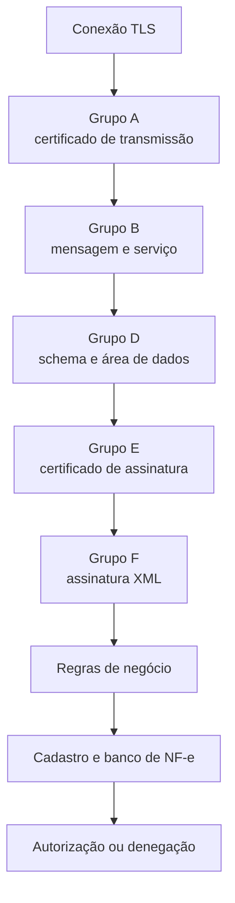
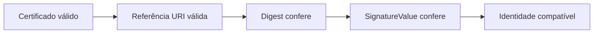
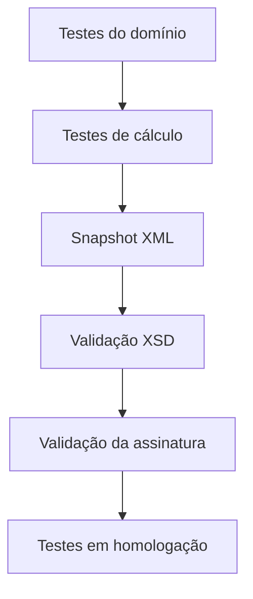

## A primeira falha encerra o caminho

Uma nota pode conter vários problemas, mas o autorizador responde conforme a etapa alcançada. Corrigir uma rejeição pode revelar a seguinte.

## Grupo A: certificado de transmissão

Verifica validade, cadeia de certificação, lista de revogados, raiz ICP-Brasil e presença de CNPJ/CPF na extensão esperada. Esse certificado autentica a conexão — pode não ser o mesmo que assinou o XML, desde que as regras do serviço sejam atendidas.

## Grupo B: mensagem inicial

Verifica tamanho, XML malformado, disponibilidade do serviço, UF atendida e versão suportada.

No Anexo I 7.03, a validação registra limite de **500 KB** para o XML de dados. 🔄 Confirme o limite do serviço vigente.

## Grupo D: área de dados

Valida schema XML, tag raiz esperada, atributo de versão, namespace padrão, ausência de prefixo proibido, codificação UTF-8 e schema específico do evento, quando aplicável.

## Grupos E e F: certificado e assinatura

Primeiro o autorizador valida o certificado usado na assinatura. Depois verifica estrutura da XMLDSig, digest, `SignatureValue` e vínculo permitido entre certificado e emitente.

## Regras de negócio

Depois da estrutura e assinatura, começam as validações de conteúdo: identificação da NF-e, emitente e destinatário, documentos referenciados, itens e classificação, tributos, totais, transporte/cobrança/pagamento e, por fim, duplicidade, cadastro e histórico fiscal.

> **Implementação:** uma regra de negócio reprovada retorna `cStat` com o item/ocorrência apontados (ex.: `[nItem: 2]`). Mapeie cada validador interno ao ID oficial do Anexo I para diagnóstico — ver [Como ler o leiaute](/docs/leiaute-e-rejeicoes/como-ler-o-leiaute).

## Diagnóstico por camada

| Sintoma | Primeiro lugar para investigar |
|---|---|
| conexão TLS falha | certificado de transmissão e cadeia |
| `cStat 214/243` | tamanho ou XML malformado |
| `cStat 215/225` | schema e versão |
| `cStat 402/404` | UTF-8 ou namespace |
| `cStat 290–298` | certificado de assinatura e XMLDSig |
| rejeição com `[nItem]` | item indicado e regra de negócio |
| denegação | situação cadastral, não estrutura XML |

## Teste local em camadas

Quanto mais cedo o erro aparece localmente, menor o consumo do Web Service e mais claro o diagnóstico.

## Fonte

| Campo | Valor |
|---|---|
| Documento | MOC 7.0 — Anexo I, §4.1 (Regras de Validação Gerais), p. 71–74. |
| Versão | ver fonte original |
| Data | ver fonte original |
| Páginas/capítulo | §4; p. 71–74 |
| NT relacionada | não indicada |
| Schema/tabela relacionada | não indicada |
| Status | base oficial mapeada; confrontar com NT, IT, XSD e regra estadual vigentes |

### Registro de origem

MOC 7.0 — Anexo I, §4.1 (Regras de Validação Gerais), p. 71–74.
