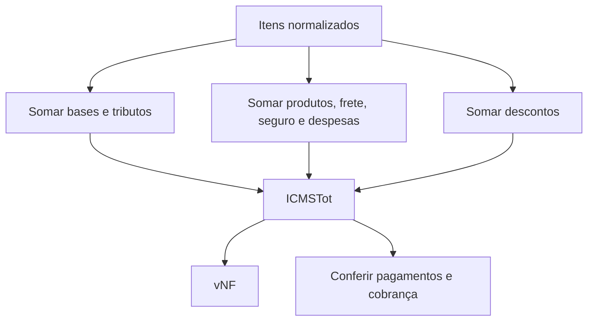
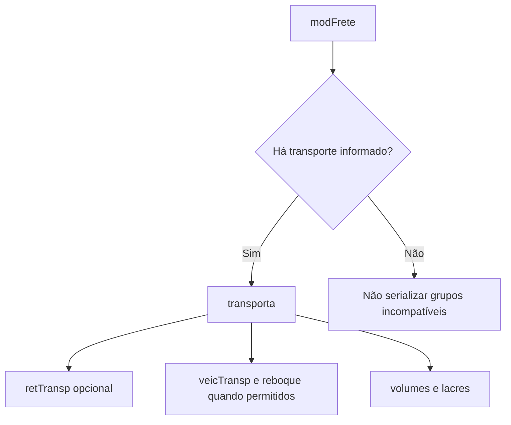

## Total não é um valor digitado

O grupo `total` consolida os itens. Ele deve ser calculado **depois** que produtos, tributos, frete, seguro, descontos e despesas estiverem estabilizados.



## Blocos de totalização

| Grupo | Conteúdo |
|---|---|
| `ICMSTot` | bases, ICMS, FCP, produtos, frete, seguro, desconto, II, IPI, PIS, COFINS, outros e total da nota |
| `ISSQNtot` | totais dos serviços sujeitos a ISSQN |
| `retTrib` | retenções de PIS, COFINS, CSLL, IRRF e previdência, quando aplicáveis |

Campos de total podem ser opcionais no schema e obrigatórios pelo conteúdo da nota.

## Transporte

O grupo `transp` começa por `modFrete`, que define a modalidade do frete. Os demais grupos dependem dela e do modelo do documento.



Na NFC-e, várias informações tradicionais de transporte são **proibidas**. Entrega a domicílio possui regras próprias. 📍

## Cobrança

O grupo `cobr` contém:

- `fat`: fatura, com valor original, desconto e valor líquido;
- `dup`: parcelas ou duplicatas, repetíveis.

```text
vLiq = vOrig - vDesc
soma(vDup) = vLiq
```

A ordem e as datas de vencimento das parcelas também são validadas.

## Pagamento não é cobrança

Cobrança descreve fatura e parcelas. Pagamento descreve os meios usados para quitar a operação — ver [Grupos finais](/docs/leiaute-e-rejeicoes/grupos-finais). Uma nota pode exigir um e não o outro.

## Política de arredondamento

> **Implementação:** defina em um só lugar a escala intermediária, o modo de arredondamento, o momento do arredondamento por item, o momento da soma e as tolerâncias do leiaute vigente. Não arredonde várias vezes em camadas diferentes.

## Checklist

- [ ] Totais são derivados dos mesmos itens enviados no XML.
- [ ] `indTot` é respeitado.
- [ ] Bases e tributos fecham por categoria.
- [ ] `vNF` segue a fórmula vigente.
- [ ] `modFrete` combina com os grupos de transporte presentes.
- [ ] Fatura líquida confere com original menos desconto.
- [ ] Parcelas conferem com a fatura e têm sequência válida.
- [ ] Modelo 65 não recebe grupos proibidos.

## Fonte

MOC 7.0 — Anexo I, grupos W a Y, p. 58–62.
