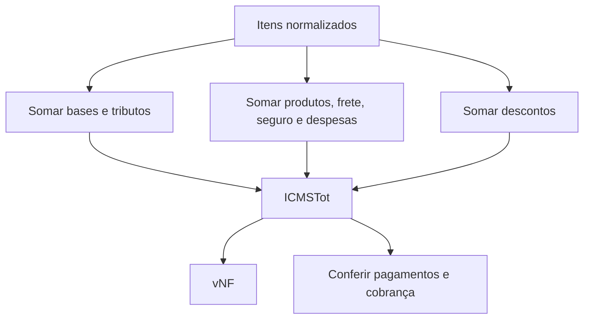
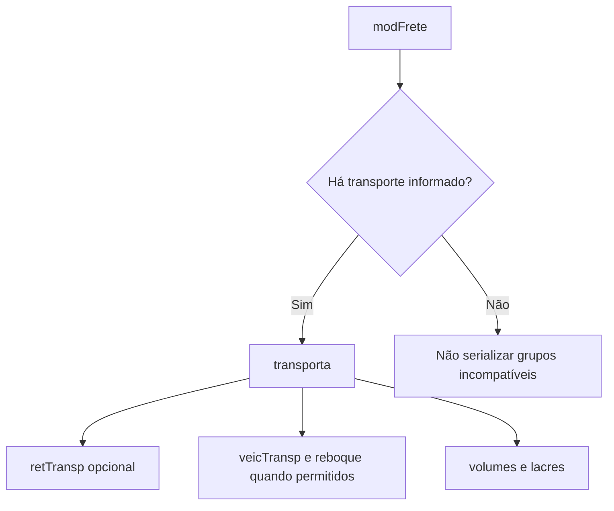

## Total não é um valor digitado

O grupo `total` consolida os itens. Ele deve ser calculado **depois** que produtos, tributos, frete, seguro, descontos e despesas estiverem estabilizados.



## Blocos de totalização

| Grupo | Conteúdo |
|---|---|
| `ICMSTot` | bases, ICMS, FCP, produtos, frete, seguro, desconto, II, IPI, PIS, COFINS, outros e total da nota |
| `ISSQNtot` | totais dos serviços sujeitos a ISSQN |
| `retTrib` | retenções de PIS, COFINS, CSLL, IRRF e previdência, quando aplicáveis |

Campos de total podem ser opcionais no schema e obrigatórios pelo conteúdo da nota.

## Transporte

O grupo `transp` começa por `modFrete`, que define a modalidade do frete. Os demais grupos dependem dela e do modelo do documento.



Na NFC-e, várias informações tradicionais de transporte são **proibidas**. Entrega a domicílio possui regras próprias. 📍

O grupo `transporta` é **proibido** quando `modFrete=9` (sem ocorrência de transporte, regra `X03-30`) e tem o preenchimento validado no transporte próprio por conta do remetente (`modFrete=3`) e do destinatário (`modFrete=4`), pelas regras `X04-30` a `X04-100`. 🔄

## Cobrança

O grupo `cobr` contém:

- `fat`: fatura, com valor original, desconto e valor líquido;
- `dup`: parcelas ou duplicatas, repetíveis.

```text
vLiq = vOrig - vDesc
soma(vDup) = vLiq
```

A ordem e as datas de vencimento das parcelas também são validadas.

## Pagamento não é cobrança

Cobrança descreve fatura e parcelas. Pagamento descreve os meios usados para quitar a operação — ver [Grupos finais](/docs/leiaute-e-rejeicoes/grupos-finais). Uma nota pode exigir um e não o outro.

## Overlay de NTs

Camada incremental posterior ao MOC 7.0. Confirme sempre a revisão vigente.

| NT (vigente) | Delta no fechamento |
|---|---|
| 2020.005 v1.21 | A fórmula do `vNF` (regra **W16-10**) passou a somar `vPIS` (campo PISST/`vPIS`) quando `indSomaPISST=1` e `vCOFINS` (campo COFINSST/`vCOFINS`) quando `indSomaCOFINSST=1`. Os indicadores `R07`/`T07` controlam se a ST de PIS/COFINS integra o total da nota. 🔄 |
| 2021.004 v1.35 | **Transporte:** a regra `X03-30` proíbe o grupo `transporta` quando `modFrete=9` (sem transporte); `X04-30` a `X04-100` validam o `transporta` no transporte próprio por conta do remetente (`modFrete=3`) e do destinatário (`modFrete=4`), com exceção para CNPJ-base/CPF do transportador igual ao do emitente/destinatário em operações com combustíveis. 🔄 |
| 2022.005 v1.11 | **NF-e de devolução (`finNFe=4`):** o valor total e os tributos da devolução não podem superar o somatório das NF-e referenciadas — `3BA02-50` (`vNF`, rej. 545), `3BA02-54` (`vICMS`, 546), `3BA02-58` (`vFCP`, 566), `3BA02-64` (`vICMSUFDest`, 567) e `3BA02-68` (`vFCPUFDest`, 581). Só se aplicam quando **todas** as NF-e referenciadas (modelo 55, sem NF de produtor) existem no BD da SEFAZ; tolerância de **R$ 1,00**; exceção para comércio exterior (`idDest=3`). A SEFAZ pode limitar a verificação (ex.: até 5 referenciadas ou 3 meses) por desempenho. 🔄 |
| 2023.004 v1.20 | **Desoneração no total:** a regra `W16-10` ganhou exceção que não rejeita quando o `vICMSDeson` do item não é subtraído do total nos itens com `indDeduzDeson=0` ou não preenchido (ver [Tributos](/docs/leiaute-e-rejeicoes/tributos)). **Transporte na NFC-e:** as regras `X03-10`/`X03-20` (presença/ausência de dados do transportador) foram **desabilitadas**. 🔄 |
| 2023.001 v1.60 | **Totais do ICMS monofásico sobre combustíveis** no grupo `total`: `vICMSMono` (próprio), `vICMSMonoReten` (sujeito a retenção) e `vICMSMonoRet` (retido anteriormente), mais os totalizadores de quantidade `qBCMono`/`qBCMonoReten`/`qBCMonoRet`. A regra `W16-10` passou a **somar `vICMSMonoReten`** na fórmula do `vNF`. `W06c-10`/`W06d-10`/`W06e-10` conferem o somatório dos valores monofásicos por item (rej. 967/968/969) e `W06b.1-10`/`W06c.1-10`/`W06d.1-10` o somatório das quantidades, com tolerância de **R$ 0,01** (rej. 700/723/744). Os campos do item ficam em [Tributos](/docs/leiaute-e-rejeicoes/tributos). 🔄 |
| 2019.001 v1.70 | **Teto da base de cálculo do ICMS:** `W03-20` (facultativa, por modelo de DF-e) rejeita `vBC` (total) superior ao limite definido pela SEFAZ — referência de **R$ 200.000,00** (rej. **935**, mensagem traz o limite da UF). 🔄 |
| 2025.001 v1.03 | **Dados de cobrança (grupo `dup`/parcelas, Y07):** `Y09-40` rejeita parcela única cujo `dVenc` seja igual à `dhEmi` — cobrança não deve ser informada em pagamento à vista (rej. **853**); `Y09-50` rejeita `dVenc` superior a **10 anos** da data atual (rej. **797**). Pagamento (grupo `YA`/`pag`) em [Grupos finais](/docs/leiaute-e-rejeicoes/grupos-finais). 🔄 |
| 2022.002 v1.30a | **Combustível equiparado à exportação:** `X04-10` deixa de exigir identificação do transportador quando houver item com `UFCons=EX` e CFOP **7.667**, pois é abastecimento presencial sem frete (`modFrete=9`). Nos demais CFOP de combustível marcados na tabela, a identificação continua obrigatória por UF (rej. 362). Produção da revisão: **06/04/2026**. 📍 🔄 |

## Política de arredondamento

> **Implementação:** defina em um só lugar a escala intermediária, o modo de arredondamento, o momento do arredondamento por item, o momento da soma e as tolerâncias do leiaute vigente. Não arredonde várias vezes em camadas diferentes.

## Checklist

- [ ] Totais são derivados dos mesmos itens enviados no XML.
- [ ] `indTot` é respeitado.
- [ ] Bases e tributos fecham por categoria.
- [ ] `vNF` segue a fórmula vigente.
- [ ] `modFrete` combina com os grupos de transporte presentes.
- [ ] Fatura líquida confere com original menos desconto.
- [ ] Parcelas conferem com a fatura e têm sequência válida.
- [ ] Modelo 65 não recebe grupos proibidos.

## Fonte

MOC 7.0 — Anexo I, grupos W a Y, p. 58–62. Overlay: NT 2020.005 v1.21 (15/10/2021), NT 2021.004 v1.35 (01/11/2022), NT 2022.005 v1.11 (11/10/2024), NT 2023.004 v1.20 (07/10/2024), NT 2023.001 v1.60 (09/06/2025), NT 2019.001 v1.70 (18/08/2025), NT 2025.001 v1.03 (29/09/2025), NT 2022.002 v1.30a (26/03/2026).
