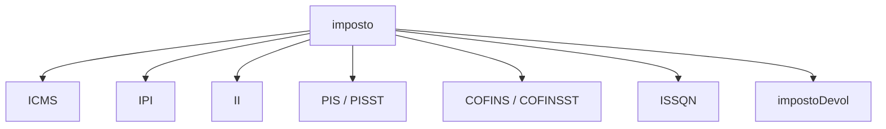
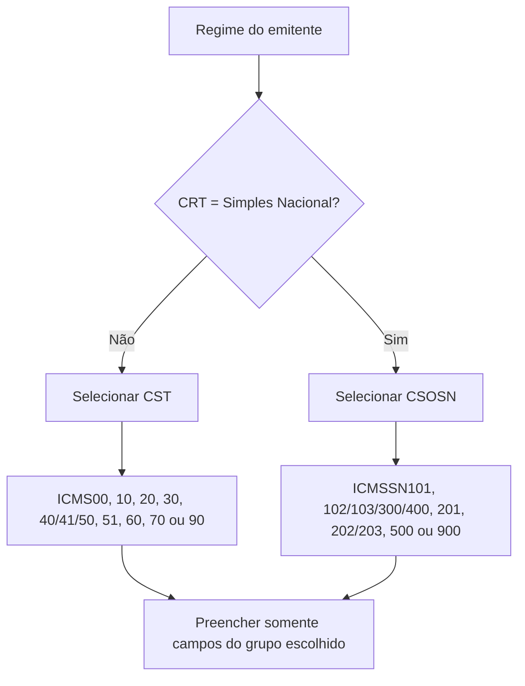
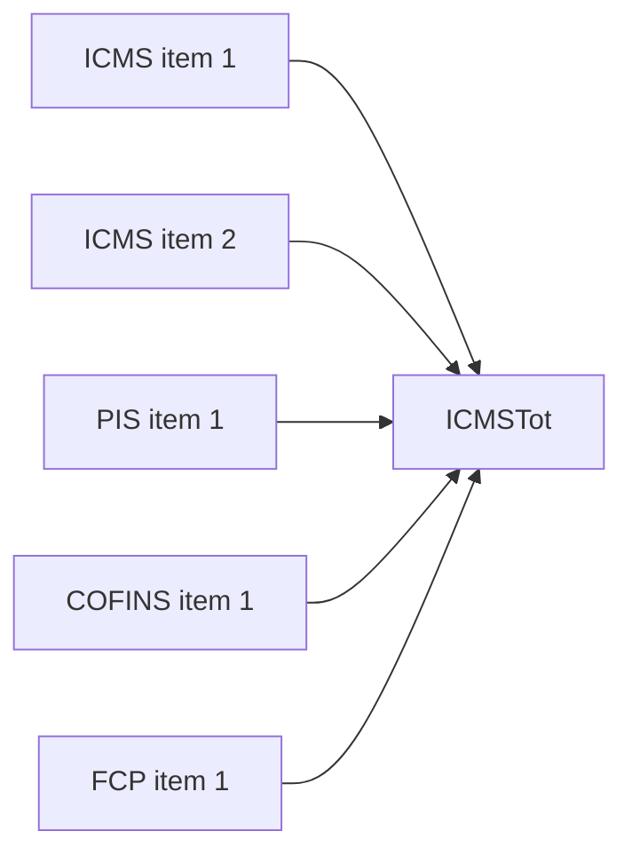

## O grupo `imposto`

Tributos pertencem ao item. O grupo `imposto` reúne os subgrupos compatíveis com a operação.

> **Implementação:** não comece pelo campo. Comece pelo enquadramento tributário da operação e selecione o grupo correspondente.

## Escolha do grupo de ICMS

Cada CST ou CSOSN possui um grupo de escolha. Informar o grupo errado gera rejeição mesmo que seus campos passem no XSD.

## Famílias do ICMS

| Cenário | Campos comuns envolvidos |
|---|---|
| tributação normal | origem, CST, base, alíquota e valor |
| redução de base | percentual de redução e base reduzida |
| substituição tributária | modalidade ST, MVA, redução, base, alíquota e valor ST |
| desoneração | valor e motivo da desoneração |
| diferimento | percentual e valores diferidos |
| retido anteriormente | base, alíquota suportada e valor retido |
| crédito do Simples | alíquota e valor do crédito |
| consumidor final interestadual | grupo `ICMSUFDest`, quando exigido |

Não copie uma fórmula genérica para todos os grupos. A semântica muda conforme o CST/CSOSN.

## IPI e Imposto de Importação

IPI usa grupo de enquadramento e uma escolha entre tributado e não tributado. O Imposto de Importação aparece quando a operação e o item exigem seus valores. Na NFC-e, determinados grupos são **proibidos** pelas regras de negócio, ainda que existam no schema compartilhado.

## PIS e COFINS

Possuem grupos de escolha por CST: cálculo por percentual, por quantidade, não tributado e outras operações. `PISST` e `COFINSST` são grupos **separados** — não substituem os grupos principais quando estes forem exigidos.

## ISSQN

Use ISSQN para item de serviço sujeito ao imposto municipal no cenário permitido. A presença de ISSQN muda totais e ativa regras de município, país, deduções e retenções.

## Totais nascem nos itens

Totais devem ser derivados dos itens normalizados — ver [Totais e fechamento](/docs/leiaute-e-rejeicoes/totais-e-fechamento).

## Vigência

- 🔄 **IBS, CBS e IS** (Reforma Tributária) são introduzidos por Nota Técnica (NT 2025.002 e correlatas) com novos grupos de item e de total, além da tabela `cClassTrib`. Os grupos acima são a fotografia pré-reforma; a tributação do item passa a conviver com os novos grupos conforme a versão do schema.
- 🕒 Exemplos de partilha e alíquotas no MOC são históricos — ver [Cálculo interestadual](/docs/referencia/calculo-interestadual).

## Checklist

- [ ] Existe exatamente um grupo de ICMS compatível por item.
- [ ] CST é usado no regime normal e CSOSN no Simples, conforme regra.
- [ ] Campos de base, alíquota e valor conferem matematicamente.
- [ ] Benefício, desoneração, diferimento e ST possuem regras próprias.
- [ ] PIS e COFINS usam o subtipo correto.
- [ ] Grupos proibidos para o modelo 65 não são serializados.
- [ ] Totais são reconciliados com os itens.

## Fonte

MOC 7.0 — Anexo I, grupos M a UA, p. 25–57. Grupos de IBS/CBS/IS: Notas Técnicas da Reforma Tributária.
