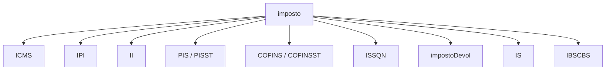
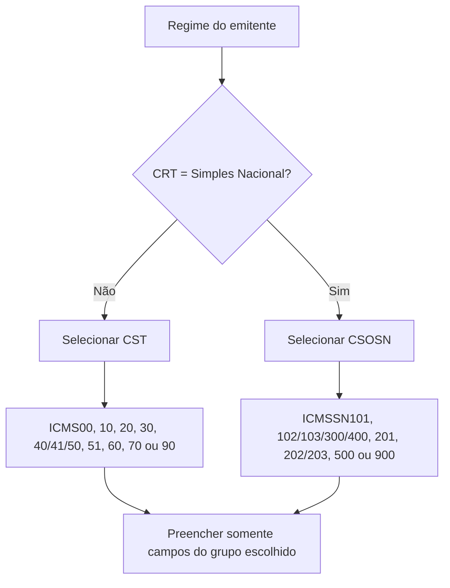
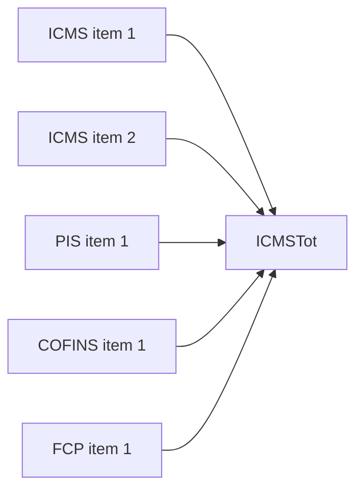

## O grupo `imposto`

Tributos pertencem ao item. O grupo `imposto` reúne os subgrupos compatíveis com a operação.

> **Implementação:** não comece pelo campo. Comece pelo enquadramento tributário da operação e selecione o grupo correspondente.

## Escolha do grupo de ICMS

Cada CST ou CSOSN possui um grupo de escolha. Informar o grupo errado gera rejeição mesmo que seus campos passem no XSD.

## Famílias do ICMS

| Cenário | Campos comuns envolvidos |
|---|---|
| tributação normal | origem, CST, base, alíquota e valor |
| redução de base | percentual de redução e base reduzida |
| substituição tributária | modalidade ST, MVA, redução, base, alíquota e valor ST |
| desoneração | valor e motivo da desoneração |
| diferimento | percentual e valores diferidos |
| retido anteriormente | base, alíquota suportada e valor retido |
| crédito do Simples | alíquota e valor do crédito |
| consumidor final interestadual | grupo `ICMSUFDest`, quando exigido |

Não copie uma fórmula genérica para todos os grupos. A semântica muda conforme o CST/CSOSN.

## Domínios fechados de CST/CSOSN

Cada tributo restringe o `CST` (ou `CSOSN`) a uma lista fechada no schema. Validar a tag contra a lista certa pega o erro antes do envio.

| Campo | Valores aceitos (XSD) |
|---|---|
| `CST` (ICMS, regime normal) | `00` `02` `10` `15` `20` `30` `40` `41` `50` `51` `53` `60` `61` `70` `90` |
| `CSOSN` (Simples Nacional) | `101` `102` `103` `201` `202` `203` `300` `400` `500` `900` |
| `CST` (IPI) | `00` `01` `02` `03` `04` `05` `49` `50` `51` `52` `53` `54` `55` `99` |
| `CST` (PIS) | `01`–`09` `49` `50`–`56` `60`–`67` `70`–`75` `98` `99` |
| `CST` (COFINS) | idêntico ao PIS |
| `modBC` (ICMS) | `0`=margem agregada % · `1`=pauta · `2`=preço tabelado máximo · `3`=valor da operação |
| `modBCST` (ICMS-ST) | `0`=preço tabelado/sugerido · `1`=lista negativa · `2`=lista positiva · `3`=lista neutra · `4`=margem valor agregado % · `5`=pauta · `6`=valor da operação |
| `motDesICMS` | `1` `3` `4` `5` `6` `7` `8` `9` `10` `11` `12` `16` `90` |
| `motDesICMSST` | `3`=uso na agropecuária · `9`=outros · `12`=órgão de fomento agropecuário |

> CST 02/15/53/61 (monofásico de combustível) e os motivos 10/11 (PCD) entraram por NT — já constam da enumeração-base deste schema. Os grupos de IBS/CBS/IS têm `CST`/`cClassTrib` próprios, definidos pelas NTs da Reforma.

## IPI e Imposto de Importação

IPI usa grupo de enquadramento e uma escolha entre tributado e não tributado. O Imposto de Importação aparece quando a operação e o item exigem seus valores. Na NFC-e, determinados grupos são **proibidos** pelas regras de negócio, ainda que existam no schema compartilhado.

## PIS e COFINS

Possuem grupos de escolha por CST: cálculo por percentual, por quantidade, não tributado e outras operações. `PISST` e `COFINSST` são grupos **separados** — não substituem os grupos principais quando estes forem exigidos.

## ISSQN

Use ISSQN para item de serviço sujeito ao imposto municipal no cenário permitido. A presença de ISSQN muda totais e ativa regras de município, país, deduções e retenções.

O `cListServ` (Item da Lista de Serviços) passou a ser validado por tabela do Portal Nacional, e não só pelo schema (regra `U06-10`, NF-e e NFC-e). Uma nota com grupo de ISSQN (`U01`) sem nenhum grupo de ICMS (`N01`) é controlada por UF pela regra `U01-20` (rejeição 592). 🔄

## IBS, CBS e Imposto Seletivo 🔄

A NT 2025.002 v1.50 substitui a NT 2024.002-RTC no âmbito da NF-e/NFC-e e incorpora ao item os grupos `IS` e `IBSCBS`. O enquadramento não é local: `CST` + `cClassTrib` selecionam, por indicadores das tabelas vigentes, quais grupos são obrigatórios, permitidos ou vedados.

| Grupo | Conteúdo principal |
|---|---|
| `IS` | `CSTIS`, `cClassTribIS`, base, alíquota percentual/específica, unidade/quantidade e `vIS` |
| `IBSCBS/gIBSCBS` | base comum; IBS UF, IBS Município e CBS; diferimento, devolução e redução de alíquota |
| `gTribRegular` | CST/classificação e valores regulares quando a operação usa tributação alternativa |
| `gTribCompraGov` | composição sem o redutor da compra governamental |
| `gTransfCred`, `gAjusteCompet`, `gEstornoCred` | transferência, ajuste de competência e estorno de crédito |
| `gCredPresOper`, `gCredPresIBSZFM` | crédito presumido da operação e apropriação sobre saldo devedor na ZFM |
| `gIBSCBSMono` | tributação monofásica de combustíveis, conforme a transição abaixo |

### Monofasia de combustíveis na v1.50

A v1.50 **reformula** o leiaute antigo: dentro de `gIBSCBSMono`, IBS e CBS têm ramos separados para **ad rem** e **ad valorem**. Cada ramo pode conter tributação padrão, retenção, valor retido anteriormente e `gpBioDiferenca` para EAC acima/abaixo do índice obrigatório (`cClassTrib` 620004/620005). Os totais do item ficam em `vTotIBSMonoItem` e `vTotCBSMonoItem`.

| Ano da emissão | IBS monofásico | CBS monofásica |
|---:|---|---|
| 2026 | ad valorem | ad valorem |
| 2027–2028 | ad valorem | ad rem |
| 2029 em diante | ad rem | ad rem |

Nos grupos ad rem, valide `valor = quantidade × alíquota ad rem`. Nos grupos ad valorem, valide `valor = base × alíquota percentual`; o IBS separa as parcelas estadual e municipal. As regras da família `UB85a`–`UB104b` escolhem o ramo pelo ano e pelos indicadores de `cClassTrib`, conferem valores com tolerância de R$ 0,01 e tratam retenção e diferença de mistura. Algumas fórmulas dependem de tabelas externas ainda “a publicar”.

### Crédito presumido (`cCredPres`)

O `cCredPres` classifica o crédito presumido de IBS/CBS por fundamento legal (LC 214/2025). A tabela vigente traz indicadores que definem **se** e **como** o crédito é apropriado — não basta o código existir:

| `cCredPres` | Fundamento (LC 214/2025) | Apropria via NF | Apropria via evento | IBS | CBS |
|---:|---|:--:|:--:|:--:|:--:|
| 1 | Art. 168 | ✅ | ✅ | ✅ | ✅ |
| 2 | Art. 169 | — | ✅ | ✅ | ✅ |
| 3 | Art. 170 | ✅ | ✅ | ✅ | ✅ |
| 4 | Art. 171 (deduz) | ✅ | — | ✅ | ✅ |
| 5 | Art. 311 (regime automotivo) | ✅ | — | — | ✅ |
| 6 | Art. 312 (regime automotivo) | ✅ | — | — | ✅ |
| 7 | Art. 444 (deduz) | ✅ | — | ✅ | — |
| 8 | Art. 447 | — | ✅ | ✅ | — |
| 9 | Art. 449 | — | ✅ | ✅ | — |
| 10 | Art. 450 | ✅ | — | — | ✅ |
| 11 | Art. 462 (deduz) | ✅ | — | ✅ | — |
| 12 | Art. 465 | — | ✅ | ✅ | — |
| 13 | Art. 467 | ✅ | — | — | ✅ |

> Os indicadores `ind_DeduzCredPres`, `ind_gIBSCredPres` e `ind_gCBSCredPres` decidem entre apropriação por NF-e ou por evento e por imposto. A tributação ad valorem da **CBS** começa em **0,9% (2026)**; a alíquota de 2027 em diante aguarda legislação (IT 2026.002).

## Totais nascem nos itens

Totais devem ser derivados dos itens normalizados — ver [Totais e fechamento](/docs/leiaute-e-rejeicoes/totais-e-fechamento).

## Overlay de NTs

Camada incremental posterior ao MOC 7.0. Confirme sempre a revisão vigente.

| NT (vigente) | Delta nos tributos do item |
|---|---|
| 2020.002 v1.01 | **IPI:** consolidou as regras de IPI das NT 2015.002/2016.001 e incluiu os códigos **163, 164 e 165** na Tabela de Enquadramento Legal do IPI (`cEnq`, ex.: REPORTO — Decreto 7.212/2010); a regra `O06-10` valida a compatibilidade entre CST do IPI e `cEnq` (rejeições 387/388). 🔄 |
| 2020.005 v1.21 | **ICMS-ST desonerado:** `vICMSSTDeson` (N33a) e `motDesICMSST` (N33b) criados nos grupos CST 10, 70 e 90 (motivos 3=uso na agropecuária, 9=outros, 12=órgão de fomento agropecuário). **ICMS diferido com FCP (CST 51):** novos `pFCPDif` (N17d), `vFCPDif` (N17e) e `vFCPEfet` (N17f); `vFCP` (N17c) passa a registrar o FCP realmente devido. **modBCST=6** (valor da operação) habilitado para CST 70 e 90. **PIS/COFINS-ST:** `indSomaPISST` (R07) e `indSomaCOFINSST` (T07) indicam se `vPIS`/`vCOFINS` da ST compõem o total da nota. 🔄 |
| 2021.004 v1.35 | **FCP-ST na partilha do ICMS:** novo subgrupo `N23.1` no Grupo de Partilha (`N10a`) com `vBCFCPST` (N23a), `pFCPST` (N23b) e `vFCPST` (N23d), para o FCP retido por ST em veículos novos (PR, Decreto 8.242/2021; reaproveitável por outras UF). **ISSQN:** `cListServ` (U06) validado por tabela do Portal Nacional (`U06-10`), também no modelo 65. 🔄 |
| 2022.003 v1.11 | **FCP destacado:** a regra `N17c-30` (opcional por UF, então só **CE**) rejeita destaque de FCP (`vFCP`/`vFCPST`/`vFCPSTRet` ≠ 0) em operação tributada normalmente (CST=00) quando a UF controla o FCP na apuração. **Excluída pela NT 2024.001 v1.20**, a pedido do CE. 🔄 |
| 2022.004 v1.10 | **ISSQN × ICMS:** a regra `U01-20` (opcional por UF) controla notas com grupo de ISSQN (`U01`) sem grupo de ICMS (`N01`). Parametrização da UF: `0`=não aceita item de serviço, `1`=aceita, `2`=aceita só em nota conjugada (com itens de ICMS). Rejeição **592**. 🔄 |
| 2023.003 v1.20 | **CFOP × CST/CSOSN na NFC-e (por UF):** as regras `N12-40` (CST, rej. 382), `N12a-40` (CSOSN, 386) e `I08-150` (CFOP da NFC-e, 725) ganharam exceções estaduais para o CFOP **5.949**: **SP** com CST 40 ou CSOSN 900 (registro de gorjeta), **RS** com CST 90 ou CSOSN 900 (integração de meios de pagamento). Na NF-e, `N12-70` (508) admite, no **CE**, CST 90 com CFOP 5.403/5.405 (RE 574.706/STF). 📍 🔄 |
| 2023.004 v1.20 | **ICMS desonerado:** novo campo `indDeduzDeson` (N28b) nos grupos com `vICMSDeson` (CST 20/30/40-41-50/70/90), indicando se o ICMS desonerado **deduz** do valor do item (`vProd`)/total (`0` ou ausente = não deduz). A regra `N28-12` exige `indDeduzDeson=1` quando o motivo é **7=SUFRAMA** (rej. 652). 🔄 |
| 2024.001 v1.20 | **MEI (CRT=4):** `orig` (N11) passa a ser exigido só quando `CRT≠4` (`N11-10`, rej. 966). Para emitente MEI a NF-e aceita só CSOSN 102/300/400/900 e a NFC-e só 102/300 (`N12a-80`/`N12a-81`, rej. 782); `N12-20`/`N12a-10` mantêm CST vedado e CSOSN exigido para o Simples (CRT 1 ou 4). Vigência das regras do MEI: **01/04/2025** em produção. 🔄 |
| 2023.001 v1.60 | **ICMS monofásico sobre combustíveis** (Convênio ICMS 199/2022, Ajuste SINIEF 01/2023): novos CST **02** (`ICMS02`, monofásico próprio), **15** (`ICMS15`, próprio + retenção), **53** (`ICMS53`, diferido) e **61** (`ICMS61`, cobrado anteriormente). O imposto é **ad rem** (R$ por unidade), não percentual: `qBCMono` (N37a, BC em quantidade) × `adRemICMS` (N38) = `vICMSMono` (N39); a retenção usa `qBCMonoReten`/`adRemICMSReten`/`vICMSMonoReten` (N39a/N40/N41) e o retido anteriormente `qBCMonoRet`/`adRemICMSRet`/`vICMSMonoRet`. Diferimento parcial (CST 53) com `pDif`/`vICMSMonoDif`; redução da alíquota por `pRedAdRem` (N47) + `motRedAdRem` (N48). `N12-20`/`N12-30`/`N12-70` ganharam exceções p/ os novos CST (Simples, NFC-e, não contribuinte); `N12-100`/`N12-110` exigem ou proíbem o grupo monofásico conforme o `cProdANP` constar na **Tabela de Combustíveis Sujeitos à Tributação Monofásica** (rej. 959/960). `N37a-10`/`N39a-10`/`N43a-10` exigem as quantidades (767/768/769); `N39-10`/`N41-10`/`N45-10` conferem o valor (962/964/966); `N38-10`/`N40-10`/`N44-10` (alíquota ad rem, 961/963/965) foram revogadas e recriadas. A v1.60 ajusta `N41-10`/`N41-20` p/ a refinaria emitir diesel B. Itens (`pBio`, `origComb`) em [Itens e produtos](/docs/leiaute-e-rejeicoes/itens-e-produtos); totais em [Totais e fechamento](/docs/leiaute-e-rejeicoes/totais-e-fechamento). Produção: 04/09/2023 (regras base); v1.60 em **14/07/2025**. 🔄 |
| 2019.001 v1.70 | **Código de Benefício Fiscal (`cBenef`) × CST** (opcional por UF — hoje DF, ES, GO, PR, RJ, RS, SC, SP): `N12-84` exige `cBenef` quando o CST prevê benefício (20/30/40/41/50/51/60/70/90, rej. **930**); `N12-86` proíbe `cBenef` em CST sem benefício (**928**); `N12-88` confere se o **tipo** do `cBenef` corresponde ao CST (**931**); `N12-94` valida vigência e compatibilidade `cBenef`×CST (**931**); `N12-98` valida só existência e vigência do `cBenef` (**946**, exceto Simples Nacional); `N12-90` exige `vICMSDeson`+`motDesICMS` para CST 20/30/40/41/50/70/90 (**934**); `N12-85` exige `cBenef` quando o CST o exigir na tabela da UF (**930**). Exceção geral: não se aplica em devolução de mercadoria com `idDest`≠1; demais exceções (devolução, ajuste, entrada) a critério da UF. As tabelas `cBenef × CST` por UF ficam no Portal Nacional (área Diversos/Documentos). Mesmas regras no grupo I: `I05f-10`/`I05f-20`/`I05f-30` (928/931/934). **Crédito Presumido:** grupo `gCred` (I05g) com `cCredPresumido` (I05h), `pCredPresumido` (I05i), `vCredPresumido` (I05j); `I05g-10` rejeita o grupo se a UF não o permite (**507**, exceto NFF), `I05h-10` valida `cCredPresumido` (**664**). **CST 51 (diferimento):** `cBenefRBC` (N14a) para o benefício de redução de BC acumulado com diferimento — `N14a-10` exige quando `pRedBC>0` (**665**), `N14a-20` valida o `cBenefRBC` (**666**); `N07-10`/`N12-97` exigem os campos do diferimento (`modBC`/`pRedBC`/`vBC`/`pICMS`/`vICMSOp`/`pDif`/`vICMSDif`/`vICMS`, rej. **929**). **`modBCST=6`** (Valor da Operação) habilitado também nos grupos ICMS=10 e 30. **ST por MVA:** `N18-10` exige `pMVAST` quando `modBCST=4` (**932**), `N18-20` proíbe `pMVAST` quando `modBCST≠4` (**933**) — ambas facultativas. **ZFM:** `N28-20` exige CFOP da lista (inclui 6.905/6.923) quando `motDesICMS=7-SUFRAMA` (**626**). **CFOP × grupo de tributação:** `I08-171` rejeita CFOP 1.933/2.933/5.933/6.933 dentro do grupo de ICMS (**374**, só mod. 55). 📍 🔄 |
| 2018.005 v1.52 | **Repasse do ICMS-ST / Complemento e Restituição (combustíveis):** os campos `pST` (N26a, alíquota suportada pelo consumidor final) e `vICMSSubstituto` (N26b, ICMS próprio do substituto) passam a ocorrência **0-1** no Grupo de Repasse do ICMS-ST e nos grupos CST **60** e CSOSN **500**; novos campos de apuração do Complemento/Restituição do ICMS-ST no Grupo de Repasse, a critério da UF. `N12-81`/`N12a-50` exigem `vBCSTRet`/`pST`/`vICMSSubstituto`/`vICMSSTRet` em operação que não seja a consumidor final (rej. **938**); `N12-82`/`N12a-60` exigem os campos de ICMS Efetivo a consumidor final (`indFinal=1`, rej. **906**). `N12-81`/`N12a-50` **não se aplicam ao modelo 65**; `N33-10` foi eliminada. 📍 🔄 |
| 2022.002 v1.30a | **Desoneração para PCD e diferimento:** no CST 20, `motDesICMS` passa a admitir **10=Deficiente Condutor** e **11=Deficiente Não Condutor** (Convênio ICMS 38/12), mantendo `indDeduzDeson`. O grupo CST **90** passa a representar também operação com diferimento: cálculo próprio (`modBC`/`vBC`/`pRedBC`/`cBenefRBC`/`pICMS`/`vICMS`), `vICMSOp`/`pDif`/`vICMSDif`, FCP e ST tornam-se subgrupos opcionais; a partilha também recebe o grupo de desoneração. Produção: **06/04/2026**. 🔄 |
| 2024.003 v1.10 | **MEI e ativo imobilizado:** `N12a-70` não rejeita CSOSN 900 para emitente MEI (`CRT=4`) nas remessas de bem do ativo imobilizado com CFOP **5.551/6.551**; permanece a exceção estadual para CFOP 5.904/6.904. O grupo agropecuário `ZF` fica em [Pagamento e grupos finais](/docs/leiaute-e-rejeicoes/grupos-finais). 🔄 |
| 2026.002 v1.00 | **Tributação no Tipo 2 (`tpImp=6`):** seguem as mesmas limitações da NFC-e: CST permitido **00/20/40/41/60/61** (90 a critério da UF) e CSOSN **102/103/300/400/500** (900 a critério da UF), com restrições de CFOP e MEI. São proibidos Partilha, Repasse ICMS-ST, `ICMSUFDest`, IPI, II, PIS-ST, COFINS-ST e devolução de tributos. 🔄 |
| 2026.004 v1.01 | **CNPJ alfanumérico:** `CNPJProd` do grupo IPI (O03) passa a texto de 14 posições. Produção: **01/07/2026**. 🔄 |
| 2025.002 v1.50 | **Reforma Tributária do Consumo:** cria `IS`/`IBSCBS`, as finalidades fiscais de crédito/débito e os grupos de diferimento, devolução, redução, tributação regular, compras governamentais, transferência/estorno/ajuste e créditos presumidos. `vIBS = vIBSUF + vIBSMun - vCredPres` quando `indDeduzCredPres=1`; IBS/CBS/IS são “por fora”. A obrigatoriedade geral de `IBSCBS` (`UB12-10`) começa em homologação em **01/07/2026** e produção em **03/08/2026** para CRT=3; Simples/MEI, em produção a partir de **04/01/2027**. A v1.50 separa a monofasia de combustíveis em IBS/CBS × ad rem/ad valorem e entra em homologação até **01/09/2026**, produção **03/11/2026**. 🔄 |
- 🕒 Exemplos de partilha e alíquotas no MOC são históricos — ver [Cálculo interestadual](/docs/referencia/calculo-interestadual).

## Checklist

- [ ] Existe exatamente um grupo de ICMS compatível por item.
- [ ] CST é usado no regime normal e CSOSN no Simples, conforme regra.
- [ ] Campos de base, alíquota e valor conferem matematicamente.
- [ ] Benefício, desoneração, diferimento e ST possuem regras próprias.
- [ ] PIS e COFINS usam o subtipo correto.
- [ ] Grupos proibidos para o modelo 65 não são serializados.
- [ ] Totais são reconciliados com os itens.

## Fonte

| Campo | Valor |
|---|---|
| Documento | MOC 7.0 — Anexo I, grupos M a UA, p. 25–57. |
| Versão | v1.01; v1.21; v1.35; v1.11 |
| Data | 19/08/2022; 15/10/2021; 01/11/2022; 25/01/2023 |
| Páginas/capítulo | p. 25–57 |
| NT relacionada | NT 2020.002 v1.01; NT 2020.005 v1.21; NT 2021.004 v1.35; NT 2022.003 v1.11; NT 2022.004 v1.10; NT 2023.003 v1.20 |
| Schema/tabela relacionada | PL_010c_NT2022_002v1.30 |
| Status | base oficial com overlay explícito de NT, IT ou schema |

### Registro de origem

MOC 7.0 — Anexo I, grupos M a UA, p. 25–57. Grupos de IBS/CBS/IS: Notas Técnicas da Reforma Tributária. Overlay: NT 2020.002 v1.01 (19/08/2022), NT 2020.005 v1.21 (15/10/2021), NT 2021.004 v1.35 (01/11/2022), NT 2022.003 v1.11 (25/01/2023), NT 2022.004 v1.10 (14/02/2023), NT 2023.003 v1.20 (08/10/2024), NT 2023.004 v1.20 (07/10/2024), NT 2024.001 v1.20 (29/08/2024), NT 2023.001 v1.60 (09/06/2025), NT 2018.005 v1.52 (10/07/2025), NT 2019.001 v1.70 (18/08/2025), NT 2022.002 v1.30a (26/03/2026), NT 2024.003 v1.10 (11/05/2026), NT 2026.002 v1.00 (25/05/2026), NT 2026.004 v1.01 (08/06/2026), NT 2025.002 v1.50 (03/06/2026).

Schema: leiauteNFe_v4.00 (PL_010c_NT2022_002v1.30).
