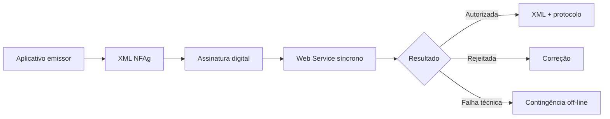

A **NFAg** é um documento fiscal eletrônico de existência exclusivamente digital. A validade jurídica depende da assinatura digital do emitente e da autorização de uso pelo Ambiente Nacional da NFAg.

## O que o manual diz

O MOC NFAg v1.00k define a integração entre os sistemas das administrações tributárias e os sistemas das empresas emissoras da Nota Fiscal de Água e Saneamento Eletrônica.

O conjunto do MOC é composto por:

| Documento | Situação nesta seção |
|---|---|
| Visão Geral | usado nesta página |
| Anexo I — Leiaute e Regras de Validação da NFAg | usado em [Leiaute e regras](/docs/nfag/leiaute-e-regras) |
| Anexo II — DANFAG | usado em [DANFAG](/docs/nfag/danfag) |

### Chave de acesso

A chave de acesso da NFAg possui **44 caracteres numéricos**.

| Parte | Origem |
|---|---|
| UF do emitente | `cUF` |
| ano e mês de emissão | extraídos da emissão |
| CNPJ do emitente | `CNPJ` |
| modelo | `mod`, com valor `75` |
| série e número | `serie`, `nNF` |
| forma de emissão | `tpEmis` |
| site autorizador | `nSiteAutoriz` |
| código numérico | `cNF` |
| dígito verificador | `cDV` |

A chave natural usa UF, CNPJ do emitente, série, número, modelo, forma de emissão e site de autorização. O autorizador usa essa chave natural para rejeitar duplicidade no mesmo ambiente.

## Comunicação

O padrão técnico é SOAP 1.2 sobre TLS 1.2, com autenticação mútua por certificado ICP-Brasil. O XML usa UTF-8, não permite prefixo de namespace e deve declarar `http://www.portalfiscal.inf.br/nfag` no elemento raiz.

Para o serviço de recepção, a área de dados da mensagem SOAP deve ser compactada em GZip e convertida para Base64. Consultas, eventos e status usam XML sem compactação.

## Web Services

| Serviço | Uso |
|---|---|
| recepção de NFAg | autorização síncrona do modelo 75 |
| consulta situação | consulta da situação atual pela chave |
| consulta status serviço | disponibilidade do autorizador |
| registro de eventos | cancelamento e eventos de marcação |

## Eventos

O Sistema de Registro de Eventos da NFAg permite eventos do contribuinte e do fisco.

| Evento | Origem |
|---|---|
| `110111` — cancelamento | empresa emitente |
| `240140` — autorizada NFAg de substituição | fisco |
| `240160` — autorizada NFAg de faturamento conjunto | fisco |
| `240161` — cancelada NFAg de faturamento conjunto | fisco |
| `240162` — substituída NFAg de faturamento conjunto | fisco |
| `240170` — liberação de prazo de cancelamento | fisco |

Eventos de marcação são gerados automaticamente quando uma NFAg referencia outra, por exemplo em substituição ou faturamento conjunto.

## QR Code e consulta

O QR Code deve constar no DANFAG em emissão normal e em contingência off-line. Em emissão normal, a URL contém a chave de acesso e o ambiente. Em contingência off-line, inclui também assinatura digital da chave de acesso, usando o certificado que assina a NFAg.

## Contingência off-line

A contingência off-line é uma exceção para problemas técnicos que impedem a autorização em tempo real. A NFAg emitida em contingência deve ser transmitida posteriormente para autorização, e a consulta pública só será completa depois que o documento constar na base do fisco.

## Implicação de implementação

> **Implementação:** trate NFAg como documento próprio: modelo `75`, namespace `nfag`, recepção síncrona compactada, QR Code com regra diferente para contingência e eventos de marcação. Reaproveite infraestrutura de certificado, SOAP e assinatura XML, mas isole schemas, validações e regras de faturamento.

## Fonte

MOC NFAg — Padrões Técnicos de Comunicação, versão 1.00k — 11 de março de 2026, p. 6–58.
