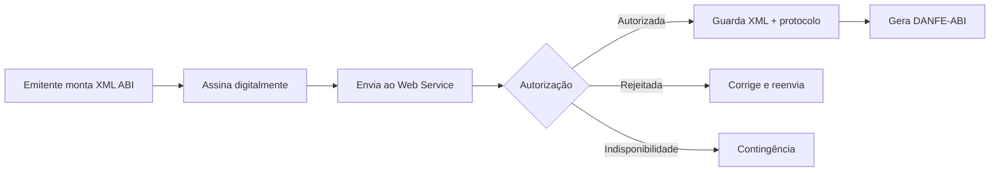

A **NF-e ABI** é um documento fiscal eletrônico de existência exclusivamente digital. A validade jurídica depende de dois atos: assinatura digital do emitente e autorização de uso pelo Ambiente Nacional da NF-e ABI.

## O que o manual diz

O projeto implanta um modelo nacional de documento fiscal eletrônico para **Alienação de Bens Imóveis**, identificado pelo **modelo 77**, voltado às operações sujeitas ao IBS/CBS.

O MOC da NF-e ABI é composto por:

| Documento | Situação nesta seção |
|---|---|
| Visão Geral NF-e ABI | usado nesta página |
| Anexo I — Leiaute e Regras de Validação | usado em [Leiaute e regras](/docs/nfe-abi/leiaute-e-regras) |
| Anexo II — DANFE-ABI e Código de Barras | citado pelo MOC, ainda não incorporado aqui |

### Chave de acesso

A chave de acesso possui **44 caracteres numéricos** e segue a ideia dos demais DF-e, mas com campos próprios do modelo ABI.

| Parte | Origem |
|---|---|
| UF do emitente | `cUF` |
| ano e mês da emissão | extraídos de `dhEmi` |
| CNPJ ou CPF do emitente | `CNPJ` ou `CPF` |
| modelo | `mod`, com valor `77` |
| série e número | `serie`, `nNF` |
| forma de emissão | `tpEmis` |
| tipo do emitente | `tpEmit` |
| site autorizador | `nSiteAutoriz` |
| código numérico | `cNF` |
| dígito verificador | `cDV` |

O DV usa o mesmo cálculo dos demais documentos fiscais eletrônicos, com referência à NT Conjunta DFe 2025.001 sobre CNPJ alfanumérico.

### Chave natural

Para detectar duplicidade, a autorização considera uma chave natural formada por UF, CNPJ/CPF do emitente, série, número, modelo, ambiente, tipo do emitente e site autorizador.

## Modelo operacional

Na emissão normal, o DANFE-ABI só deve ser gerado depois da autorização de uso. Em cenário de indisponibilidade, o manual prevê emissão em contingência.

## Web Services

| Serviço | Uso |
|---|---|
| `NfeAutorizacao` | recepção e autorização da NF-e ABI |
| `NfeConsultaProtocolo` | consulta da situação atual |
| `NfeStatusServico` | verificação de disponibilidade |
| `NFeRecepcaoEvento` | registro de eventos |
| `NFeRecepcaoEvento` — cancelamento | evento específico de cancelamento, `tpEvento=110111` |

O padrão técnico é SOAP 1.2 sobre TLS 1.2 ou superior, com autenticação mútua por certificado ICP-Brasil. O XML deve usar UTF-8 e namespace único `http://www.portalfiscal.inf.br/nfeabi`.

## Eventos

O modelo segue o Sistema de Registro de Eventos: uma parte genérica identifica autor, evento, NF-e ABI vinculada e assinatura; a parte específica entra no detalhe do evento. O Anexo I detalha o evento de **Pagamento de Parcela**.

## Como interpretar

A NF-e ABI aproveita padrões já conhecidos da NF-e, mas não deve ser tratada como variação do modelo 55. O modelo, namespace, grupos do XML, regras de validação e lógica tributária são próprios.

## Implicação de implementação

> **Implementação:** trate NF-e ABI como um produto fiscal separado no código: tipo documental `77`, namespace `nfeabi`, schemas próprios, tabelas próprias e feature flags por ambiente. Reaproveite infraestrutura de certificado, SOAP, assinatura XML e validação, mas não reaproveite validadores de leiaute da NF-e modelo 55.

## Fonte

| Campo | Valor |
|---|---|
| Documento | MOC NF-e ABI — Visão Geral, versão 1.00 — outubro de 2025, p. 7–34. |
| Versão | 1.00 |
| Data | outubro de 2025 |
| Páginas/capítulo | p. 7–34 |
| NT relacionada | não indicada |
| Schema/tabela relacionada | não indicada |
| Status | base oficial mapeada; confrontar com NT, IT, XSD e regra estadual vigentes |

### Registro de origem

MOC NF-e ABI — Visão Geral, versão 1.00 — outubro de 2025, p. 7–34.
