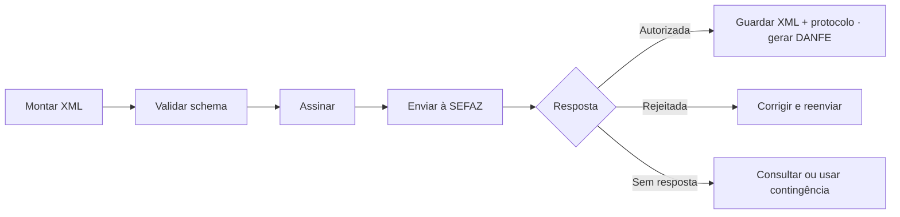

Esta seção reúne a documentação técnica da **NF-e, modelo 55** (operações com mercadorias e transporte associado) e da **NFC-e, modelo 65** (venda presencial ao consumidor final), publicada no **Portal Nacional da NF-e** (`nfe.fazenda.gov.br`).

Diferente do manual oficial, o conteúdo aqui é organizado **pela tarefa que você precisa resolver**, não pela ordem dos capítulos. Cada manual foi redistribuído entre as seções abaixo.

## Por onde começar

| Se você precisa… | Vá para |
|---|---|
| escolher entre NF-e e NFC-e e planejar a integração | [Comece aqui](/docs/comece-aqui) |
| entender chave de acesso, GTIN, responsável técnico e conceitos | [Fundamentos](/docs/fundamentos) |
| montar o XML, assinar e chamar os Web Services | [Emissão e comunicação](/docs/emissao-e-comunicacao) |
| preencher grupos do leiaute e interpretar rejeições | [Leiaute e rejeições](/docs/leiaute-e-rejeicoes) |
| cancelar, corrigir, manifestar ou usar EPEC | [Eventos](/docs/eventos) |
| gerar DANFE, código de barras e QR Code | [DANFE](/docs/danfe) |
| operar quando a SEFAZ está indisponível | [Contingência](/docs/contingencia) |
| conhecer autorizadoras, boas práticas e homologação | [Operação](/docs/operacao) |
| acompanhar mudanças publicadas depois do MOC | [Notas Técnicas](/docs/notas-tecnicas) · [Informes Técnicos](/docs/informes-tecnicos) |
| consultar tabelas, glossário e proveniência das fontes | [Referência](/docs/referencia) |

## O fluxo, em uma imagem

## Como estas páginas foram escritas

As páginas de **referência** seguem quatro blocos, sempre na mesma ordem, para separar o que é regra oficial do que é orientação de quem implementa:

1. **O que o manual diz** — fiel à fonte, com a localização exata (seção e página).
2. **Como interpretar** — explicação em linguagem simples, sem alterar a regra.
3. **Vigência** — se o dado é histórico, depende de UF ou muda por Nota Técnica.
4. **Implicação de implementação** — orientação de engenharia, marcada como tal.

As páginas de **guia** (em *Comece aqui* e *Operação*) usam um formato mais leve: resumo, fluxo e checklist.

### Legenda de vigência

Estes marcadores aparecem ao lado de regras que não devem ser tratadas como retrato do sistema atual:

| Marcador | Significado |
|---|---|
| 🕒 **histórico** | valor, algoritmo ou exemplo da época da fonte (ex.: SHA-1, chave de 1024 bits, partilha de 2016) |
| 📍 **depende de UF** | comportamento definido por legislação ou ambiente estadual |
| 🔄 **atualizado por NT** | estrutura ou regra que muda por Nota Técnica posterior à fonte |

> **Implementação:** trechos como este, em destaque, são orientação de engenharia do projeto — não texto oficial. Use o manual, o XSD e a Nota Técnica vigente para decidir campos, tipos e prazos.

## Mapa das fontes

Cada seção é montada a partir destes manuais oficiais. A página de [proveniência](/docs/referencia/proveniencia) registra versões, datas de corte e erratas conhecidas.

| Manual | Onde foi distribuído |
|---|---|
| MOC 7.0 — Visão Geral | Fundamentos · Emissão e comunicação · Eventos · Referência |
| Anexo I — Leiaute e Regras de Validação | Leiaute e rejeições |
| Anexo II — DANFE e Código de Barras | DANFE |
| Anexo III — Contingência NF-e | Contingência |
| Anexo IV — Contingência NFC-e | Contingência |
| Manual do DANFE NFC-e e QR Code (2025) | DANFE |
| Manual de Boas Práticas NFC-e | Operação |
| Especificações da Contingência Off-line v2.0 | Contingência |
| Manuais operacionais (emissor, SVRS, SVAN) | Comece aqui · Operação |
| Documentos com schema próprio | [NF-e ABI](/docs/nfe-abi) · [NFAg](/docs/nfag) · [NFGas](/docs/nfgas), publicados como tópicos de raiz |

> CT-e e MDF-e não aparecem na navegação publicada. Reforma Tributária, NF-e ABI, NFAg e NFGas são tópicos próprios na raiz de `Open Fiscal`.

## Fonte

| Campo | Valor |
|---|---|
| Documento | Índice editorial: NF-e e NFC-e |
| Versão | ver fonte original |
| Data | ver fonte original |
| Páginas/capítulo | ver fonte original |
| NT relacionada | não indicada |
| Schema/tabela relacionada | não indicada |
| Status | página índice; rastreabilidade detalhada nas páginas filhas |

### Registro de origem

Página de entrada construída a partir da matriz de fontes oficiais em Referência, com detalhes nas páginas temáticas.
