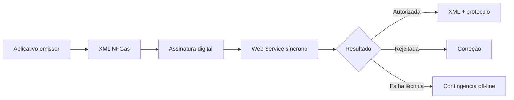

A **NFGas** é um documento fiscal eletrônico de existência exclusivamente digital. A validade jurídica depende da assinatura digital do emitente e da autorização de uso pelo Ambiente Nacional da NFGas.

## O que o manual diz

O MOC NFGas v1.00f define a integração entre os sistemas das administrações tributárias e os sistemas das empresas emissoras da Nota Fiscal Eletrônica do Gás.

O conjunto do MOC é composto por:

| Documento | Situação nesta seção |
|---|---|
| Visão Geral | usado nesta página |
| Anexo I — Leiaute e Regras de Validação da NFGas | usado em [Leiaute e regras](/docs/nfgas/leiaute-e-regras) |
| Anexo II — DANFGas | usado em [DANFGas](/docs/nfgas/danfgas) |

### Chave de acesso

A chave de acesso da NFGas possui **44 caracteres**. O schema (`Id` no padrão `NFGas[0-9]{6}[A-Z0-9]{12}[0-9]{26}`) define o segmento de 12 posições do **CNPJ do emitente** como **alfanumérico** (`[A-Z0-9]{12}`): a NFGas já adota CNPJ alfanumérico, portanto a chave não é totalmente numérica.

| Parte | Origem |
|---|---|
| UF do emitente | `cUF` |
| ano e mês de emissão | extraídos da emissão |
| CNPJ do emitente | `CNPJ` |
| modelo | `mod`, com valor `76` |
| série e número | `serie`, `nNF` |
| forma de emissão | `tpEmis` |
| site autorizador | `nSiteAutoriz` |
| código numérico | `cNF` |
| dígito verificador | `cDV` |

A chave natural usa UF, CNPJ do emitente, série, número, modelo, forma de emissão e site de autorização. O autorizador usa essa chave natural para rejeitar duplicidade no mesmo ambiente.

## Comunicação

O padrão técnico é SOAP 1.2 sobre TLS 1.2, com autenticação mútua por certificado ICP-Brasil. O XML usa UTF-8, não permite prefixo de namespace e deve declarar `http://www.portalfiscal.inf.br/nfgas` no elemento raiz.

Para o serviço de recepção, a área de dados da mensagem SOAP deve ser compactada em GZip e convertida para Base64. Consultas, eventos e status usam XML sem compactação.

## Web Services

| Serviço | Uso |
|---|---|
| recepção de NFGas | autorização síncrona do modelo 76 |
| consulta situação | consulta da situação atual pela chave |
| consulta status serviço | disponibilidade do autorizador |
| registro de eventos | cancelamento e eventos de marcação |

## Eventos

O Sistema de Registro de Eventos da NFGas permite eventos do contribuinte e do fisco.

| Evento | Origem |
|---|---|
| `110111` — cancelamento | empresa emitente |
| `240140` — autorizada NFGas de substituição | fisco |
| `240160` — autorizada NFGas de faturamento conjunto | fisco |
| `240161` — cancelada NFGas de faturamento conjunto | fisco |
| `240162` — substituída NFGas de faturamento conjunto | fisco |
| `240170` — liberação de prazo de cancelamento | fisco |

Eventos de marcação são gerados automaticamente quando uma NFGas referencia outra, por exemplo em substituição ou faturamento conjunto.

No schema, o único evento de contribuinte com leiaute próprio é o **cancelamento** (`evCancNFGas`, `descEvento` fixo `Cancelamento`); ele compartilha o namespace `http://www.portalfiscal.inf.br/nfgas` e o atributo `versao` fixo `1.00`. Os eventos de marcação `240xxx` são lavrados pelo fisco.

## QR Code e consulta

O QR Code deve constar no DANFGas em emissão normal e em contingência off-line. Em emissão normal, a URL contém a chave de acesso e o ambiente. Em contingência off-line, inclui também assinatura digital da chave de acesso, usando o certificado que assina a NFGas.

A consulta pública nacional indicada pelo manual fica no portal `https://dfe-portal.svrs.rs.gov.br/NFGas`.

## Contingência off-line

A contingência off-line é uma exceção para problemas técnicos que impedem a autorização em tempo real. A NFGas emitida em contingência deve ser transmitida posteriormente para autorização até o final do primeiro dia útil subsequente.

O DANFGas em contingência deve indicar que foi emitido nessa modalidade, e a consulta pública só será completa depois que o documento constar na base do fisco.

## Implicação de implementação

> **Implementação:** trate NFGas como documento próprio: modelo `76`, namespace `nfgas`, recepção síncrona compactada, QR Code com regra diferente para contingência e eventos de marcação. Reaproveite infraestrutura de certificado, SOAP e assinatura XML, mas isole schemas, validações, CFOPs e regras de faturamento.

## Fonte

| Campo | Valor |
|---|---|
| Documento | MOC NFGas — Padrões Técnicos de Comunicação, versão 1.00f — 11 de março de 2026, p. 6–58. |
| Versão | 1.00f |
| Data | março de 2026 |
| Páginas/capítulo | p. 6–58 |
| NT relacionada | não indicada |
| Schema/tabela relacionada | PL_NFGas_1.00e |
| Status | base oficial mapeada; confrontar com NT, IT, XSD e regra estadual vigentes |

### Registro de origem

MOC NFGas — Padrões Técnicos de Comunicação, versão 1.00f — 11 de março de 2026, p. 6–58.

Schema: nfgas_v1.00 · eventoNFGas_v1.00 · evCancNFGas_v1.00 (PL_NFGas_1.00e)
