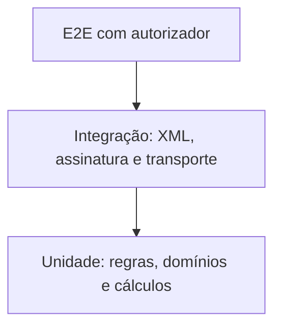
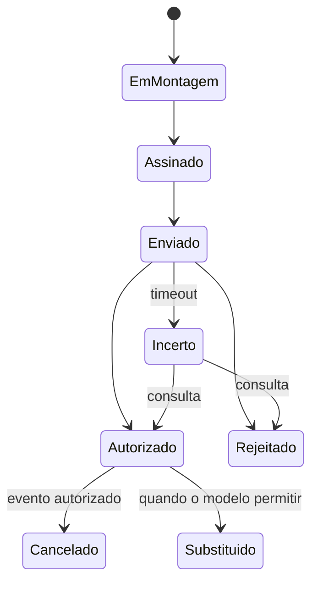
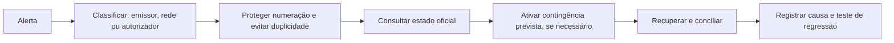

Um emissor confiável precisa provar cálculos, XML, assinatura, comunicação e recuperação. Testar apenas um documento autorizado deixa os riscos principais sem cobertura.

## Pirâmide de testes fiscais

- **Unidade:** seleção de modelo/finalidade, formação e DV da chave, arredondamento, condições de preenchimento, domínios/datas, QR Code, transições de estado.
- **Integração:** serialização contra o XSD correto, assinatura e digest, envelope/compactação, interpretação de respostas, geração do DANFE, armazenamento.
- **E2E:** usar homologação para autorização, rejeição, consulta, evento e contingência. Não dependa só dela: serviços externos caem e não cobrem todas as combinações.

## Matriz mínima por modelo

| Cenário | NF-e | NFC-e |
|---|:---:|:---:|
| autorização normal | ✓ | ✓ |
| rejeição de schema | ✓ | ✓ |
| duplicidade/timeout | ✓ | ✓ |
| cancelamento | ✓ | ✓ |
| documento auxiliar | DANFE | DANFE NFC-e |
| QR Code | quando aplicável | obrigatório |
| contingência própria | ✓ | off-line |
| cenário específico | referências/transporte | consumidor/pagamento |

## Máquina de estados

Não use apenas `autorizado: true/false`.

Guarde o histórico das transições, não apenas o estado atual.

## Observabilidade

Registre de forma estruturada: correlação interna e chave protegida; modelo, ambiente, serviço e autorizador; código e motivo retornados; duração, tentativas e resultado da consulta; versão do schema e da aplicação; estado anterior e novo.

> **Implementação:** não registre chave privada, senha do certificado, CSC, token PIX ou XML completo sem controles de acesso e retenção.

## Indicadores úteis

Taxa de autorização na 1ª tentativa; rejeições por código e versão; timeouts e consultas de recuperação; tempo de autorização por serviço; documentos em estado incerto; contingências não conciliadas; certificados próximos do vencimento.

## Procedimento de incidente

> Uma rejeição é resposta definitiva ao conteúdo enviado; timeout é estado desconhecido. Tratar os dois da mesma forma é causa comum de duplicidade — ver [uso indevido](/docs/emissao-e-comunicacao/recibo-e-uso-indevido).

## Fonte

| Campo | Valor |
|---|---|
| Documento | Orientação de engenharia do projeto, fundamentada no MOC 7.0 (§4.3) e no Manual de Boas Práticas NFC-e. |
| Versão | ver fonte original |
| Data | ver fonte original |
| Páginas/capítulo | §4 |
| NT relacionada | não indicada |
| Schema/tabela relacionada | não indicada |
| Status | base oficial mapeada; confrontar com NT, IT, XSD e regra estadual vigentes |

### Registro de origem

Orientação de engenharia do projeto, fundamentada no MOC 7.0 (§4.3) e no Manual de Boas Práticas NFC-e.
