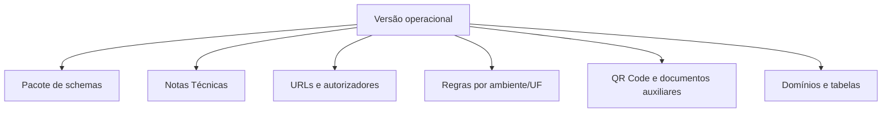
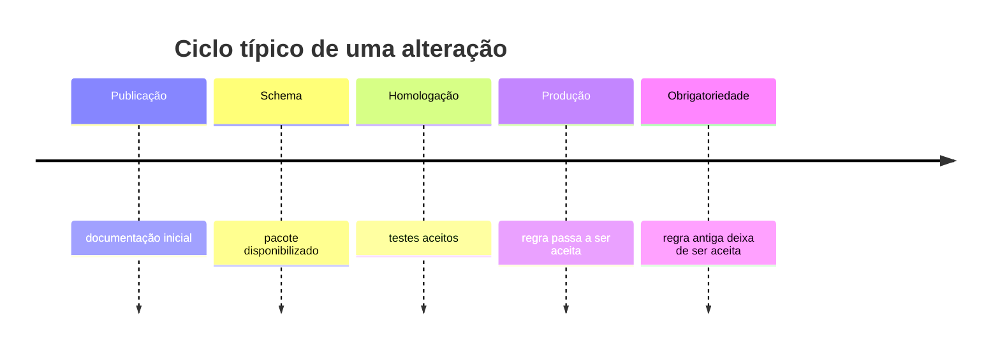

Uma integração fiscal muda em várias velocidades. "Leiaute 4.00" não identifica sozinho todas as regras ativas.

## O que precisa de versão

Registre, no mínimo: modelo; versão declarada no XML; pacote XSD; NTs incorporadas; ambiente (`tpAmb`); UF/autorizador; data de vigência; versão do sistema (`verProc`).

## Homologação e produção

| Aspecto | Homologação | Produção |
|---|---|---|
| finalidade | testes de integração | documento com efeito fiscal |
| dados | textos e condições de teste | dados reais |
| credenciais | certificado e credenciamento válidos | certificado e autorização produtiva |
| endpoint | URL do ambiente | URL produtiva |
| numeração | controle separado | sequência fiscal oficial |

Nunca escolha o ambiente apenas pela URL. Valide `tpAmb` no XML e na resposta.

## Calendário de implantação

NTs podem definir datas diferentes para schema, homologação, produção e obrigatoriedade.

Modele uma janela de convivência quando duas versões forem aceitas. A ativação deve ser configurável por modelo, ambiente e data.

## Endpoints e autorizadores

Não fixe URLs no emissor. Use um catálogo validado com serviço, ambiente, UF/autorizador, versão do protocolo, URL, validade e fonte oficial.

O mapa atual dos endpoints publicados no Portal Nacional está em [Serviços por UF](/docs/operacao/servicos-por-uf). Use essa página como referência documental; no sistema, armazene os dados em estrutura versionada, não em condicionais espalhadas.

## Schema por UF

O Portal Nacional publica a versão técnica dos serviços por UF/autorizador. Em 20/06/2026, os Web Services estaduais e virtuais de NF-e listados estavam na versão `4.00`.

Isso não significa que cada estado tenha um XSD próprio. O schema da NF-e/NFC-e é nacional; o que varia por UF é endpoint, credenciamento, regras opcionais, CSC/CSRT, `cBenef` e disponibilidade de serviços. Para a matriz por UF e os pacotes XSD baixados no repositório, veja [Serviços por UF](/docs/operacao/servicos-por-uf).

## Atualização segura

1. arquive o pacote oficial recebido;
2. calcule hash dos arquivos;
3. compare schemas e regras com a versão atual;
4. classifique mudanças obrigatórias, opcionais e incompatíveis;
5. atualize fixtures e testes;
6. valide em homologação;
7. publique com flag e data controlada;
8. monitore rejeições novas em produção.

## Evite estes erros

- substituir schemas sem registrar a versão anterior;
- ativar regra de produção pela data do computador local;
- assumir que todas as UFs implantam juntas; 📍
- misturar endpoints de homologação e produção;
- aceitar resposta de ambiente diferente do solicitado;
- usar a data de publicação como data de obrigatoriedade.

> A fonte normativa é o pacote oficial e suas Notas Técnicas — ver [Notas Técnicas no MOC](/docs/referencia/notas-tecnicas). Esta página explica como aplicar o material, não congela o estado futuro do portal. 🔄

## Fonte

| Campo | Valor |
|---|---|
| Documento | Orientação de engenharia do projeto, fundamentada no MOC 7.0 (§4.2.6, controle de versão) e nas Notas Técnicas. |
| Versão | ver fonte original |
| Data | ver fonte original |
| Páginas/capítulo | §4 |
| NT relacionada | não indicada |
| Schema/tabela relacionada | não indicada |
| Status | base oficial mapeada; confrontar com NT, IT, XSD e regra estadual vigentes |

### Registro de origem

Orientação de engenharia do projeto, fundamentada no MOC 7.0 (§4.2.6, controle de versão) e nas Notas Técnicas.
