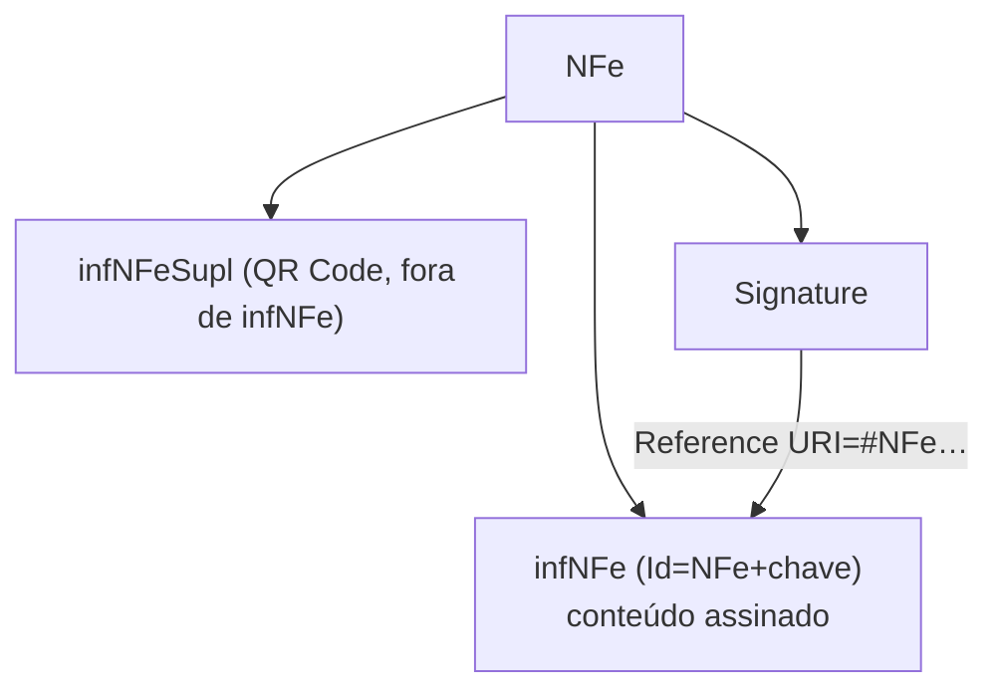

A NF-e/NFC-e usa **XML Digital Signature (XMLDSig)** no formato **Enveloped**: a tag `<Signature>` fica **dentro** do próprio documento que ela assina. É o que dá validade jurídica ao documento, junto com a autorização de uso.

## O que se assina

| Documento | Elemento assinado | `Id` |
|---|---|---|
| NF-e/NFC-e | `infNFe` | literal `NFe` + chave de acesso (44 dígitos) |
| Eventos (cancelamento, CC-e, EPEC…) | `infEvento` | literal `ID` + tipo de evento + chave + sequência |

A `<Signature>` referencia o elemento pelo atributo `Id` via `Reference URI` (`#NFe…`) — ver [Reference URI e digest](/docs/seguranca/reference-uri-digest). Há **uma** assinatura por documento.



> ⚠️ Assine **somente depois de concluir o conteúdo**. Qualquer alteração em `infNFe` após a assinatura invalida o `DigestValue` — ver [Grupos finais](/docs/leiaute-e-rejeicoes/grupos-finais#assinatura). O grupo `infNFeSupl` (QR Code da NFC-e) fica **fora** de `infNFe` e tem assinatura própria do QR Code, não a XMLDSig.

## O que vai (e o que não vai) no KeyInfo

- **Inclua** apenas `<X509Certificate>` com o certificado do **usuário final** — cadeia **EndCertOnly** (ver [Certificado digital](/docs/seguranca/certificado-digital)).
- **Não inclua** `<X509SubjectName>`, `<X509IssuerSerial>`, `<KeyValue>` ou similares: a SEFAZ deriva tudo do certificado.
- **Não envie** a lista de certificados revogados — cada SEFAZ valida a sua.
- **Namespace** da assinatura na própria tag `<Signature>`; é **vedado** usar prefixo de namespace no restante da mensagem.

## Estrutura da XMLDSig

```
Signature
├─ SignedInfo
│  ├─ CanonicalizationMethod   → C14N (ver Canonicalização)
│  ├─ SignatureMethod          → algoritmo de assinatura
│  └─ Reference URI=#NFe…
│     ├─ Transforms            → enveloped-signature + C14N
│     ├─ DigestMethod
│     └─ DigestValue           → hash do infNFe canonicalizado
├─ SignatureValue              → assinatura do SignedInfo
└─ KeyInfo → X509Data → X509Certificate
```

## Algoritmos — referência histórica do MOC 7.0

> 🕒 **Histórico.** A **Tabela 4-2 do MOC 7.0** especifica **RSA-SHA1** (`SignatureMethod`), **SHA-1** (`DigestMethod`) e chave **RSA de 1024 bits**, com `Transform` de assinatura *enveloped* e canonicalização **C14N**. É a especificação de 2020: implemente o protocolo fiscal exigido, mas **confronte com o schema e os atos vigentes** e não trate SHA-1/1024 bits como recomendação de segurança. Ver [Proveniência](/docs/referencia/proveniencia#manuais-usados).

## Caso especial: PAA (NT 2026.001) 🔄

Na emissão por **Provedor de Assinatura e Autorização**, além da XMLDSig qualificada do PAA, há uma **segunda assinatura RSA** (RSA-SHA1, Base64) sobre o atributo `Id`, no grupo `infPAA` (`PAASignature`, `RSAKeyValue`). É um mecanismo fiscal específico, isolado de qualquer uso criptográfico geral — ver [Arquitetura](/docs/emissao-e-comunicacao/arquitetura#emissao-por-paa-procemi4) e [Grupos finais](/docs/leiaute-e-rejeicoes/grupos-finais#overlay-de-nts).

## Implicação de implementação

> **Implementação:** isole a camada de assinatura por versão de especificação. Gere a `<Signature>` como **último** passo antes de transmitir; não serialize/reformate o XML depois (quebra o digest). Use uma biblioteca XMLDSig madura em vez de montar a assinatura por concatenação de strings.

## Fonte

| Campo | Valor |
|---|---|
| Documento | MOC 7.0 — Visão Geral, §4.2 (Assinatura Digital), p. 49–55 (Tabela 4-2). |
| Versão | v1.00 |
| Data | 22/04/2026 |
| Páginas/capítulo | §4.2; p. 49–55; Tabela 4-2 |
| NT relacionada | NT 2026.001 v1.00 (PAA) |
| Schema/tabela relacionada | leiauteNFe_v4.00 (grupo `Signature`) |
| Status | base oficial com algoritmos marcados como históricos; overlay PAA explícito |

### Registro de origem

MOC 7.0 — Visão Geral, capítulo 4 (§4.2), p. 49–55 (Tabela 4-2: RSA-SHA1, digest SHA-1, chave 1024 bits, C14N, transform *enveloped*). Consolida [Arquitetura](/docs/emissao-e-comunicacao/arquitetura#assinatura-xml) e [Grupos finais](/docs/leiaute-e-rejeicoes/grupos-finais#assinatura). Overlay: NT 2026.001 v1.00 (22/04/2026).
