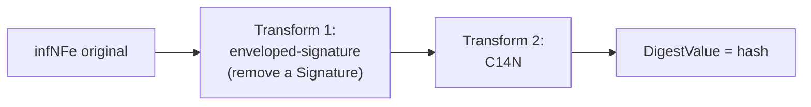

A assinatura digital protege **bytes**, mas dois XMLs logicamente iguais podem ter bytes diferentes (espaços, ordem de atributos, namespaces redundantes). A **canonicalização (C14N)** resolve isso: transforma o XML em uma forma de bytes única e determinística antes de calcular o hash. Sem ela, qualquer reserialização quebraria a assinatura.

## O que o manual diz

A XMLDSig da NF-e usa **Canonical XML 1.0** (C14N, *Canonical XML without comments*) tanto no `CanonicalizationMethod` do `SignedInfo` quanto como `Transform` da referência ao `infNFe`.

| Onde | Para quê |
|---|---|
| `SignedInfo/CanonicalizationMethod` | canonicaliza o `SignedInfo` antes de calcular o `SignatureValue` |
| `Reference/Transforms` | canonicaliza o `infNFe` antes de calcular o `DigestValue` |

## O que a C14N normaliza

- Codificação **UTF-8**;
- quebras de linha e espaços em branco significativos padronizados;
- atributos em ordem canônica; declarações de namespace propagadas para onde são usadas;
- tags vazias expandidas (`<x></x>`), remoção de redundâncias.

Por isso a NF-e proíbe **prefixo de namespace** e tags opcionais vazias: reduzem tamanho e ambiguidade antes mesmo da canonicalização — ver [Arquitetura](/docs/emissao-e-comunicacao/arquitetura#documento-xml).

## Os dois transforms da referência

A referência ao `infNFe` aplica, **nesta ordem**:

1. **enveloped-signature** — remove a própria `<Signature>` do cálculo (ela está *dentro* do que assina; não pode entrar no próprio hash);
2. **C14N** — canonicaliza o resultado.

Só então o `DigestMethod` calcula o `DigestValue`. Ver [Reference URI e digest](/docs/seguranca/reference-uri-digest).

## O erro clássico

> ⚠️ **Não reformate o XML depois de assinar.** *Pretty-print*, reindentação, troca de codificação, reordenação de atributos ou re-serialização por outra biblioteca alteram os bytes; mesmo que a C14N normalize parte disso, o documento pode chegar à SEFAZ com digest divergente. Assine por **último** e transmita exatamente os bytes assinados — ver [Erros comuns](/docs/seguranca/erros-comuns).

## Implicação de implementação

> **Implementação:** use a implementação de C14N da sua biblioteca XMLDSig; não tente canonicalizar "na mão". Garanta que o módulo de assinatura e o de transmissão operem sobre **a mesma árvore/bytes** — serializar, salvar e reabrir o XML entre assinar e enviar é a fonte mais comum de "assinatura difere do calculado" (`cStat 297`).

## Fonte

| Campo | Valor |
|---|---|
| Documento | MOC 7.0 — Visão Geral, §4.2 (Assinatura Digital / Tabela 4-2), p. 49–55. |
| Versão | v1.00 |
| Data | 22/04/2026 |
| Páginas/capítulo | §4.2; Tabela 4-2; p. 49–55 |
| NT relacionada | não indicada |
| Schema/tabela relacionada | leiauteNFe_v4.00 (grupo `Signature`) |
| Status | base oficial; C14N conforme W3C XML Signature, confrontar com schema vigente |

### Registro de origem

MOC 7.0 — Visão Geral, capítulo 4 (§4.2), Tabela 4-2, p. 49–55 (canonicalização C14N e transform *enveloped-signature*). Canonical XML 1.0 conforme recomendação W3C (XML-C14N), aplicada pelo grupo `Signature` do `leiauteNFe_v4.00`.
