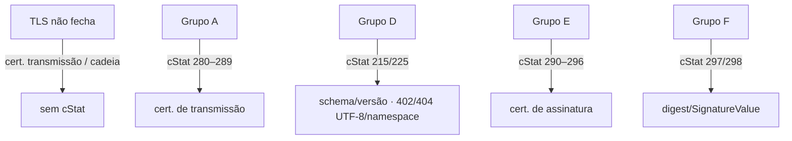

A maioria das falhas de segurança cai em duas faixas de `cStat`: **certificado** e **assinatura/XMLDSig**. Saber em qual camada o erro nasce — TLS, certificado de assinatura ou digest — encurta o diagnóstico. Falhas de TLS nem chegam a gerar `cStat`: a conexão não fecha.

## Onde cada erro nasce

## Faixas de `cStat` (MOC — Tabela de Código de Status)

| Faixa | Camada | Causa típica |
|---|---|---|
| **280–289** | certificado de **transmissão** | inválido, vencido, sem CNPJ, fora da cadeia/ICP, revogado, falha de acesso à LCR |
| **290–296** | certificado de **assinatura** | inválido, vencido, sem CNPJ, cadeia, revogado, raiz não-ICP, falha de LCR |
| **297** | assinatura XML | **assinatura difere do calculado** (digest/`SignatureValue`) |
| **298** | assinatura XML | **assinatura difere do padrão do Projeto** (estrutura XMLDSig incorreta) |

> Os números são estáveis no MOC, mas decida sempre pelo `xMotivo`: alguns `cStat` são reaproveitados por NTs distintas — ver [Códigos de retorno](/docs/leiaute-e-rejeicoes/codigos-de-retorno). Erros adjacentes de estrutura: `215/225` (schema/versão) e `402/404` (UTF-8/namespace) aparecem **antes** da validação de assinatura, no grupo D.

## Causas frequentes e onde olhar

| Sintoma | Causa provável | Onde corrigir |
|---|---|---|
| TLS não estabelece | truststore sem cadeia ICP-Brasil; cert. de transmissão vencido/revogado | [TLS mútuo](/docs/seguranca/tls-mutuo) · [Cadeia](/docs/seguranca/cadeia-certificado) |
| `cStat 290–293` | cert. de assinatura inválido, vencido ou sem CNPJ no OID esperado | [Certificado digital](/docs/seguranca/certificado-digital) |
| `cStat 294–296` | revogado, fora da cadeia ou raiz não-ICP | [Cadeia](/docs/seguranca/cadeia-certificado) |
| `cStat 297` | XML reformatado/reserializado após assinar; canonicalização errada | [Canonicalização](/docs/seguranca/canonicalizacao) · [Reference URI e digest](/docs/seguranca/reference-uri-digest) |
| `cStat 298` | estrutura XMLDSig fora do padrão: prefixo de namespace, `KeyInfo` com campos proibidos, transforms na ordem errada | [Assinatura XML](/docs/seguranca/assinatura-xml) |
| assinatura válida, mas rejeita por identidade | CNPJ do certificado ≠ emitente do XML | [Certificado digital](/docs/seguranca/certificado-digital) |
| `cStat 1181–1184` | emissão por PAA: provedor inexistente, vínculo inativo ou assinatura RSA inválida | [Assinatura XML](/docs/seguranca/assinatura-xml#caso-especial-paa-nt-2026001) |

## A regra de ouro contra o `cStat 297`

> ⚠️ **Não toque no XML depois de assinar.** A causa nº 1 de "assinatura difere do calculado" é serializar/salvar/reabrir, reindentar ou re-serializar por outra biblioteca entre **assinar** e **transmitir**. Assine por último e envie exatamente os mesmos bytes. Para depurar: recalcule o `DigestValue` sobre o XML **efetivamente transmitido** — se diferir do enviado, o problema é canonicalização/reserialização; se o digest confere mas o `SignatureValue` não, é chave/algoritmo.

## Implicação de implementação

> **Implementação:** logue, por chamada, `cStat`, `xMotivo`, ambiente, UF, serviço e o `hash` do XML — **sem** chave privada, senha do certificado ou dados pessoais (ver [Códigos de retorno](/docs/leiaute-e-rejeicoes/codigos-de-retorno)). Valide a assinatura **localmente** (XSD → assinatura) antes de transmitir, conforme o teste em camadas do [pipeline](/docs/leiaute-e-rejeicoes/pipeline-de-validacao#teste-local-em-camadas): erro pego cedo não consome o Web Service e dá diagnóstico mais limpo.

## Fonte

| Campo | Valor |
|---|---|
| Documento | MOC 7.0 — Anexo II (Tabela de Código de Status) e Anexo I, §4.1 (Regras de Validação). |
| Versão | v1.00 |
| Data | 22/04/2026 |
| Páginas/capítulo | Tabela de cStat (faixas 280–298); Anexo I, §4.1, p. 71–74 |
| NT relacionada | NT 2026.001 v1.00 (cStat 1181–1184, PAA) |
| Schema/tabela relacionada | não indicada |
| Status | base oficial; confirmar o texto exato de cada cStat na tabela vigente |

### Registro de origem

MOC 7.0 — Anexo II (Tabela de Código de Status: faixas 280–289 transmissão, 290–296 assinatura, 297/298 XMLDSig) e Anexo I, §4.1 (Regras de Validação Gerais, grupos A/D/E/F), p. 71–74. Diagnóstico por camada conforme [Pipeline de validação](/docs/leiaute-e-rejeicoes/pipeline-de-validacao). Códigos PAA (1181–1184) da NT 2026.001 v1.00 — ver [Códigos de retorno](/docs/leiaute-e-rejeicoes/codigos-de-retorno).
