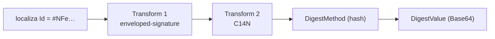
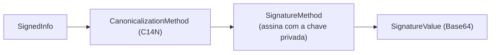

A `<Reference>` da XMLDSig diz **o que** está sendo assinado e **como** o hash foi calculado. Na NF-e, ela aponta para o `infNFe` pelo atributo `Id`. Entender essa cadeia é o que permite diagnosticar `cStat 297` (digest/assinatura difere) sem tentativa e erro.

## A referência pelo `Id`

| Campo | Valor |
|---|---|
| Atributo no `infNFe` | `Id="NFe" + chave de acesso` (44 dígitos) |
| `Reference URI` | `#NFe` + chave (ex.: `URI="#NFe35..."`) |

A `#` indica referência **interna** ao mesmo documento. O processador localiza o elemento cujo `Id` casa com o que vem depois do `#`. Em eventos, o `Id` de `infEvento` segue o padrão `ID` + tipo de evento + chave + sequência, e a `Reference URI` aponta para ele — ver [Assinatura XML](/docs/seguranca/assinatura-xml).

## Como o `DigestValue` é calculado

1. resolve a `Reference URI` para o `infNFe`;
2. aplica os transforms: **enveloped-signature** (remove a `<Signature>`) e **C14N** (canonicaliza) — ver [Canonicalização](/docs/seguranca/canonicalizacao);
3. calcula o hash (`DigestMethod`) e grava o `DigestValue` em **Base64**.

## Como o `SignatureValue` é calculado

O `SignatureValue` **não** assina o `infNFe` diretamente: assina o `SignedInfo` canonicalizado — que **contém** o `DigestValue`. Daí a cadeia de confiança:

> Conteúdo íntegro → `DigestValue` confere → `SignedInfo` íntegro → `SignatureValue` confere → documento autêntico.

É exatamente a ordem verificada nos grupos E/F do [pipeline](/docs/leiaute-e-rejeicoes/pipeline-de-validacao#grupos-e-e-f-certificado-e-assinatura): referência válida → digest confere → `SignatureValue` confere → identidade compatível.

## Por que cada byte importa

| Quebra | Efeito |
|---|---|
| qualquer alteração em `infNFe` após assinar | `DigestValue` deixa de conferir |
| reserialização/reindentação antes de enviar | digest ou assinatura divergem (`cStat 297`) |
| `Id` e `Reference URI` inconsistentes | referência não resolve; assinatura inválida |
| transforms fora da ordem (C14N antes do *enveloped*) | digest divergente |

## Implicação de implementação

> **Implementação:** monte `Id` e `Reference URI` a partir da **mesma** chave de acesso, com o prefixo `NFe`. Calcule o digest sobre o `infNFe` **já no estado final** e não toque no XML depois. Ao depurar `cStat 297`, compare o `DigestValue` que você calcula localmente (sobre o XML transmitido) com o do XML enviado: se diferem, o problema é canonicalização/reserialização; se o digest confere mas o `SignatureValue` não, o problema é a chave/algoritmo de assinatura.

## Fonte

| Campo | Valor |
|---|---|
| Documento | MOC 7.0 — Visão Geral, §4.2 (Assinatura Digital / Tabela 4-2), p. 49–55. |
| Versão | v1.00 |
| Data | 22/04/2026 |
| Páginas/capítulo | §4.2; Tabela 4-2; p. 49–55 |
| NT relacionada | não indicada |
| Schema/tabela relacionada | leiauteNFe_v4.00 (grupo `Signature`) |
| Status | base oficial; estrutura conforme W3C XML Signature, confrontar com schema vigente |

### Registro de origem

MOC 7.0 — Visão Geral, capítulo 4 (§4.2), Tabela 4-2, p. 49–55 (Reference URI `#NFe…`, transforms *enveloped-signature* + C14N, `DigestValue`/`SignatureValue` em Base64). Estrutura conforme W3C XML Signature. Ordem de verificação em [Pipeline de validação](/docs/leiaute-e-rejeicoes/pipeline-de-validacao).
