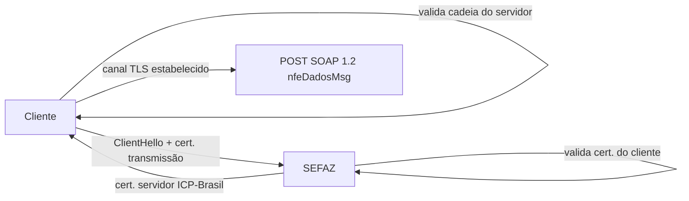

A comunicação com a SEFAZ é **HTTPS com autenticação mútua**: além de o cliente validar o servidor (como em qualquer HTTPS), o servidor exige e valida o **certificado do cliente**. Isso dispensa usuário/senha — a identidade da conexão *é* o certificado de transmissão.

## O que o manual diz

| Item | Especificação |
|---|---|
| Protocolo | **TLS 1.2 ou superior** |
| Autenticação | **mútua** (servidor e cliente por certificado ICP-Brasil) |
| Mensagem | **SOAP 1.2**, estilo `Document/Literal`, perfil WS-I Basic Profile |
| Payload | XML no parâmetro `nfeDadosMsg` |
| Versão do leiaute | `versaoDados`, no `nfeCabecMsg` do SOAP Header |

## O certificado de transmissão

O certificado apresentado no handshake é o **de transmissão**, não necessariamente o de assinatura — ver [Certificado digital](/docs/seguranca/certificado-digital):

- carrega o **CNPJ do responsável pela transmissão** (pode ser software house, contabilidade ou o próprio emissor);
- precisa de *Extended Key Usage* **"Autenticação de Cliente"**;
- é validado no **Grupo A** do [pipeline](/docs/leiaute-e-rejeicoes/pipeline-de-validacao#grupo-a-certificado-de-transmissao): validade, cadeia, revogação e raiz ICP-Brasil.

> 🔐 Falha de TLS acontece **antes** de qualquer `cStat`: a conexão simplesmente não fecha. Se o handshake cai, investigue cadeia/validade do certificado de transmissão e a truststore — não o XML.

## Confiar na cadeia do servidor

Para fechar o TLS, o cliente precisa **confiar na cadeia do servidor** da SEFAZ. Os hosts publicados no Portal Nacional usam árvores distintas:

| Host | Âncora de confiança |
|---|---|
| Web Services (ex.: `www1.nfe.fazenda.gov.br`) | **ICP-Brasil** (Raiz Brasileira v10 → AC SERPRO) |
| Portal público (ex.: `www.nfe.fazenda.gov.br`) | Let's Encrypt |

> **Implementação:** instale a cadeia **ICP-Brasil** na truststore do cliente dos Web Services — as âncoras públicas do SO podem não incluir a Raiz Brasileira. Detalhe e arquivos de referência em [Cadeia de certificação](/docs/seguranca/cadeia-certificado) e em [Mapa dos Web Services](/docs/emissao-e-comunicacao/web-services#cadeia-de-certificacao-tls).

## Implicação de implementação

> **Implementação:** o fluxo é *stateless* por chamada — abra TLS mútuo, faça um POST SOAP e receba a resposta na mesma conexão; não há sessão a reaproveitar entre serviços. Resolva endpoint e `versaoDados` por (serviço × UF/autorizador × ambiente) — ver [Serviços por UF](/docs/operacao/servicos-por-uf) — e não fixe URLs no código. Fixe TLS ≥ 1.2 e desabilite versões inferiores.

## Fonte

| Campo | Valor |
|---|---|
| Documento | MOC 7.0 — Visão Geral, §4.1 (Padrões Técnicos) e capítulo 5, p. 49–55. |
| Versão | v1.00 |
| Data | 22/04/2026 |
| Páginas/capítulo | §4.1; p. 49–55 |
| NT relacionada | não indicada |
| Schema/tabela relacionada | não indicada |
| Status | base oficial; confirmar a versão mínima de TLS exigida no serviço vigente |

### Registro de origem

MOC 7.0 — Visão Geral, capítulo 4 (§4.1) e capítulo 5, p. 49–55 (Tabela 4-1). Consolida a parte de transporte de [Arquitetura](/docs/emissao-e-comunicacao/arquitetura#comunicacao) e a cadeia TLS de [Web Services](/docs/emissao-e-comunicacao/web-services#cadeia-de-certificacao-tls).
