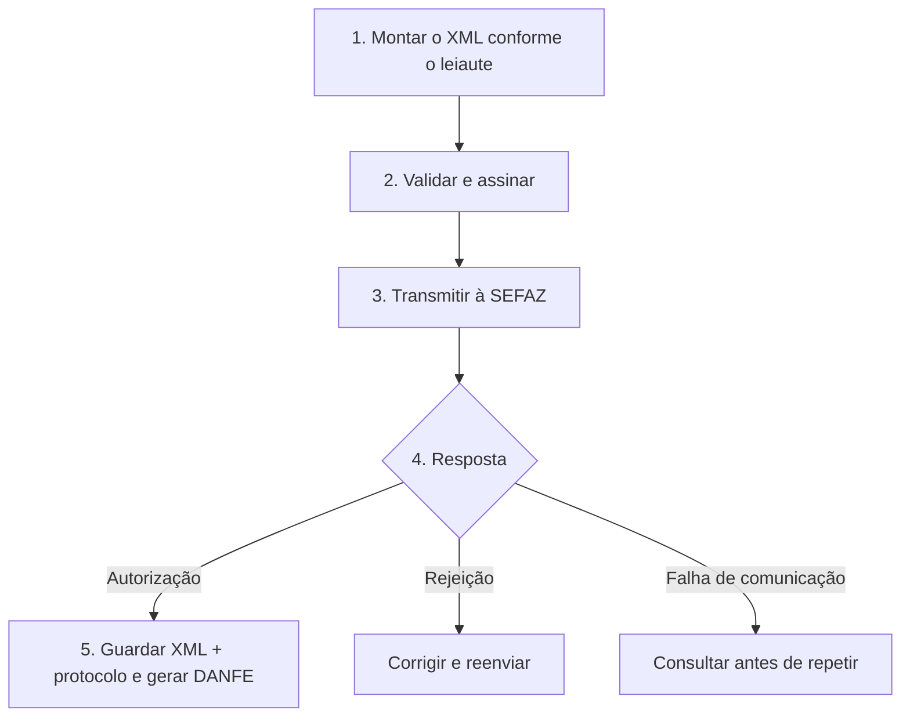

Base de conhecimento sobre os principais documentos fiscais eletrônicos do Brasil — seus leiautes, regras de validação, manuais oficiais e notas técnicas.

## Tópicos por família documental

| Tópico | Origem e escopo |
|---|---|
| [NF-e e NFC-e](/docs/nfe-nfce) | conteúdo coletado no Portal Nacional da NF-e: modelos 55 e 65, MOC 7.0 e documentos auxiliares |
| [NF-e ABI](/docs/nfe-abi) | modelo 77, alienação de bens imóveis, MOC e Anexo I próprios |
| [NFAg](/docs/nfag) | modelo 75, água e saneamento, MOC, Anexo I e DANFAG próprios |
| [NFGas](/docs/nfgas) | modelo 76, gás canalizado, MOC, Anexo I e DANFGas próprios |
| [Reforma Tributária](/docs/reforma-tributaria) | trilha do IBS, da CBS e do Imposto Seletivo na NF-e/NFC-e — overlay navegável da LC 214/2025 ao XML |

CT-e e MDF-e continuam fora da navegação publicada. O material da Reforma Tributária tem trilha própria em [Reforma Tributária](/docs/reforma-tributaria).

## Documentos cobertos

| Documento | Modelo | O que é |
|-----------|--------|---------|
| **NF-e** | 55 | Nota Fiscal Eletrônica — operações entre empresas e transporte |
| **NFC-e** | 65 | NF de Consumidor Eletrônica — venda no varejo ao consumidor final |
| **NFAg** | 75 | Nota Fiscal de Água e Saneamento Eletrônica |
| **NFGas** | 76 | Nota Fiscal Eletrônica do Gás |
| **NF-e ABI** | 77 | Nota Fiscal Eletrônica de Alienação de Bens Imóveis |

## Onde ficam os manuais oficiais

| Portal | URL |
|--------|-----|
| NFe / NFCe / NFAg / NFGas / NF-e ABI | `https://dfe-portal.svrs.rs.gov.br/Nfe/Documentos` |
| Portal Nacional NFe | `https://www.nfe.fazenda.gov.br/portal/principal.aspx` |

## Estrutura de cada documento

Todo documento fiscal eletrônico segue a mesma lógica:

## Escopo atual

O conteúdo ativo separa cada documento com schema próprio em um tópico de raiz. Alterações de IBS, CBS e IS são tratadas nos capítulos do documento afetado, conforme a versão da Nota Técnica e do schema.
