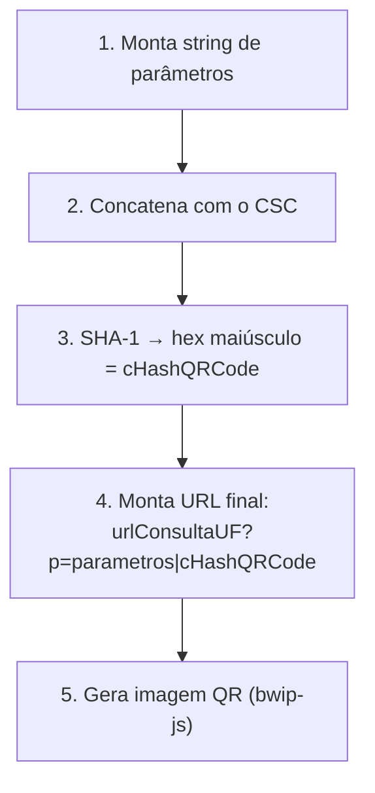

> **TL;DR:** A NFC-e não usa código de barras — usa **QR Code**. **Existem duas versões em jogo:**
> - **QR v2** (atual na maioria das UF): hash **SHA-1 com CSC** (Código de Segurança do Contribuinte).
> - **QR v3** (NT 2025.001, entrando): **sem CSC** — a autenticidade vem da **assinatura** de campos do QR, e só em **contingência**. O CSC tende a ser **eliminado**.
>
> Sua lib deve suportar **as duas** e escolher por UF/configuração. O texto do QR vai no grupo **`ZX/infNFeSupl`** (`qrCode` ZX02 + `urlChave` ZX03), que **não entra na assinatura da nota**.
>
> ⚠️ O detalhe completo está no **"Manual DANFE-NFC-e + QR Code v6.0"** e na **NT 2025.001** (QR v3) — documentos separados do Anexo II.

---

## QR v2 (CSC) vs QR v3 (assinatura)

| | **QR v2** (atual) | **QR v3** (NT 2025.001) |
|--|-------------------|--------------------------|
| Autenticidade | hash SHA-1(params + **CSC**) | **assinatura** de campos do QR |
| Precisa de CSC? | ✅ sim (por UF/ambiente) | ❌ não |
| Quando assina | sempre | **só em contingência** |
| Vantagem | já funciona em todas UF | sem manutenção de CSC, menos complexidade |
| Futuro | será descontinuado | padrão único futuro |

> 🧠 Por isso a lib deve abstrair: `montarQrCode(versao, ...)`. Em UF que já aceita v3, você dispensa o CSC; nas demais, continua no v2.

---

## CSC — necessário enquanto v2 existir

| | Certificado digital | **CSC** |
|--|--------------------|---------|
| Pra quê | assinar o XML | gerar o hash do QR Code |
| Formato | `.pfx` (A1) | `idCSC` (6 dígitos) + `CSC` (string ~36 chars) |
| Onde consegue | autoridade certificadora (ICP-Brasil) | **portal da SEFAZ do seu estado** |
| Usado em | NF-e e NFC-e | **só NFC-e** |

> 🧠 **Dois "segredos" diferentes.** O certificado assina; o CSC valida o QR. Sua lib precisa dos dois pra NFC-e. O CSC é por **UF + ambiente** (homologação tem CSC próprio).

---

## Como montar o QR Code **v2** (com CSC)



**Parâmetros (separados por `|`), na ordem:**

| Campo | O que é |
|-------|---------|
| `chNFe` | chave de acesso (44) |
| `nVersao` | versão do QR Code (`2`) |
| `tpAmb` | `1` ou `2` |
| `cDest` | CNPJ/CPF do destinatário (**só se houver**) |
| `dhEmi` | data/hora emissão em **hexadecimal** (**só offline**) |
| `vNF` | valor total (**só offline**) |
| `vICMS` | valor ICMS (**só offline**) |
| `digVal` | digest da assinatura em **hex** (**só offline**) |
| `cIdToken` | o `idCSC` (6 dígitos) |
| `cHashQRCode` | SHA-1 dos params + CSC |

> Online (`tpEmis=1`) → QR **curto** (a nota já está autorizada, a SEFAZ tem os dados).
> Offline (`tpEmis=9`) → QR **longo** (inclui `dhEmi`, `vNF`, `vICMS`, `digVal` porque a nota ainda não foi autorizada).

---

## Esboço em TypeScript

```ts
import { createHash } from "node:crypto";

/** Monta a URL do QR Code da NFC-e (v2.0). */
export function montarQrCodeNFCe(p: {
  chave: string; tpAmb: "1" | "2"; tpEmis: string;
  csc: string; idCsc: string;        // do portal da SEFAZ
  urlConsultaUF: string;             // endpoint de consulta da UF
  offline?: { dhEmiHex: string; vNF: string; vICMS: string; digValHex: string };
  cpfCnpjDest?: string;
}): string {
  const pares: [string, string | undefined][] = [
    ["chNFe", p.chave],
    ["nVersao", "2"],
    ["tpAmb", p.tpAmb],
    ["cDest", p.cpfCnpjDest],
    ["dhEmi", p.offline?.dhEmiHex],
    ["vNF", p.offline?.vNF],
    ["vICMS", p.offline?.vICMS],
    ["digVal", p.offline?.digValHex],
    ["cIdToken", p.idCsc],
  ];
  // string de parâmetros (só os presentes), no formato chave=valor&...
  const params = pares
    .filter(([, v]) => v !== undefined && v !== "")
    .map(([k, v]) => `${k}=${v}`)
    .join("&");

  // hash = SHA-1( params + CSC ) em hex maiúsculo
  const cHash = createHash("sha1").update(params + p.csc).digest("hex").toUpperCase();

  return `${p.urlConsultaUF}?p=${params}&cHashQRCode=${cHash}`;
}
```

> ⚠️ A ordem e o formato exatos dependem da versão do QR e podem ter ajustes por NT — **confira o manual v6.0** antes de fechar. O conceito (params + CSC → SHA-1 hex) é estável.

---

## DANFE NFC-e (o cupom) — campos obrigatórios

Cupom estreito (largura ≥ 55 mm). Diferente do DANFE 55, **não** lista o detalhe fiscal completo dos itens (vai pra consulta via QR).

Mínimo obrigatório:
- Emitente: Razão social, CNPJ, IE, UF
- "Documento Auxiliar da Nota Fiscal de Consumidor Eletrônica"
- Itens: descrição, qtde, valor unitário, valor total (resumido)
- Totais: qtde de itens, valor total, **forma de pagamento + valor pago + troco**
- Chave de acesso (texto) + **link de consulta**
- **QR Code**
- Dados do consumidor (CPF/CNPJ, se informado)
- Tributos totais (Lei 12.741) — "Tributos Totais Incidentes R$ ..."

Em contingência off-line: carimbo **"EMITIDA EM CONTINGÊNCIA — Pendente de autorização"** e a 2ª via **"Via do Estabelecimento"** (arquivo 07).

> 💡 O **DANFE Simplificado – Etiqueta** (NT 2020.004, está no Anexo II que você subiu) é outro formato pra e-commerce/logística — útil se o projeto atende varejo online.

---

## Checklist NFC-e (o que a lib precisa a mais vs NF-e 55)

- [ ] Suportar **QR v2 (CSC)** e **QR v3 (assinatura, NT 2025.001)** — escolher por UF
- [ ] Aceitar **CSC + idCSC** por UF/ambiente (enquanto v2 existir; v3 dispensa)
- [ ] Montar QR Code online **e** offline (params diferentes)
- [ ] Hash SHA-1(params + CSC) em hex maiúsculo (v2)
- [ ] Gravar `qrCode` (ZX02) e `urlChave` (ZX03) no grupo **`infNFeSupl`** (não assinado)
- [ ] Template de **cupom** (≥55mm), não A4
- [ ] `pag` coerente com total + troco
- [ ] **Resposta síncrona obrigatória** (lote de 1) — NFC-e não usa recibo/lote (NT 2023.002)
- [ ] Contingência **off-line** (`tpEmis=9`) — única da NFC-e (arquivo 07)
- [ ] Baixar **Manual DANFE-NFC-e + QR v6.0** e **NT 2025.001** do Portal

> 📌 **Onde o QR mora no XML:** grupo **`ZX – infNFeSupl`** (filho de `NFe`, irmão de `infNFe`), com `qrCode` (texto da URL, 60-1000 chars) e `urlChave` (URL de consulta por chave). Esse grupo **fica fora da assinatura** da nota.
