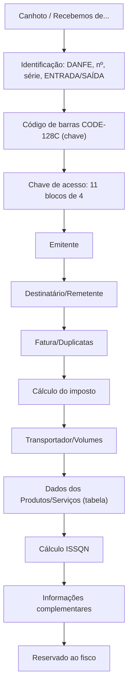
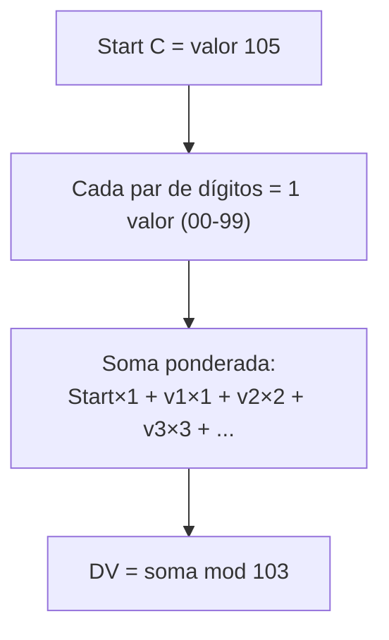
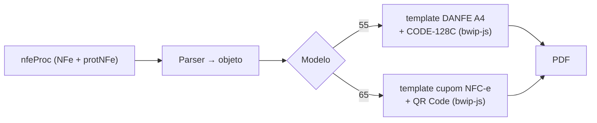

> **TL;DR:** DANFE é a representação em papel/PDF do XML — **não pode mostrar nada que não esteja no XML**. Tem código de barras **CODE-128C** (chave de 44 dígitos, DV mod 103). A NFC-e usa **QR Code** em vez disso. Layout exato está no Anexo II.

---

## O que é o DANFE

| Serve pra | Não serve pra |
|-----------|---------------|
| Acompanhar a mercadoria | Ser a nota (a nota é o XML) |
| Coletar assinatura de recebimento | Mostrar dados fora do XML |
| Permitir escrituração pelo destinatário | Ter "valor fiscal" em homologação |

- Homologação → carimba **"SEM VALOR FISCAL"**.
- Contingência → carimba a frase do modo usado (ver arquivo 07).
- Papel: qualquer um, **menos jornal**. Tamanho **A4 mín. até Ofício II**. Retrato ou paisagem.
- Fonte: **Times New Roman** ou **Courier New**.

---

## Blocos do DANFE (modelo 55)



**Colunas obrigatórias da tabela de produtos** (não podem sumir):
`Código · Descrição · NCM · CST · CFOP · Unidade · Quantidade · Valor Unitário · Valor Total · BC ICMS · Valor ICMS · Alíquota ICMS`

> Você pode suprimir colunas que não usa e adicionar suas próprias **à direita** da Descrição. Mas as 12 acima ficam.

---

## CODE-128C — o código de barras da chave

A NF-e (55) usa **CODE-128C** com a **chave de 44 dígitos**. Estrutura simbólica:

```
[margem clara] [Start C] [dados] [DV] [Stop] [margem clara]
```

- CODE-128C codifica **2 dígitos por símbolo** → 44 dígitos = 22 símbolos.
- **DV próprio do código de barras** = **módulo 103** (≠ do DV da chave, que é mod 11).

### DV do CODE-128C (mod 103)



```ts
/** DV do CODE-128C para uma string de dígitos (par count). */
export function dvCode128C(digitos: string): number {
  if (digitos.length % 2 !== 0) throw new Error("CODE-128C precisa de nº par de dígitos");
  let soma = 105; // valor do Start C (peso 1)
  let peso = 1;
  for (let i = 0; i < digitos.length; i += 2) {
    const valor = Number(digitos.slice(i, i + 2)); // par de dígitos
    soma += valor * peso;
    peso++;
  }
  return soma % 103;
}
```

> Na prática você **não vai calcular barras na mão** — use `bwip-js` passando o tipo `code128` e a chave. A teoria acima é só pra entender/validar. O `bwip-js` cuida de Start/DV/Stop.

**Dimensões mínimas (Anexo II):**
- Largura total: **6 cm** (laser/jato) ou **11,5 cm** (matricial).
- Altura da barra: **0,8 cm**. Módulo: **0,02 cm**.

---

## NFC-e (65) — QR Code, não código de barras

A NFC-e troca o CODE-128C por um **QR Code** que aponta pra consulta pública. O DANFE NFC-e:
- É um **cupom estreito** (largura ≥ 55 mm).
- **Não** lista detalhe completo dos itens no corpo (vai pra consulta).
- Em contingência: carimba **"EMITIDA EM CONTINGÊNCIA"** e o QR Code carrega data/hora de emissão.

> A spec do DANFE NFC-e + QR Code está num manual **separado** (Portal Nacional da NFC-e), não no Anexo II. Trate como módulo à parte na lib.

---

## Estratégia de geração na lib



**Duas abordagens de PDF:**
1. **HTML → PDF** (template + headless/print). Mais fácil de estilizar o layout do Anexo II.
2. **PDF programático** (`pdfkit`). Mais controle, mais trabalho de posicionamento.

> Para começar: gere o DANFE a partir do `nfeProc` autorizado (precisa do protocolo). Em homologação, force o carimbo "SEM VALOR FISCAL".

---

## Checklist DANFE

- [ ] Lê do `nfeProc` (XML + protocolo), nunca de dados soltos
- [ ] Chave em 11 blocos de 4 dígitos
- [ ] CODE-128C (55) **ou** QR Code (65)
- [ ] Carimbo "SEM VALOR FISCAL" se `tpAmb=2`
- [ ] Frase de contingência se `tpEmis≠1`
- [ ] 12 colunas obrigatórias na tabela de itens (55)
- [ ] `infAdProd` impresso embaixo do item correspondente
- [ ] Número da folha (`x/y`) no topo, mesmo se 1 folha
