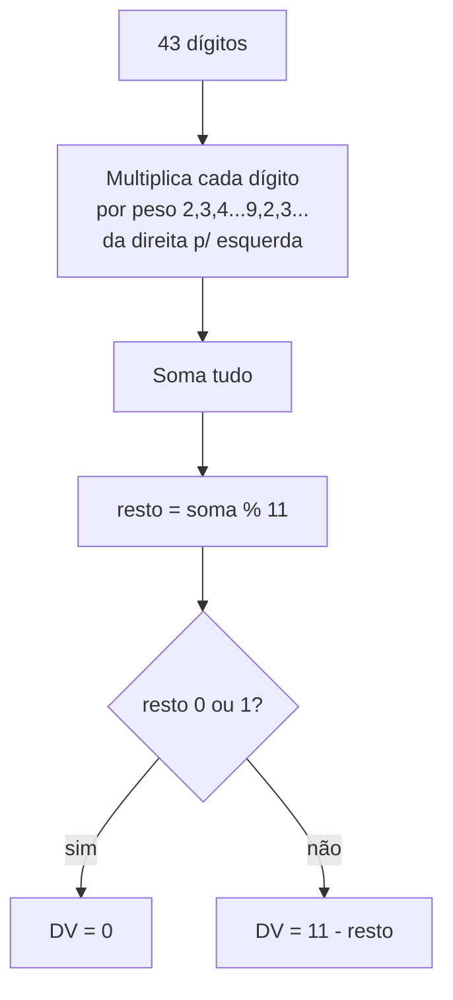

> **TL;DR:** Toda nota tem um ID de **44 dígitos numéricos**. Você **monta** 43 e **calcula** o último (dígito verificador, mod 11). Errou o DV = rejeição.

---

## Composição (43 + 1)

```
cUF │ AAMM │ CNPJ        │ mod │ serie │ nNF      │ tpEmis │ cNF     │ cDV
 2  │  4   │    14       │  2  │   3   │    9     │   1    │   8     │  1
─── │ ──── │ ──────────  │ ─── │ ───── │ ──────── │ ────── │ ─────── │ ───
                          ↑ 43 dígitos montados                        ↑ calculado
```

| Pos | Campo | Tam | O que é | Fonte (tag XML) |
|-----|-------|-----|---------|-----------------|
| 1 | `cUF` | 2 | Código IBGE do estado | `ide/cUF` |
| 2 | `AAMM` | 4 | Ano+mês da emissão (`AAMM`) | de `ide/dhEmi` |
| 3 | `CNPJ` | 14 | CNPJ do emitente | `emit/CNPJ` |
| 4 | `mod` | 2 | `55` ou `65` | `ide/mod` |
| 5 | `serie` | 3 | Série da nota | `ide/serie` |
| 6 | `nNF` | 9 | Número da nota | `ide/nNF` |
| 7 | `tpEmis` | 1 | Forma de emissão (ver arq. 07) | `ide/tpEmis` |
| 8 | `cNF` | 8 | Código numérico aleatório | `ide/cNF` |
| 9 | `cDV` | 1 | **Dígito verificador (mod 11)** | `ide/cDV` |

> 🔑 **`cNF` é um número aleatório que você gera.** Regra moderna: ele **não pode** ser igual ao `nNF`. Gere 8 dígitos random e pronto.

---

## Dígito verificador — mod 11

Algoritmo: pesos cíclicos **2→9** aplicados da direita pra esquerda sobre os 43 dígitos.



### Código (TypeScript)

```ts
/** Calcula o dígito verificador (cDV) dos 43 primeiros dígitos da chave. */
export function calcChaveDV(chave43: string): number {
  if (!/^\d{43}$/.test(chave43)) {
    throw new Error("Chave deve ter exatamente 43 dígitos numéricos");
  }
  let soma = 0;
  let peso = 2;
  // da direita para a esquerda
  for (let i = chave43.length - 1; i >= 0; i--) {
    soma += Number(chave43[i]) * peso;
    peso = peso === 9 ? 2 : peso + 1;
  }
  const resto = soma % 11;
  return resto === 0 || resto === 1 ? 0 : 11 - resto;
}

/** Monta os 44 dígitos a partir dos campos. */
export function montarChave(p: {
  cUF: string;      // 2
  aamm: string;     // 4  (ex: "2406")
  cnpj: string;     // 14
  mod: "55" | "65"; // 2
  serie: string;    // 3  (zero-padded)
  nNF: string;      // 9  (zero-padded)
  tpEmis: string;   // 1
  cNF: string;      // 8  (zero-padded)
}): string {
  const base43 =
    p.cUF + p.aamm + p.cnpj + p.mod +
    p.serie.padStart(3, "0") +
    p.nNF.padStart(9, "0") +
    p.tpEmis +
    p.cNF.padStart(8, "0");
  return base43 + String(calcChaveDV(base43));
}

/** Valida uma chave de 44 dígitos. */
export function validarChave(chave44: string): boolean {
  if (!/^\d{44}$/.test(chave44)) return false;
  return calcChaveDV(chave44.slice(0, 43)) === Number(chave44[43]);
}
```

> 🚨 **CNPJ alfanumérico (NT 2026.004 / `tiposBasico_v1.03`):** com a virada, a chave **deixa de ser 44 dígitos**. O padrão passa a ser `[0-9]{6}[0-9A-Z]{12}[0-9]{26}` — as **12 posições do CNPJ** dentro da chave podem ter **letras**. Então:
> - `validarChave` não pode usar `/^\d{44}$/` — use `/^[0-9]{6}[0-9A-Z]{12}[0-9]{26}$/`.
> - O **DV mod 11 da chave** passa a tratar cada caractere pelo **valor**: dígito = seu número; letra = `código ASCII − 48` (`A`=17 … `Z`=42). Veja o mesmo tratamento no CNPJ abaixo.
> - **CPF e os demais campos seguem numéricos** — só o trecho do CNPJ vira alfanumérico.

```ts
/** Valor de um caractere para cálculo de DV (dígito ou letra). */
const valorChar = (c: string) =>
  c >= "0" && c <= "9" ? Number(c) : c.charCodeAt(0) - 48; // 'A'=17 ... 'Z'=42

/** DV mod 11 genérico (chave ou CNPJ), aceitando alfanumérico. */
function dvMod11(base: string, pesoInicial = 2): number {
  let soma = 0, peso = pesoInicial;
  for (let i = base.length - 1; i >= 0; i--) {
    soma += valorChar(base[i]) * peso;
    peso = peso === 9 ? 2 : peso + 1;
  }
  const r = soma % 11;
  return r === 0 || r === 1 ? 0 : 11 - r;
}

/** CNPJ alfanumérico: 12 posições [0-9A-Z] + 2 DV numérico. */
export function validarCNPJAlfa(cnpj: string): boolean {
  if (!/^[0-9A-Z]{12}[0-9]{2}$/.test(cnpj)) return false;
  const d1 = dvMod11(cnpj.slice(0, 12));
  const d2 = dvMod11(cnpj.slice(0, 13));
  return cnpj.endsWith(`${d1}${d2}`);
}
```

---

## Máscara de exibição (DANFE)

No papel, a chave aparece em **11 blocos de 4 dígitos**:

```
9999 9999 9999 9999 9999 9999 9999 9999 9999 9999 9999
```

```ts
export const formatarChave = (c: string) =>
  c.replace(/(\d{4})(?=\d)/g, "$1 ").trim();
```

---

## Pegadinhas

- **`tpEmis` é parte da chave.** Por isso uma nota normal e a mesma nota em contingência SVC têm chaves diferentes (mesmo número/série). Isso é proposital — evita duplicidade entre ambientes. (Ver arquivo 07.)
- **Zero à esquerda importa.** `serie`, `nNF`, `cNF` entram **com padding**. Nunca corte zeros.
- **`AAMM` vem da data de emissão** (`dhEmi`), não da data atual.
- O mesmo algoritmo mod 11 calcula o DV do **código de barras adicional** de contingência FS-DA (ver arquivo 07).
