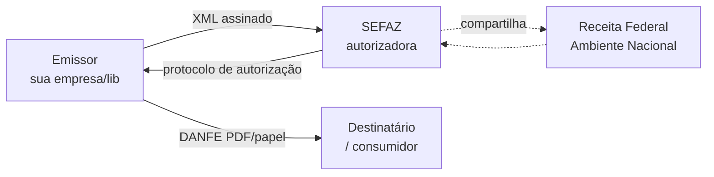
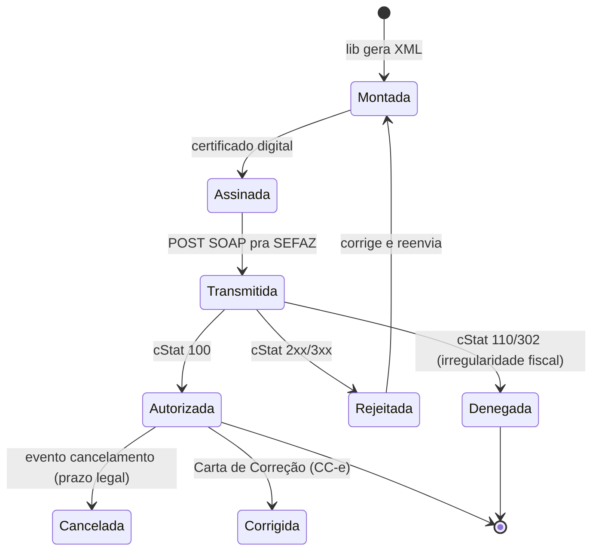

> **TL;DR:** NF-e é um XML assinado e autorizado. Tem dois modelos: **55** (entre empresas / transporte de mercadoria) e **65** (venda no varejo pro consumidor). A validade jurídica vem de **duas** condições: **assinatura digital do emitente** + **Autorização de Uso da SEFAZ**.

---

## Base legal (de onde vem tudo)

O projeto nasceu do **Protocolo ENAT 03/2005** (27/08/2005), que entregou ao **ENCAT** a coordenação do projeto NF-e. A partir daí:

| Norma | Institui |
|-------|----------|
| **Ajuste SINIEF 07/2005** | NF-e **modelo 55** |
| **Ato COTEPE 72/05** | Legislação complementar (técnica) do modelo 55 |
| **Ajuste SINIEF 19/2016** | NFC-e **modelo 65** — regras e quais documentos em papel ela substitui |

A NF-e modelo 55 substitui as notas modelo **1 / 1-A** e a Nota Fiscal de Produtor (**modelo 4**). A NFC-e modelo 65 substitui a Nota de Venda a Consumidor (**modelo 2**), o **Cupom Fiscal (ECF)** e o **CF-e-SAT**.

> ⚠️ Nos manuais, "NF-e" às vezes significa **ambos os modelos**. Só diferenciam escrevendo "modelo 55" ou "modelo 65" explicitamente.

---

## O que é cada coisa

| Sigla | Nome | É o quê |
|-------|------|---------|
| **NF-e** | Nota Fiscal Eletrônica | O XML fiscal. Modelo **55**. |
| **NFA-e** | Nota Fiscal Avulsa Eletrônica | NF-e modelo 55 emitida **pela própria SEFAZ** (ver abaixo). |
| **NFC-e** | NF de Consumidor Eletrônica | Variante pro varejo. Modelo **65**. |
| **DANFE** | Documento Auxiliar da NF-e | A representação em papel/PDF. **Não é a nota.** |
| **SEFAZ** | Secretaria de Fazenda | Autoriza ou rejeita a nota. |
| **SVC** | SEFAZ Virtual de Contingência | SEFAZ reserva quando a principal cai. |
| **EPEC** | Evento Prévio de Emissão em Contingência | Avisa a Receita antes de transmitir. |
| **MOC** | Manual de Orientação ao Contribuinte | A "documentação oficial". Anexos I–IV. |
| **Chave de Acesso** | — | ID único de 44 caracteres da nota. |
| **Protocolo** | — | Comprovante de autorização (15 dígitos). |

---

## Quem fala com quem



- O **emissor** monta, assina e envia o XML.
- A **SEFAZ de origem** (a do estado do emissor) autoriza.
- Quando ela cai, entra a **SVC** (SVC-AN ou SVC-RS, depende do estado).
- A nota autorizada é **compartilhada** com a Receita e demais estados envolvidos.

---

## Modelo 55 (NF-e) vs Modelo 65 (NFC-e)

| Critério | NF-e (55) | NFC-e (65) |
|----------|-----------|------------|
| Uso | B2B, transporte de carga, indústria | Varejo, venda pro consumidor final |
| Destinatário | Outra empresa (CNPJ) ou pessoa | Consumidor final (CPF opcional) |
| Representação | DANFE A4 retrato/paisagem | DANFE NFC-e (cupom estreito ≥58mm) |
| Autenticação visual | Código de barras CODE-128C (chave) | **QR Code** + chave |
| Contingência off-line | ❌ proibida | ✅ permitida (`tpEmis=9`) |
| Spec do DANFE | Anexo II do MOC | Manual DANFE NFC-e + QR Code (à parte) |

> **Regra:** a contingência **off-line** é **exclusiva da NFC-e**. Tentar usar `tpEmis=9` numa NF-e modelo 55 é rejeição na certa.

---

## NFA-e — Nota Fiscal Avulsa Eletrônica (modelo 55)

Quando a NF-e é emitida **pelo site da SEFAZ** (e não pelo sistema da empresa), com a **assinatura digital da própria administração tributária**, ela vira **NFA-e**. Segue o leiaute do modelo 55, com diferenças:

- **Emitente** (`emit`): preenchido com os dados do **remetente**.
- **Dados do Fisco**: vão no grupo **`avulsa`** (id D01).
- **`procEmi` = 1** (emissão de NF-e avulsa pelo Fisco).
- **`tpEmis` = 1** (Normal — NFA-e **não** tem contingência).
- **Assinatura**: feita com o **certificado da SEFAZ** (não o do emitente).
- **IE**: contribuinte eventual pode usar `"ISENTO"`.
- **Série**: faixa reservada (ver tabela abaixo) define se a chave leva CNPJ da SEFAZ, CNPJ ou CPF do emitente.

---

## Chave Natural — por que duplicar dá rejeição

A identificação tributária única de uma nota **não** é a chave de acesso inteira — é a **chave natural**, um subconjunto:

- **NF-e (55):** UF + CNPJ/CPF do emitente + **série** + **número** + modelo + ambiente de autorização.
- **NFC-e (65):** UF + CNPJ do emitente + série + número + modelo + tipo de emissão.

> O ambiente de autorização e o tipo de emissão estão embutidos no campo **`tpEmis`** (id B22). A SEFAZ **rejeita** um novo pedido de autorização se detectar **duplicidade de chave natural** — ou seja, reenviar a mesma série+número numa nota já autorizada falha. Ver [chave de acesso](/docs/nfe/fundamentos/chave-de-acesso).

---

## Séries reservadas (`serie` + `procEmi`)

O campo **`serie`** (B07), junto com **`procEmi`** (B26), controla quem emite e o que entra na chave. Faixas oficiais (Tabela 2-4 do MOC):

| Série | Emitente | Assinatura | `procEmi` | Numeração |
|-------|----------|------------|-----------|-----------|
| **000–889** | CNPJ | e-CNPJ do emitente | ≠ 1,2 | Sequencial por CNPJ, controlada pelo emitente |
| **890–899** | CNPJ/CPF | e-CNPJ da SEFAZ (NFA-e) | 1 | Sequencial pela SEFAZ |
| **900–909** | CNPJ | e-CNPJ da SEFAZ (1) ou do emitente (2) | 1 ou 2 | Site SEFAZ, por CNPJ |
| **910–919** | CPF | e-CNPJ da SEFAZ (1) ou e-CPF do emitente (2) | 1 ou 2 | Site SEFAZ, por CPF |
| **920–969** | CPF | e-CPF do emitente | ≠ 1,2 | Aplicativo da empresa, por CPF |

> As faixas **900–969** vieram da **NT 2018.001** (emitente pessoa física / CPF na chave). Produtor rural pessoa física: como o **CPF não identifica a Inscrição Estadual**, usa-se séries específicas (920–969) por estabelecimento para não colidir a numeração.

---

## GTIN e o Cadastro Centralizado (CCG)

**GTIN** (Global Trade Item Number, administrado pela **GS1**) é o código de barras do produto — 8, 12, 13 ou 14 dígitos. Vai nos campos `cEAN` / `cEANTrib` do item.

O **CCG** (Cadastro Centralizado de GTIN, **NT 2017.001**) é a base contra a qual a SEFAZ valida o GTIN informado. A nota é **rejeitada** se o GTIN não bater. O dono da marca mantém os dados no **CNP-GS1** (`cnp.gs1br.org`). Validações típicas que reprovam:

- Dígito de controle do GTIN inválido;
- Descrição genérica ("A definir", "Disponível"…);
- NCM ausente/inexistente; CEST incompatível com o NCM;
- GTIN-14 sem GTIN de nível inferior.

> Use `cEAN`/`cEANTrib` = **`SEM GTIN`** quando o produto não tem código — é o valor aceito para "não se aplica".

---

## Responsável Técnico e CSRT

**Responsável Técnico** (**NT 2018.005**) é quem desenvolve / mantém o software emissor. Vai no grupo **`infRespTec`** (CNPJ, contato, e-mail, fone). Se o emissor é de desenvolvimento próprio, o responsável é o próprio contribuinte.

A critério da UF, pode ser exigido o **CSRT** (Código de Segurança do Responsável Técnico): código alfanumérico de **16 a 36 bytes**, conhecido só pela SEFAZ e pelo desenvolvedor (máx. **5 CSRT válidos** por UF). Dele se deriva o **`hashCSRT`** que vai no XML, provando a autoria do software.

### Algoritmo do `hashCSRT`

```ts
import { createHash } from "node:crypto";

/** hashCSRT = Base64( SHA-1( CSRT + chaveDeAcesso ) ) → 28 caracteres. */
export function hashCSRT(csrt: string, chave44: string): string {
  return createHash("sha1")
    .update(csrt + chave44, "utf8")
    .digest("base64"); // 20 bytes → 28 chars Base64
}
```

Exemplo oficial do MOC:

```
CSRT  = G8063VRTNDMO886SFNK5LDUDEI24XJ22YIPO
chave = 41180678393592000146558900000006041028190697
SHA-1 (hex) = 696bfa2de10ce17eaee3ea8123639867c82b8a0c
Base64      = aWv6LeEM4X6u4+qBI2OYZ8grigw=
```

```xml
<infRespTec>
  <CNPJ>99999999999999</CNPJ>
  <xContato>Nome do Contato</xContato>
  <email>email@empresaficticia.com.br</email>
  <fone>41999999999</fone>
  <idCSRT>01</idCSRT>
  <hashCSRT>aWv6LeEM4X6u4+qBI2OYZ8grigw=</hashCSRT>
</infRespTec>
```

---

## cBenef e CCC (contexto)

- **`cBenef`** — código de benefício fiscal, **definido por cada UF**. As tabelas "cBenef × CST" ficam nos portais estaduais (índice na área "Diversos" do Portal Nacional). Regra introduzida pela **NT 2019.001**.
- **CCC** (Cadastro Centralizado de Contribuintes) — base usada pela SEFAZ para validar se a **IE do destinatário** existe na UF de destino, se está habilitada e se bate com o CNPJ. Vale tanto pra autorizadora quanto pra contingência (SVC/EPEC).

---

## Ciclo de vida de uma nota (visão macro)



**Estados que importam pra lib:**
- `Autorizada` → pode imprimir DANFE e circular mercadoria.
- `Rejeitada` → erro de validação. Corrige e reenvia (pode reusar número).
- `Denegada` → problema cadastral/fiscal. A nota "morre", o número é queimado.
- `Cancelada` / `Corrigida` → são **eventos** (ver [eventos](/docs/nfe/transmissao/eventos-consultas)).

---

## Ambientes

| `tpAmb` | Ambiente | Pra quê |
|---------|----------|---------|
| `1` | **Produção** | Notas reais, valor fiscal |
| `2` | **Homologação** | Testes. DANFE leva **"SEM VALOR FISCAL"** |

> 🧪 **Sempre comece em homologação (`tpAmb=2`).** É um campo dentro do XML.

---

## Documentos oficiais (MOC 7.0) — o que olhar

| Documento | Contém |
|-----------|--------|
| MOC – Visão Geral | Web services, fluxos, eventos, conceitos |
| **Anexo I** – Leiaute + Regras de Validação | **O XSD e as regras de rejeição.** A bíblia. |
| Anexo II – DANFE e Código de Barras | Layout do papel, CODE-128C |
| Anexo III – Contingência NF-e | FS-DA, SVC, EPEC |
| Anexo IV – Contingência NFC-e | Off-line |

> Os arquivos `.xsd` (`leiauteNFe_v4.00.xsd`, `tiposBasico_v4.00.xsd`, etc.) **são** o Anexo I em forma de máquina. Sua lib deve refletir eles.
