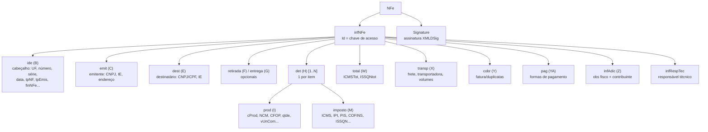
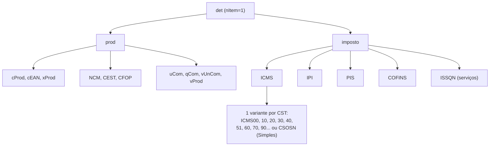

> **TL;DR:** A nota é `<NFe><infNFe>` com ~12 grupos. Os 4 que você não pode errar: **`ide`** (cabeçalho), **`emit`** (quem vende), **`dest`** (quem compra), **`det`** (1 por produto, com imposto), **`total`** (somatório) e **`pag`** (pagamento). Cada grupo tem um "id" (letra A–Z) usado nas regras de validação.

---

## Árvore de alto nível



---

## Tabela dos grupos (com o "id" das regras de validação)

| id | Grupo | Cardinalidade | O que carrega |
|----|-------|---------------|---------------|
| A | `infNFe` | 1 | Raiz. Atributo `Id="NFe"+chave`, `versao="4.00"` |
| B | `ide` | 1 | Identificação da nota (ver abaixo) |
| C | `emit` | 1 | Emitente |
| D | `avulsa` | 0–1 | Nota avulsa (raro) |
| E | `dest` | 0–1 | Destinatário (obrigatório no 55) |
| F | `retirada` | 0–1 | Local de retirada |
| G | `entrega` | 0–1 | Local de entrega |
| GA| `autXML` | 0–10 | CNPJ/CPF autorizados a baixar o XML |
| H | `det` | **1–990** | Item. Repete por produto |
| I | `det/prod` | 1 (por item) | Dados do produto |
| M | `det/imposto` | 1 (por item) | Tributos do item |
| W | `total` | 1 | Totais (`ICMSTot`) |
| X | `transp` | 1 | Transporte |
| Y | `cobr` | 0–1 | Cobrança (fatura + duplicatas) |
| YA| `pag` | 1 | Pagamento (obrigatório) |
| Z | `infAdic` | 0–1 | Informações adicionais |
| — | `infRespTec`| 0–1 | Responsável técnico (CNPJ, contato, hash CSRT) |

---

## Campos-chave do `ide` (cabeçalho)

| Tag | id | O que é | Valores |
|-----|----|---------|---------|
| `cUF` | B02 | Estado IBGE | 11–53 |
| `cNF` | B03 | Código numérico aleatório (8) | random |
| `natOp` | B04 | Natureza da operação | texto livre ("VENDA") |
| `mod` | B06 | Modelo | `55` ou `65` |
| `serie` | B07 | Série | 0–999 |
| `nNF` | B08 | Número | 1–999999999 |
| `dhEmi` | B09 | Data/hora emissão | ISO c/ fuso |
| `tpNF` | B11 | Entrada/Saída | `0`=entrada `1`=saída |
| `idDest` | B11a | Destino da operação | `1`=interna `2`=interestadual `3`=exterior |
| `tpImp` | B21 | Formato do DANFE | `0`..`5` (1=retrato 2=paisagem) |
| `tpEmis` | B22 | Forma de emissão | ver arq. 07 |
| `cDV` | B23 | DV da chave | calculado |
| `tpAmb` | B24 | Ambiente | `1`=prod `2`=homolog |
| `finNFe` | B25 | Finalidade | `1`=normal `2`=compl `3`=ajuste `4`=devolução |
| `indFinal` | B25a | Consumidor final | `0`=não `1`=sim |
| `indPres` | B25b | Presença do comprador | `0`..`5`,`9` |
| `procEmi` | B26 | Processo de emissão | `0`=app próprio |
| `verProc` | B27 | Versão do app | texto |
| `dhCont` | B28 | Data/hora entrada em contingência | só em contingência |
| `xJust` | B29 | Justificativa da contingência | só em contingência |

> `dhCont` + `xJust` são **obrigatórios** quando `tpEmis` ≠ 1. Em contingência off-line (NFC-e) eles existem no XML mas **não** são impressos no DANFE.

---

## O grupo `det` (item) — onde mora a complexidade

Cada item tem `prod` (o produto) + `imposto` (os tributos). **Os tributos são a parte difícil.**



### ICMS tem ~13 variantes — escolha por CST/CSOSN

| Você usa | Quando |
|----------|--------|
| `ICMS00` | tributação integral |
| `ICMS10` | com Substituição Tributária (ST) |
| `ICMS20` | base reduzida |
| `ICMS40/41/50` | isento / não tributado / suspensão |
| `ICMS60` | ST já cobrado anteriormente |
| `ICMS70`,`ICMS90` | combinações |
| `ICMSSN101..900` | **Simples Nacional** (usa CSOSN, não CST) |

> 🎯 **Estratégia de lib:** modele ICMS como **union discriminada** por CST/CSOSN. Cada variante tem campos diferentes. Não tente um objeto único "com tudo opcional" — vira inferno. (Ver arquivo 04.)

---

## `total/ICMSTot` — o somatório obrigatório

Campos principais (todos `vXxx` em decimal 13,2):

```
vBC vICMS vICMSDeson vFCP vBCST vST vFCPST
vProd vFrete vSeg vDesc vII vIPI vIPIDevol
vPIS vCOFINS vOutro vNF vTotTrib
```

> ⚠️ Esses totais **têm que bater** com a soma dos itens (regra de validação). A SEFAZ recalcula. Se não fechar → rejeição (ex: `vNF` errado).

---

## Esqueleto mínimo do XML (modelo 55, emissão normal)

```xml
<NFe xmlns="http://www.portalfiscal.inf.br/nfe">
  <infNFe versao="4.00" Id="NFe35240612345678000190550010000000011000000017">
    <ide>
      <cUF>35</cUF><cNF>00000001</cNF><natOp>VENDA</natOp>
      <mod>55</mod><serie>1</serie><nNF>1</nNF>
      <dhEmi>2024-06-15T10:00:00-03:00</dhEmi>
      <tpNF>1</tpNF><idDest>1</idDest>
      <cMunFG>3550308</cMunFG>
      <tpImp>1</tpImp><tpEmis>1</tpEmis><cDV>7</cDV>
      <tpAmb>2</tpAmb><finNFe>1</finNFe>
      <indFinal>0</indFinal><indPres>0</indPres>
      <procEmi>0</procEmi><verProc>minha-lib-1.0</verProc>
    </ide>
    <emit> <CNPJ>...</CNPJ> <xNome>...</xNome> <enderEmit>...</enderEmit> <IE>...</IE> <CRT>3</CRT> </emit>
    <dest> <CNPJ>...</CNPJ> <xNome>...</xNome> <enderDest>...</enderDest> <indIEDest>9</indIEDest> </dest>
    <det nItem="1">
      <prod> <cProd>...</cProd> <xProd>...</xProd> <NCM>...</NCM> <CFOP>5102</CFOP>
             <uCom>UN</uCom> <qCom>1.0000</qCom> <vUnCom>10.00</vUnCom> <vProd>10.00</vProd>
             <indTot>1</indTot> </prod>
      <imposto> <ICMS><ICMS00>...</ICMS00></ICMS> <PIS>...</PIS> <COFINS>...</COFINS> </imposto>
    </det>
    <total><ICMSTot> ... <vNF>10.00</vNF> </ICMSTot></total>
    <transp><modFrete>9</modFrete></transp>
    <pag><detPag><tPag>01</tPag><vPag>10.00</vPag></detPag></pag>
  </infNFe>
  <!-- <Signature> entra aqui após assinar -->
</NFe>
```

> O atributo `Id` do `infNFe` é literalmente `"NFe" + chaveDeAcesso`. Ele é o alvo da assinatura (ver arquivo 05).
