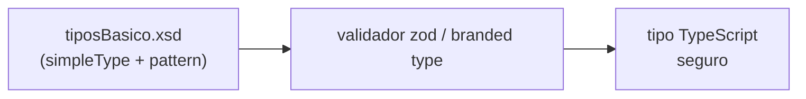
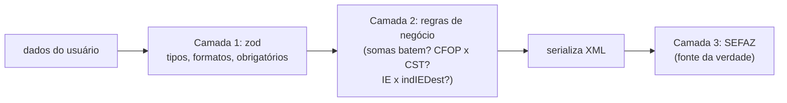

> **TL;DR:** O `tiposBasico_v4.00.xsd` define ~50 tipos primitivos (CNPJ, CPF, decimais, datas). Traduza cada um pra um tipo/validador TS. **Dinheiro é string ou centavos — nunca float.**

---

## De onde vêm os tipos

O XSD usa `simpleType` com `restriction` (pattern regex, maxLength, enumeration). Cada um vira um **validador** na sua lib.



---

## Catálogo dos tipos que importam

| Tipo XSD | Regra | TS sugerido |
|----------|-------|-------------|
| `TCnpj` | `[0-9]{14}` | `string` + `validarCNPJ()` |
| `TCpf` | `[0-9]{11}` | `string` + `validarCPF()` |
| `TChNFe` | `[0-9]{44}` | `string` + `validarChave()` |
| `TProt` | `[0-9]{15}` ou `{17}` | `string` |
| `TUf` | enumeração de siglas | `union` de UFs |
| `TCodUfIBGE` | `11`..`53` | `union` literal |
| `TCodMunIBGE` | `[0-9]{7}` | `string` |
| `TMod` | `55`,`65` | `"55" \| "65"` |
| `TSerie` | `0`..`999` | `number`→string pad |
| `TNF` | `1`..`999999999` | `number`→string pad |
| `TAmb` | `1`,`2` | `1 \| 2` |
| `TData` | `AAAA-MM-DD` | `string` ISO |
| `TDateTimeUTC` | ISO **com fuso** | `string` |
| `TDec_1302` | 13 inteiros, 2 decimais | **ver seção decimais** |
| `TDec_1104` | 11 inteiros, 4 decimais | idem |
| `TIeDest` | IE do destinatário | string (valida por UF) |

> Os `TDec_XXYY` são onde está o perigo. `XX` = nº de dígitos inteiros, `YY` = casas decimais. Ex: `TDec_1302` = até 13 inteiros + 2 decimais → **valor monetário**.

---

## Dinheiro e quantidade — a regra que mais quebra lib

```
❌ vUnCom: 10.1   →  no XML pode virar "10.1" e a SEFAZ esperava "10.1000"
❌ soma de floats →  0.1 + 0.2 = 0.30000000000000004
✅ guarde em centavos (int) OU use decimal.js, e formate na hora de serializar
```

### Padrão recomendado: inteiro em centavos + formatador

```ts
import Decimal from "decimal.js";

/** Formata um Decimal/number/string para o padrão NF-e (ponto, casas fixas). */
export function dec(v: Decimal.Value, casas: number): string {
  return new Decimal(v).toFixed(casas); // "10.00", "1.0000"
}

// uso:
dec(10.1, 2);   // "10.10"  -> vUnCom (valor)
dec(1, 4);      // "1.0000" -> qCom (quantidade tem 4 casas)
```

**Regra de casas por campo (memorize as 3 mais comuns):**

| Campo | Casas | Tipo |
|-------|-------|------|
| Valores `vXxx` (R$) | **2** | `TDec_1302` |
| Quantidade `qCom`, `qTrib` | **4** | `TDec_1104` |
| Alíquota `pXxx` (%) | **2 ou 4** | varia |

---

## Validadores essenciais (TS puro)

### CNPJ

```ts
export function validarCNPJ(cnpj: string): boolean {
  const c = cnpj.replace(/\D/g, "");
  if (c.length !== 14 || /^(\d)\1{13}$/.test(c)) return false;
  const calc = (base: string) => {
    let pos = base.length - 7, soma = 0;
    for (let i = 0; i < base.length; i++) {
      soma += Number(base[i]) * pos--;
      if (pos < 2) pos = 9;
    }
    const r = soma % 11;
    return r < 2 ? 0 : 11 - r;
  };
  const d1 = calc(c.slice(0, 12));
  const d2 = calc(c.slice(0, 12) + d1);
  return c.endsWith(`${d1}${d2}`);
}
```

### CPF

```ts
export function validarCPF(cpf: string): boolean {
  const c = cpf.replace(/\D/g, "");
  if (c.length !== 11 || /^(\d)\1{10}$/.test(c)) return false;
  const calc = (qtd: number) => {
    let soma = 0;
    for (let i = 0; i < qtd; i++) soma += Number(c[i]) * (qtd + 1 - i);
    const r = (soma * 10) % 11;
    return r === 10 ? 0 : r;
  };
  return calc(9) === Number(c[9]) && calc(10) === Number(c[10]);
}
```

> ⚠️ **Inscrição Estadual (IE)** tem regra **diferente por estado** (27 algoritmos). Não tente um só. Use uma tabela por UF ou um pacote dedicado. No destinatário, `indIEDest=9` significa "não contribuinte" → IE não obrigatória.

> 🚨 **CNPJ vai virar alfanumérico (NT 2026.004 / `tiposBasico_v1.03`).** O padrão `TCnpj` passa a ser exatamente **`[0-9A-Z]{12}[0-9]{2}`** — 12 posições alfanuméricas + 2 dígitos de DV (que continuam numéricos). O DV usa mod 11 tratando letra como `ASCII − 48`. **Não tipe CNPJ como `[0-9]{14}`** — veja `validarCNPJAlfa` no arquivo 02. Isso também muda a **chave de acesso** (arq. 02). O CPF **não** muda.

---

## Modelando ICMS como union discriminada (zod)

```ts
import { z } from "zod";

const ICMS00 = z.object({
  CST: z.literal("00"),
  orig: z.string().length(1),
  modBC: z.string(),
  vBC: z.string(),
  pICMS: z.string(),
  vICMS: z.string(),
});

const ICMS40 = z.object({
  CST: z.union([z.literal("40"), z.literal("41"), z.literal("50")]),
  orig: z.string().length(1),
});

// Simples Nacional usa CSOSN
const ICMSSN102 = z.object({
  CSOSN: z.literal("102"),
  orig: z.string().length(1),
});

export const ICMS = z.discriminatedUnion("CST", [ICMS00, ICMS40 /* ... */]);
```

> A **union discriminada** dá: autocomplete certo por CST, erro de tipo se faltar campo, e serialização correta. É o jeito certo de domar as 13 variantes.

---

## Estratégia de validação em 2 camadas



- **Camada 1 (zod):** pega 80% dos erros antes de gerar XML. Barato.
- **Camada 2 (negócio):** as *Regras de Validação* do Anexo I (somatórios, coerência CST/CFOP). Implemente as principais; as exóticas deixe a SEFAZ pegar.
- **Camada 3 (SEFAZ):** sempre vai validar de novo. Você nunca cobre 100% local — e tudo bem.
