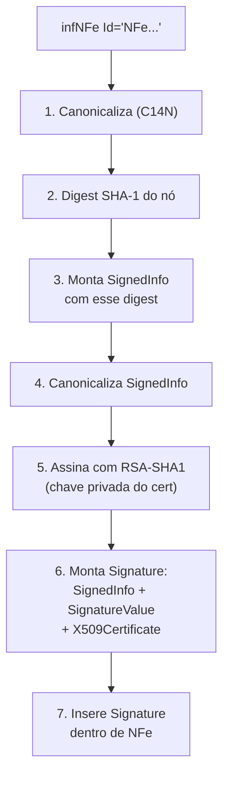
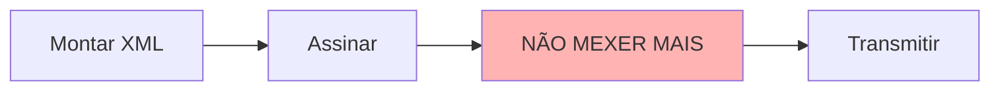

> **TL;DR:** Você assina **só o nó `<infNFe>`**, usando o atributo `Id` como referência. Algoritmos fixos: **SHA-1 + RSA-SHA1 + C14N**. Errar a canonicalização (C14N) é o erro nº 1. A `<Signature>` entra **dentro de `<NFe>`, depois de `<infNFe>`**.

---

## O que assinar e como



| Etapa | Algoritmo / valor exato |
|-------|-------------------------|
| Canonicalization | `http://www.w3.org/TR/2001/REC-xml-c14n-20010315` (C14N) |
| SignatureMethod | `http://www.w3.org/2000/09/xmldsig#rsa-sha1` |
| Reference URI | `#NFe<chave>` (o `Id` do infNFe, com `#`) |
| Transforms | `enveloped-signature` **+** `c14n` |
| DigestMethod | `http://www.w3.org/2000/09/xmldsig#sha1` |
| KeyInfo | `<X509Data><X509Certificate>` (cert público, base64) |

> Sim, ainda é **SHA-1**. É o padrão fixado pela SEFAZ pra NF-e. Não troque por SHA-256 "pra ser mais seguro" — vira rejeição.

---

## Certificado digital (A1 vs A3)

| Tipo | É | Pra lib server |
|------|---|----------------|
| **A1** | arquivo `.pfx`/`.p12` + senha | ✅ fácil. Lê com `node-forge` |
| **A3** | hardware (token/cartão) | ❌ difícil em server, precisa PKCS#11 |

**Comece só com A1.** Você carrega o `.pfx`, extrai chave privada + certificado, e assina.

```ts
import forge from "node-forge";
import fs from "node:fs";

export function lerPfx(caminho: string, senha: string) {
  const p12Der = fs.readFileSync(caminho, "binary");
  const p12Asn1 = forge.asn1.fromDer(p12Der);
  const p12 = forge.pkcs12.pkcs12FromAsn1(p12Asn1, senha);

  const keyBags = p12.getBags({ bagType: forge.pki.oids.pkcs8ShroudedKeyBag });
  const certBags = p12.getBags({ bagType: forge.pki.oids.certBag });

  const key = keyBags[forge.pki.oids.pkcs8ShroudedKeyBag]![0].key!;
  const cert = certBags[forge.pki.oids.certBag]![0].cert!;

  return {
    privateKeyPem: forge.pki.privateKeyToPem(key),
    certificatePem: forge.pki.certificateToPem(cert),
    // valida validade:
    validTo: cert.validity.notAfter,
  };
}
```

---

## Assinando (xml-crypto)

```ts
import { SignedXml } from "xml-crypto";

export function assinarNFe(xml: string, chave: string, key: string, cert: string): string {
  const sig = new SignedXml({
    privateKey: key,
    publicCert: cert,
    signatureAlgorithm: "http://www.w3.org/2000/09/xmldsig#rsa-sha1",
    canonicalizationAlgorithm: "http://www.w3.org/TR/2001/REC-xml-c14n-20010315",
  });

  sig.addReference({
    xpath: `//*[@Id='NFe${chave}']`,
    transforms: [
      "http://www.w3.org/2000/09/xmldsig#enveloped-signature",
      "http://www.w3.org/TR/2001/REC-xml-c14n-20010315",
    ],
    digestAlgorithm: "http://www.w3.org/2000/09/xmldsig#sha1",
  });

  // Coloca a Signature como irmã de infNFe, dentro de NFe:
  sig.computeSignature(xml, {
    location: { reference: "//*[local-name(.)='infNFe']", action: "after" },
  });

  return sig.getSignedXml();
}
```

---

## Os 5 erros clássicos de assinatura

1. **Assinar o XML inteiro em vez do `infNFe`.** A Reference tem que apontar pro `Id`.
2. **C14N errada.** Usar canonicalização exclusiva quando a NF-e quer C14N "normal". Resultado: digest não bate → rejeição "Assinatura difere".
3. **Reorganizar/reformatar o XML depois de assinar.** Qualquer espaço a mais muda o digest. **Assine por último, não toque mais no XML.**
4. **Esquecer o `#` na Reference URI.** É `#NFe<chave>`, não `NFe<chave>`.
5. **Certificado sem a cadeia / errado / vencido.** A SEFAZ valida o ICP-Brasil. Cheque `validTo` antes.



> 🧠 **Mantra:** *monta → assina → congela → envia.* Se precisou mexer no XML, monte de novo e reassine.

---

## Eventos também são assinados

Cancelamento, Carta de Correção e EPEC são XMLs próprios (`<evento>`) e **cada um é assinado** do mesmo jeito — a Reference aponta pro `Id` do `<infEvento>`. (Ver arquivo 06.)
