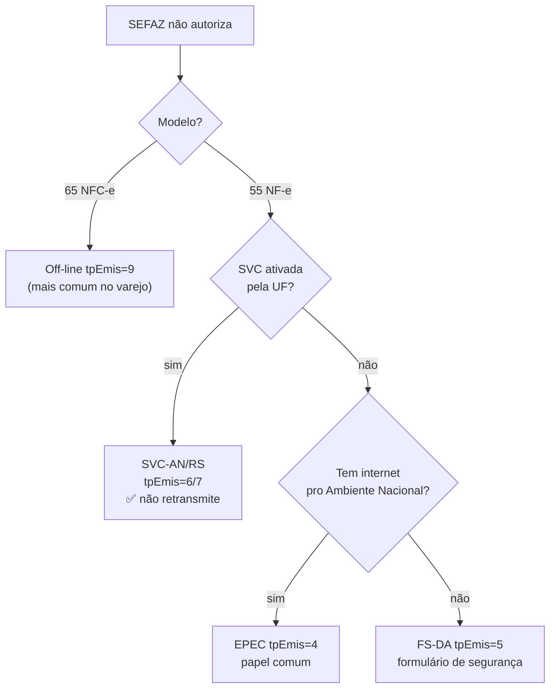
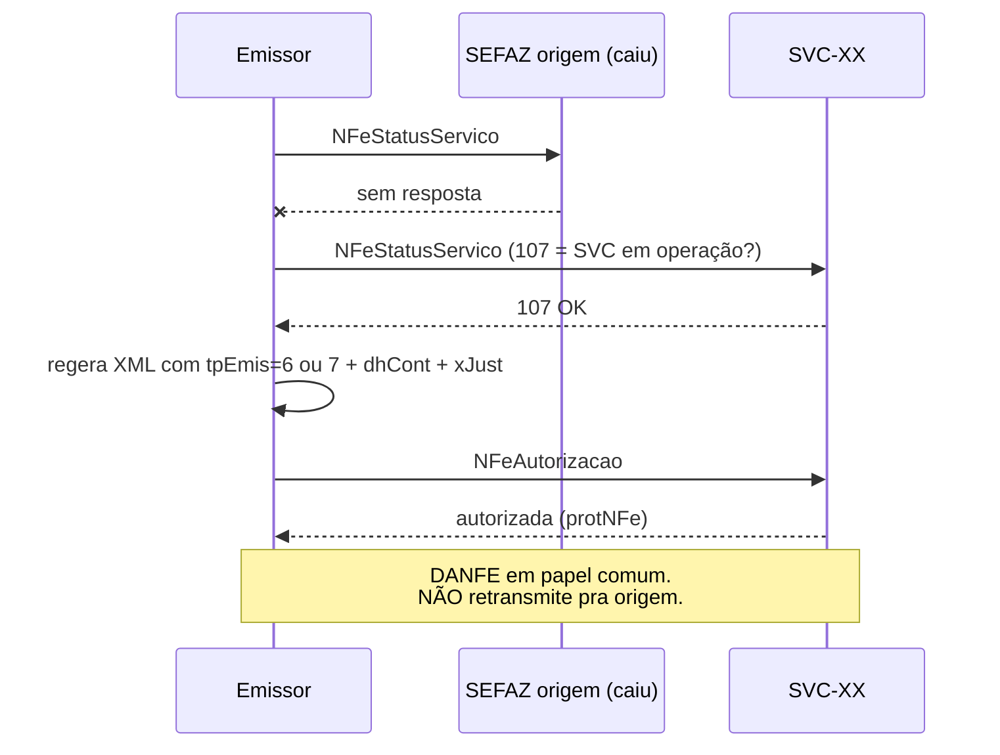
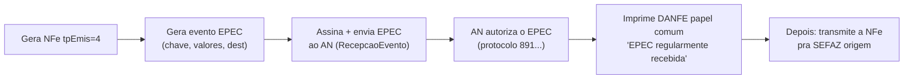
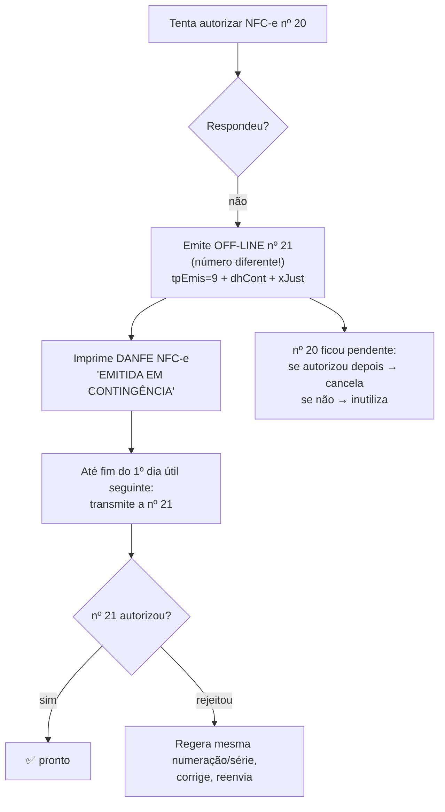
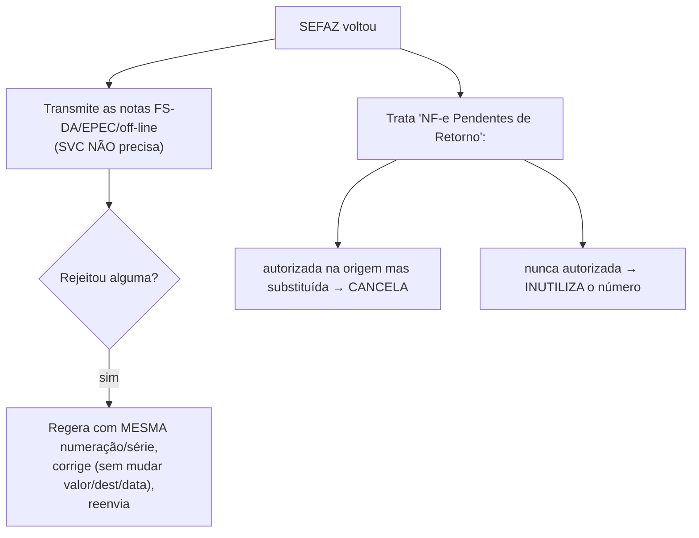

> **TL;DR:** Se não consegue autorização normal, você muda o campo **`tpEmis`** e usa um modo de contingência. NF-e (55): **FS-DA, SVC ou EPEC**. NFC-e (65): **off-line ou EPEC**. Cada modo muda a chave de acesso (porque `tpEmis` está nela) e exige `dhCont` + `xJust` no XML.

---

## A tabela mestra do `tpEmis`

| `tpEmis` | Modo | Modelo | Transmite depois? | DANFE em |
|----------|------|--------|-------------------|----------|
| `1` | Normal | 55 e 65 | — | papel comum |
| `2` | Contingência FS (legado) | 55 | sim | Formulário Segurança |
| `4` | **EPEC** | 55 e 65 | sim | papel comum |
| `5` | **FS-DA** | 55 | sim | Formulário Segurança |
| `6` | **SVC-AN** | 55 | **não** | papel comum |
| `7` | **SVC-RS** | 55 | **não** | papel comum |
| `9` | **Off-line** | **65 só** | sim | DANFE NFC-e |

> Regra de ouro: **SVC não precisa retransmitir** (a nota já foi autorizada, só por outra SEFAZ). **FS-DA, EPEC e off-line precisam** retransmitir quando a falha passar.

---

## Qual modo escolher



Não há hierarquia obrigatória — o emissor escolhe o que tiver à mão. Mas na prática:
- **NFC-e** → quase sempre **off-line** (caixa não pode parar).
- **NF-e** → **SVC** se a UF ativou (melhor, não retransmite); senão **EPEC** (precisa internet pro AN); FS-DA é o último recurso (papel especial).

---

## SVC — SEFAZ Virtual de Contingência

A SEFAZ de origem "terceiriza" a autorização pra uma SVC:

| SVC | Atende (exemplos) |
|-----|-------------------|
| **SVC-AN** (Ambiente Nacional) | SP, RJ, MG, RS, SC, e outros |
| **SVC-RS** (Rio Grande do Sul) | BA, PR, PE, GO, ES, e outros |



> A SVC só aceita `tpEmis=6/7`. A SEFAZ normal só aceita `1,2,4,5`. Uma chave autorizada na SVC tem `tpEmis` diferente → **chave de acesso diferente**, mesmo que número/série sejam iguais. É assim que evitam duplicidade.

---

## EPEC — Evento Prévio de Emissão em Contingência

Você manda um **resumo** da nota pro Ambiente Nacional **antes** de conseguir autorizar a nota completa.



DANFE leva a frase: **"DANFE impresso em contingência - EPEC regularmente recebida pela Receita Federal do Brasil"**.

---

## FS-DA — Formulário de Segurança

Modo mais "manual". Imprime em **papel especial** (formulário de segurança credenciado).

- `tpEmis=5`, imprime **2 vias** com a frase **"DANFE em Contingência - impresso em decorrência de problemas técnicos"**.
- Gera um **2º código de barras adicional** no DANFE com 36 dígitos:

```
cUF(2) tpEmis(1) CNPJ(14) vNF(14) ICMSp(1) ICMSs(1) DD(2) DV(1)
```
- `vNF` sem ponto decimal (centavos), tudo alinhado à direita com zeros.
- `DV` = mesmo cálculo mod 11 da chave de acesso.

> ⚠️ Em FS-DA o DANFE **tem que** ser no formulário de segurança. Imprimir em papel comum = documento inidôneo. Tabela de regularidade no Anexo III.

---

## Off-line (NFC-e) — `tpEmis=9`

O modo do varejo. Caixa emite sem autorização, transmite depois.



Campos obrigatórios no XML off-line:
```
mod=65  tpEmis=9  dhCont  xJust  idDest=1  finNFe=1  indFinal=1  indPres=1
```
- **Avance o número** ao entrar em contingência (evita duplicidade).
- Imprime **2 vias** (consumidor + "Via do Estabelecimento") **ou** guarda o XML eletronicamente (com termo no livro modelo 6).
- **Prazo de transmissão:** até o fim do **1º dia útil seguinte**.

---

## Depois que a falha passa (ações obrigatórias)



> **NF-e Pendentes de Retorno** = você enviou e não soube se autorizou. Sempre dê **número novo** à versão em contingência e depois limpe a pendente (cancela ou inutiliza).
