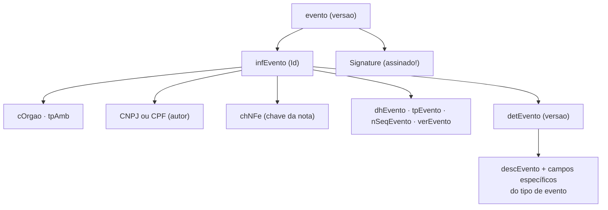
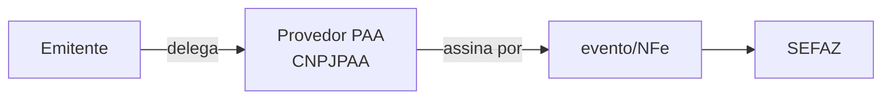
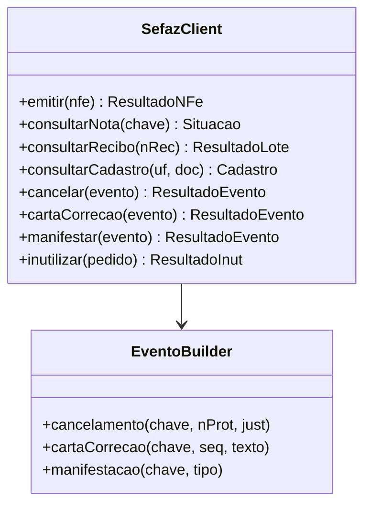

> **TL;DR:** Além de emitir, a lib precisa de **eventos** (cancelar, corrigir...), **consultas** (situação da nota, recibo, cadastro) e **inutilização**. Todos seguem o mesmo padrão: um XML pequeno (alguns **assinados**) via SOAP. Aqui estão as **estruturas reais** tiradas dos XSD que você subiu (`leiauteEvento_v1_00`, `consSitNFe`, `consCad_v2_00`, `leiauteInutNFe`, etc.).

---

## Evento (`leiauteEvento_v1_00.xsd`) — estrutura

Todo evento é `evento` → `infEvento` (+ `Signature`). O retorno é `retEvento` → `infEvento`.



**`infEvento` — campos:**

| Campo | O que é |
|-------|---------|
| `Id` | `"ID" + tpEvento + chNFe + nSeqEvento`(2) — alvo da assinatura |
| `cOrgao` | UF do órgão (ou `91` p/ Ambiente Nacional) |
| `tpAmb` | `1`/`2` |
| `CNPJ`/`CPF` | autor do evento |
| `chNFe` | chave da nota (44) |
| `dhEvento` | data/hora com fuso |
| `tpEvento` | tipo (tabela abaixo) |
| `nSeqEvento` | sequência (1-20) — permite vários do mesmo tipo |
| `verEvento` | versão |
| `detEvento` | grupo específico do tipo |

**`detEvento` muda por tipo** (o `descEvento` + campos):

| Evento | `tpEvento` | `detEvento` carrega |
|--------|-----------|---------------------|
| Cancelamento | `110111` | `descEvento`="Cancelamento" · `nProt` · `xJust`(15-255) |
| Cancel. por substituição (NFC-e) | `110112` | `nProt` · `xJust` · `chNFeRef` |
| Carta de Correção | `110110` | `descEvento`="Carta de Correcao" · `xCorrecao`(15-1000) · `xCondUso` (texto fixo) |
| EPEC | `110140` | dados resumidos da NF-e (ver arq. 07) |
| Ator interessado (transportador) | `110150` | `xNome` · autorizações |
| Comprovante de entrega | `110130` | dados da entrega + hash/imagem |
| Manifestação destinatário | `210200/210210/210220/210240` | confirmação/ciência/desconhecimento/não realizada |

> 🎯 Modele `detEvento` como **union discriminada por `tpEvento`** (mesma ideia do ICMS, arq. 04). Cada tipo tem campos próprios.

### `retEvento` — o retorno

`infEvento` com: `tpAmb · verAplic · cOrgao · cStat · xMotivo · chNFe · tpEvento · nSeqEvento · **nProt** · dhRegEvento`.
- `cStat=135` (registrado) ou `136` (registrado fora de prazo) = sucesso. Guarde o `nProt`.

---

## PAA — Provedor de Assinatura e Autorização (NT 2026.001)

O `leiauteEvento_v1_00` que você subiu **já tem** o grupo PAA: `infPAA` com `CNPJPAA`, `PAASignature` (`RSAKeyValue` + `SignatureValue`).



- Permite um **terceiro homologado (PAA)** assinar/transmitir em nome do emitente.
- **Base legal: Ajuste SINIEF 9/22** (CONFAZ + RFB), detalhado pela **NT 2026.001**.
- `infPAA/PAASignature` carrega a chave pública (`RSAKeyValue`) e a assinatura do PAA.
- **Opcional** — só implemente se for atuar como/integrar um PAA. Para a maioria, ignore.

---

## Consulta Situação da NF-e (`consSitNFe_v4_00.xsd`)

Pega a situação de **uma** nota pela chave. **Não é assinada.**

```xml
<consSitNFe versao="4.00">
  <tpAmb>2</tpAmb>
  <xServ>CONSULTAR</xServ>
  <chNFe>3524...</chNFe>
</consSitNFe>
```

Retorno (`retConsSitNFe`): `cStat` + `xMotivo` + o `protNFe` (se autorizada) + eventuais `procEventoNFe` (cancelamento, CC-e vinculados). É a forma de **descobrir o estado real** de uma nota.

---

## Consulta Recibo do Lote (`retConsReciNFe_v4_00.xsd`)

Só no fluxo **assíncrono** (lote com várias notas). Você manda o `nRec` e recebe os `protNFe` de cada nota.

```xml
<consReciNFe versao="4.00">
  <tpAmb>2</tpAmb>
  <nRec>351000...</nRec>
</consReciNFe>
```

> Com a **resposta síncrona obrigatória pra lote de 1** (NT 2025.001, arq. 06/17), você só usa isso em lotes múltiplos.

---

## Consulta Cadastro (`consCad_v2_00.xsd`) — versão 2.00

Descobre se um contribuinte existe/está ativo e pega dados cadastrais. **Não assinada.**

```xml
<ConsCad versao="2.00">
  <infCons>
    <xServ>CONS-CAD</xServ>
    <UF>SP</UF>
    <IE>1234567890</IE>   <!-- ou <CNPJ> ou <CPF> -->
  </infCons>
</ConsCad>
```

**Retorno (`retConsCad_v2_00`)** — `infCad` traz por inscrição:

| Campo | O que é |
|-------|---------|
| `IE` · `CNPJ`/`CPF` · `UF` | identificação |
| `cSit` | situação cadastral (`0`=não habilitada `1`=habilitada) |
| `indCredNFe` | está credenciado a emitir NF-e? |
| `indCredCTe` | idem CT-e |
| `xNome` · `xFant` | nome |
| `xRegApur` | regime de apuração |
| `CNAE` | atividade |
| `ender` | endereço (xLgr, nro, xBairro, cMun, xMun, CEP) |
| `dBaixa` · `dUltSit` | datas |
| `IEAtual`/`IEUnica` | IE vinculadas |

> 💡 Útil **antes de emitir**: valida se o destinatário é contribuinte e pega a IE certa → evita rejeição de `indIEDest`/IE (arq. 11).

---

## Inutilização (`leiauteInutNFe_v4_00.xsd`) — **assinada**

Queima uma **faixa de numeração** que não virou nota (você pulou números). Não confundir com cancelamento (arq. 06).

```xml
<inutNFe versao="4.00">
  <infInut Id="ID...">          <!-- Id = "ID" + cUF+ano+CNPJ+mod+serie+nNFIni+nNFFin -->
    <tpAmb>2</tpAmb>
    <xServ>INUTILIZAR</xServ>
    <cUF>35</cUF>
    <ano>24</ano>               <!-- 2 dígitos -->
    <CNPJ>...</CNPJ>
    <mod>55</mod>
    <serie>1</serie>
    <nNFIni>10</nNFIni>
    <nNFFin>15</nNFFin>
    <xJust>justificativa (15-255)</xJust>
  </infInut>
  <!-- Signature -->
</inutNFe>
```

Retorno (`retInutNFe`): `cStat=102` (inutilização homologada) + `nProt`. **Assine** o `infInut` (mesmo esquema do arq. 05, Reference no `Id`).

---

## Envelopes "proc" (o que você arquiva)

Cada operação tem um XML final = pedido + retorno juntos. **Esse é o que você guarda.**

| Arquivo XSD | Envelope | Junta |
|-------------|----------|-------|
| `nfe_v4_00` (procNFe) | `nfeProc` | `NFe` + `protNFe` |
| `procEventoNFe_v1_00` | `procEventoNFe` | `evento` + `retEvento` |
| `procInutNFe_v4_00` | `ProcInutNFe` | `inutNFe` + `retInutNFe` |

> 🗄️ **Guarde sempre o `proc*`**, não só o pedido. É ele que prova autorização/registro e alimenta o DANFE.

---

## Reflexo na arquitetura (arq. 09/13)



- **`EventoBuilder`** monta `infEvento` por `tpEvento` (union discriminada) e assina.
- **Consultas** (situação, recibo, cadastro) **não assinam** — só montam o XML e fazem POST.
- **Inutilização** assina (igual evento).
- Todos reaproveitam: montar envelope SOAP + POST TLS + parsear `cStat` (arq. 06).

---

## Checklist

- [ ] `EventoBuilder` com union por `tpEvento` (cancelar, CC-e, manifestar, ator, comprovante)
- [ ] `Id` do `infEvento` = `"ID"+tpEvento+chNFe+nSeqEvento`
- [ ] Assinar evento e inutilização (Reference no `Id` — arq. 05)
- [ ] Consultas sem assinatura (situação/recibo/cadastro)
- [ ] Montar e **arquivar** os envelopes `proc*`
- [ ] PAA (`infPAA`) só se for integrar provedor (opcional)
- [ ] Tratar `cStat`: `135/136` evento ok · `102` inutilização ok · `101` cancelamento ok
