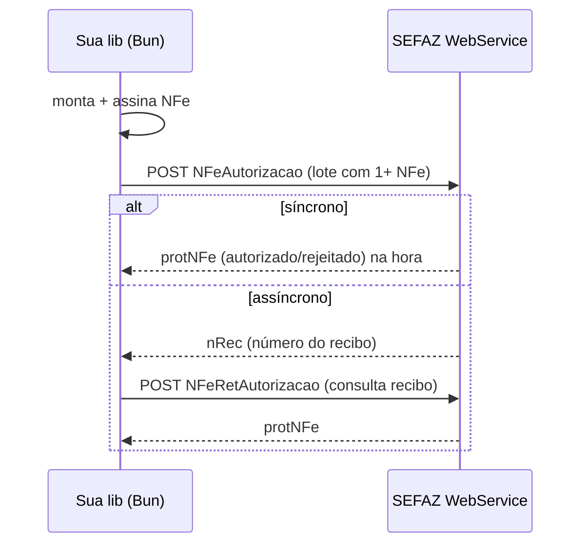
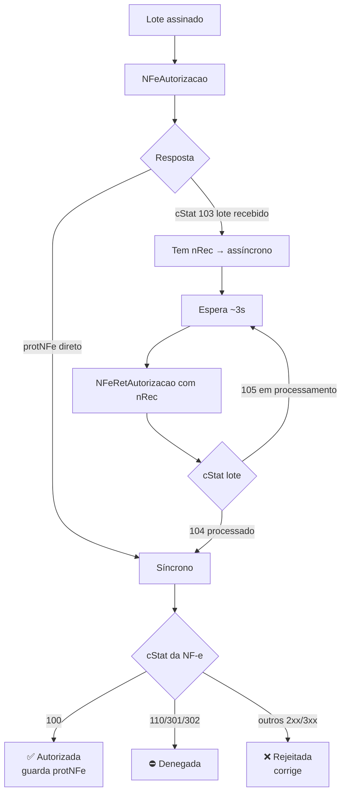
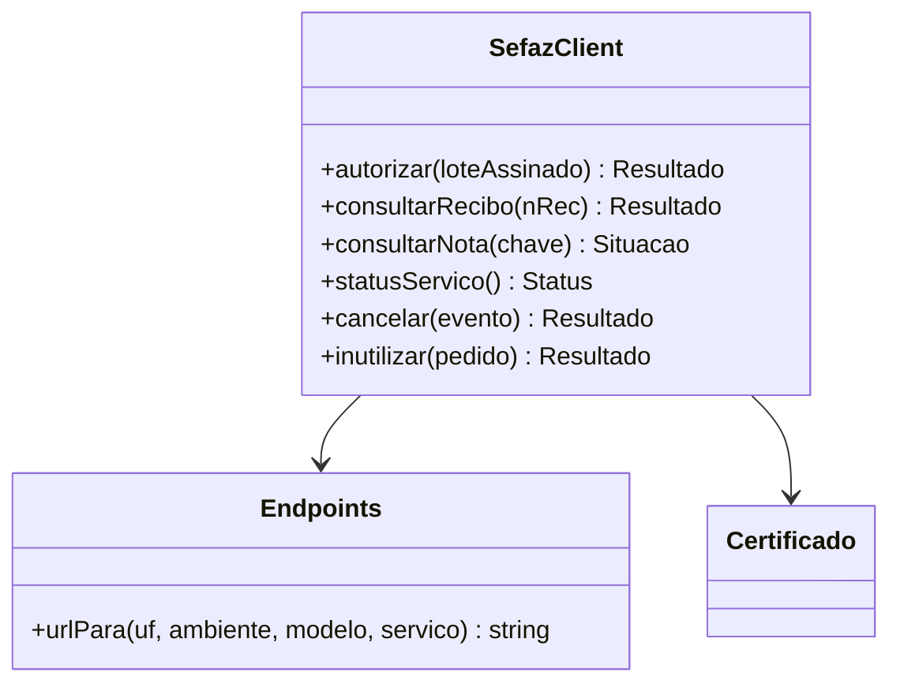

> **TL;DR:** Web service = você faz **POST de XML (SOAP)** num endpoint HTTPS com o **certificado como TLS client**. Envia um **lote**, recebe um **recibo**, depois **consulta o recibo** pra saber se autorizou. Cancelar/corrigir/inutilizar são chamadas separadas.

---

## Como a comunicação funciona



- A SEFAZ exige **TLS mútuo**: seu certificado A1 vai como **client cert** da conexão HTTPS (não só pra assinar o XML).
- O corpo é **SOAP 1.2** — mas na prática é "XML dentro de envelope XML". Você pode montar o envelope na mão.

```ts
// TLS client cert no Bun/fetch
const res = await fetch(endpoint, {
  method: "POST",
  headers: { "Content-Type": "application/soap+xml; charset=utf-8" },
  body: soapEnvelope,
  // Bun: tls com cert + key (do .pfx convertido em PEM)
  tls: { cert: certificatePem, key: privateKeyPem },
});
```

---

## Os web services principais

| Web Service | Pra quê | Operação |
|-------------|---------|----------|
| `NFeAutorizacao` | Enviar lote pra autorizar | emitir |
| `NFeRetAutorizacao` | Consultar o recibo do lote | emitir (assíncrono) |
| `NFeConsultaProtocolo` | Situação de uma nota pela chave | consultar |
| `NFeStatusServico` | A SEFAZ tá no ar? | health check |
| `RecepcaoEvento` | Cancelamento, CC-e, EPEC, manifestação | eventos |
| `NFeInutilizacao` | Queimar faixa de numeração não usada | inutilizar |
| `NFeConsultaCadastro` | Consultar cadastro de contribuinte | apoio |
| `NFeDistribuicaoDFe` | Baixar notas emitidas contra você | apoio |

> Cada **UF** tem URLs próprias, e há separação **produção × homologação**. Mantenha uma **tabela de endpoints por (UF, ambiente, modelo)**. Ela muda — guarde como dado, não como código.

---

## Fluxo de emissão (detalhado)



> O retorno de autorização traz o **`protNFe`** com o protocolo. Você **junta** `NFe` + `protNFe` num `<nfeProc>` — esse é o XML final que você guarda e usa pra gerar o DANFE.

> 🆕 **Resposta síncrona agora é obrigatória pra lote de 1 nota (NT 2025.001).** Mande `indSinc=1` e receba o `protNFe` na hora — **sem recibo, sem consulta posterior**. NFC-e (65) já era assim; NF-e (55) passou a ser também. O fluxo assíncrono (recibo → consulta) fica só pra lotes com várias notas. Simplifica muito a lib: pro caso comum (1 nota), é um POST e pronto.

---

## Códigos de status (`cStat`) que você vai ver toda hora

| cStat | Significado | Ação |
|-------|-------------|------|
| `100` | **Autorizado o uso** | 🎉 sucesso |
| `103` | Lote recebido | aguarde / consulte recibo |
| `104` | Lote processado | leia o protNFe interno |
| `105` | Lote em processamento | consulte de novo |
| `110` / `301` / `302` | Denegada (irregularidade) | número queimado |
| `135` | Evento registrado | sucesso de evento |
| `204` | Duplicidade de NF-e | já existe essa chave |
| `217` | NF-e não consta na base | (consulta) |
| `539` | Duplicidade com chave diferente | erro de cNF/numeração |
| `3xx` diversos | Rejeições de validação | corrigir XML |

> A lista completa de rejeições está no **Anexo I (Regras de Validação)**. São centenas. Mapeie as comuns; logue a mensagem (`xMotivo`) pras demais.

---

## Eventos (via `RecepcaoEvento`)

Todos seguem o mesmo formato `<evento><infEvento>...</infEvento></evento>` assinado.

| Evento | tpEvento | Quando | Prazo |
|--------|----------|--------|-------|
| **Cancelamento** | `110111` | desfazer nota autorizada | curto (ex: 24h, varia por UF) |
| **Cancelamento por substituição** (NFC-e) | `110112` | substituir NFC-e | — |
| **Carta de Correção (CC-e)** | `110110` | corrigir erro que **não** muda valor/destinatário/data | até 30 dias |
| **EPEC** | `110140` | contingência eletrônica | na hora da falha |
| **Manifestação do destinatário** | `2101xx` | confirmar/desconhecer operação | — |
| **Ator interessado** (informar transportador) | `110150` | apontar transportador da carga | — |
| **Comprovante de entrega** | `110130` | registrar entrega | — |
| **Insucesso na entrega** | `110192`* | registrar falha na entrega | — |
| **Conciliação financeira (ECONF)** | * | conciliar pagamento | — |

> *Confirme o `tpEvento` exato na NT correspondente (arquivo 17) — alguns são recentes (NT 2023.005, 2024.002, 2020.007) e os números podem ter ajuste.

**Regras de cancelamento que pegam gente:**
- Só cancela quem **autorizou** a nota. Se autorizou na SVC, cancela depois na SEFAZ de origem.
- Não cancela nota que já circulou/foi entregue (regra de negócio + prazo legal).
- O cancelamento também tem `cStat` próprio (`135` = registrado).

---

## Inutilização

Quando você **pula** números de nota (ex: deu erro no meio da sequência), precisa **inutilizar** a faixa pra Receita saber que aqueles números nunca viraram nota.

```
NFeInutilizacao → informa: UF, ano, CNPJ, modelo, série, nº inicial, nº final, justificativa
```

> Inutilização **não** é cancelamento. Cancelamento = nota existiu e foi desfeita. Inutilização = número nunca foi usado.

---

## Padrão de implementação na lib



- **Um cliente por finalidade**, mas todos compartilham: montar envelope SOAP, fazer POST com TLS, parsear resposta.
- **Resiliência:** timeout (~30s, o SLA da NFC-e), retry com backoff, e fallback pra **contingência** (arquivo 07) se a SEFAZ não responde.
